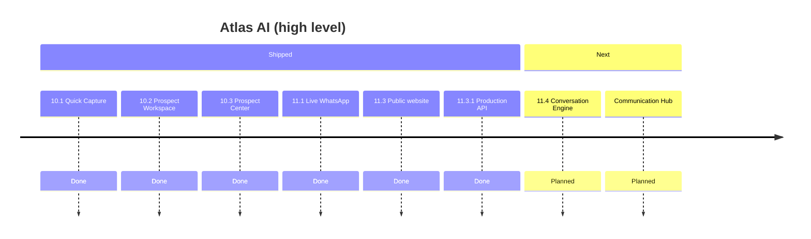

# Roadmap

## Document control

| Field | Value |
|-------|-------|
| **Document ID** | DOC-0005 |
| **Title** | Atlas AI Roadmap |
| **Version** | 0.1 |
| **Status** | Draft |
| **Owner** | Atlas Development Team |
| **Last Updated** | 2026-07-20 |
| **Related Sprint** | 11.4 (next) |
| **Related Release** | Release-11.3.1 (current) |

---

## Related documents

- [Current_System_State.md](./Current_System_State.md)
- [Vision.md](./Vision.md)
- [../05-sprints/README.md](../05-sprints/README.md)
- [../BACKLOG.md](../BACKLOG.md) *(legacy path)*

---

## Purpose

Summarize **planned** releases and milestones. For exact production behavior today, see [Current_System_State.md](./Current_System_State.md).

---

## Completed milestones

| Release | Sprint(s) | Summary |
|---------|-----------|---------|
| Release-11.3.1 | 11.3.1 | Production API client; Vercel → Railway integration |
| Release-11.3 | 11.3 | Public Team Vision website; contact form; legal pages |
| Release-11.1 | 11.1 | Live WhatsApp webhook pipeline; inbound/outbound logging |
| Release-10.x | 10.1–10.3 | Quick Capture, Prospect Workspace, Prospect Center |
| Release-6.x | 6–6.1 | Meta WhatsApp Embedded Signup |

---

## Current baseline

**Release-11.3.1** — Operational production stack:

- Public website on Vercel
- API on Railway
- Supabase persistence
- Resend contact email
- WhatsApp Cloud API + Embedded Signup

---

## Next milestone

### Sprint 11.4 — Conversation Engine & Communication Hub

| Field | Value |
|-------|-------|
| **Objective** | Implement the Atlas AI Conversation Engine with WhatsApp Business integration and establish Communication Hub architecture for future multi-channel support |
| **Status** | Planned |
| **Documents** | [Sprint-11.4.md](../05-sprints/Sprint-11.4.md) *(planned)* · [Communication_Hub.md](../02-architecture/Communication_Hub.md) *(planned)* |

---

## Future (planned — not committed dates)

| Theme | Description |
|-------|-------------|
| Formal user authentication | Replace bootstrap token with full Atlas login |
| Communication Hub channels | Email, SMS evaluation (architecture only in 11.4) |
| Reusable UI component library | Shared Atlas form and dialog primitives |
| i18n polish | Remaining backend-generated copy localization |
| Template message admin | WhatsApp template management UI |

> Items above are **backlog/planned**. See [../BACKLOG.md](../BACKLOG.md) for detail.

---

## Roadmap diagram

