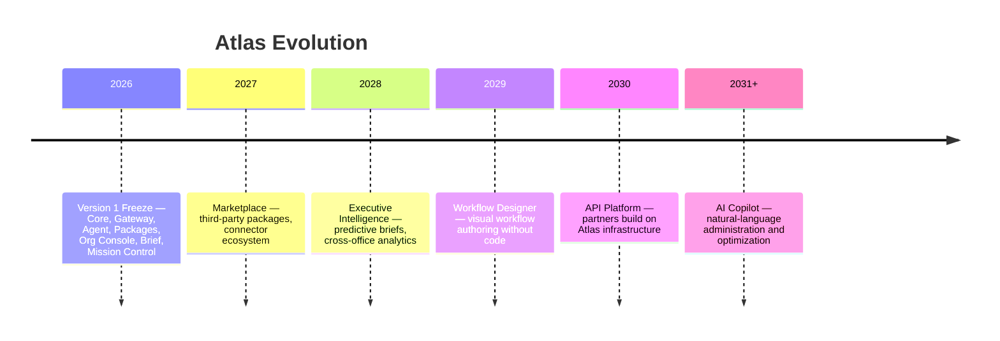

# Why Atlas Exists

**Document type:** Vision  
**Status:** FROZEN (Version 1)  
**Version:** 1.0  
**Last Updated:** 2026-07-21  
**Audience:** Product, Engineering, Leadership, Investors  

**Related:** [ATLAS_NEVER_SLEEPS.md](./ATLAS_NEVER_SLEEPS.md), [../02-architecture/ATLAS_PLATFORM_V1.md](../02-architecture/ATLAS_PLATFORM_V1.md), [../00-executive/Roadmap.md](../00-executive/Roadmap.md)

---

## Mission

Atlas exists to give every organization an **AI employee** that completes business workflows through natural conversation — without requiring custom software development for each agency, office, or industry.

Atlas automates process execution. Humans provide judgment, relationships, and real-world information. Atlas handles the repetitive work between those moments.

---

## Vision

Atlas is not software that reacts to messages.

Atlas is an **intelligent operating system for business** — always aware, always preparing, always improving.

**Atlas never sleeps.**

See [ATLAS_NEVER_SLEEPS.md](./ATLAS_NEVER_SLEEPS.md) for the continuous intelligence model (Listening → Thinking → Acting).

---

## Atlas Never Sleeps

Traditional business software waits for a user to log in. Atlas operates continuously:

| Mode | Question answered |
|------|-------------------|
| **Listening** | What changed? |
| **Thinking** | What does it mean? |
| **Acting** | What should happen next? |

Version 1 implements this foundation:

- **Daily Brief (Release 1.3)** — synthesizes what happened
- **Mission Control (Release 1.4)** — tracks what is happening now
- **Event Bus** — the nervous system connecting all domains

Future versions extend Listening and Thinking across calendar events, stalls, and external triggers — without replacing the Version 1 architecture.

---

## Product Philosophy

1. **Organizations configure Atlas.** Nothing organization-specific belongs in Core or packages as hardcoded defaults.
2. **Packages extend Atlas.** Industry workflows are installable modules, not forks.
3. **Atlas Core powers everything.** Core is generic, stable, and locked.
4. **Events connect everything.** No domain polls another domain.
5. **Humans approve actions that matter.** Recommendations and alerts inform; they do not auto-execute sensitive work.

---

## Target Customers

Atlas Version 1 is built from **Team Vision Financial** recruiting experience, but the platform is designed for any organization that:

- Engages prospects through messaging channels (Messenger, WhatsApp, Instagram)
- Runs structured workflows with milestones (qualify → schedule → onboard)
- Needs operational visibility without building custom dashboards
- Wants to configure behavior without changing source code

Primary initial customer profile: **financial services recruiting agencies** with multiple offices, licensing requirements, and high-touch prospect journeys.

---

## Long-Term Goals

| Horizon | Goal |
|---------|------|
| **Year 1–2** | Production deployments for Team Vision and partner agencies; package marketplace foundation |
| **Year 3–5** | Multi-industry package ecosystem; executive intelligence suite; workflow designer |
| **Year 5–10** | API platform for third-party integrations; AI copilot for agency owners; cross-organization benchmarking (opt-in) |

---

## Why Atlas Is Not a CRM

| CRM | Atlas |
|-----|-------|
| Record storage and pipeline views | Workflow execution and conversation automation |
| User enters data manually | Atlas collects data through conversation |
| Static reports | Daily Brief and Mission Control — event-driven intelligence |
| One-size-fits-all fields | Package-defined workflows with organization configuration |
| Reactive | Proactive (Never Sleeps vision) |

Atlas may integrate with CRMs. Atlas is not a CRM replacement — it is the **execution and intelligence layer** on top of relationship work.

---

## Why Atlas Is Package-Based

Every industry has different workflows, qualification rules, and outcomes. Hardcoding Team Vision recruiting logic into Core would:

- Block other industries from using Atlas
- Force Core changes for every new customer type
- Create unmaintainable coupling

**Packages** (`backend/packages/`) install workflow definitions, business logic, and analytics without modifying Core. Team Vision Recruiting Pack (Release 1.1) is the reference implementation.

---

## Why Atlas Is Event-Driven

Business activity is asynchronous and multi-source:

- Messages arrive at any time
- Calendar events change
- Workflows advance in steps
- Connectors connect and disconnect
- Humans take over conversations

Polling creates latency, coupling, and missed signals. The **Event Bus** lets every domain publish facts and subscribe to what matters — Mission Control updates in real time; Daily Brief aggregates history; packages track analytics.

See [RFC-010 Event Bus Principles](../10-rfcs/RFC-010-event-bus-principles.md).

---

## Guiding Principles

The **Atlas Constitution:**

| Principle | Meaning |
|-----------|---------|
| **Simple wins** | Smallest correct solution beats clever architecture |
| **Hide complexity** | Operators see outcomes, not engines |
| **Automation first** | If Atlas can safely do it, Atlas should |
| **Easy to duplicate** | New organizations configure; they do not fork |
| **Simple Scales** | Add layers and packages; do not modify Core |

Additional principles:

- **Business rules are authoritative** — see [BUSINESS_RULES.md](../06-business/BUSINESS_RULES.md)
- **Ground truth beats inference** — Agent never invents facts
- **Documentation outlives code** — Version 1 freeze exists because software becomes legacy

---

## Future Vision (5–10 Years)

Atlas becomes the **default operating system** for agencies that run conversation-driven businesses:

Atlas remains package-based and event-driven at every stage. Core stays generic. Organizations stay in control.

---

## Final Statement

Atlas exists because **every organization deserves an AI employee that knows their business** — not a chatbot that waits, and not a CRM that stores records without acting.

Version 1 freezes the foundation. Everything built after inherits these principles.

**Atlas never sleeps.**
