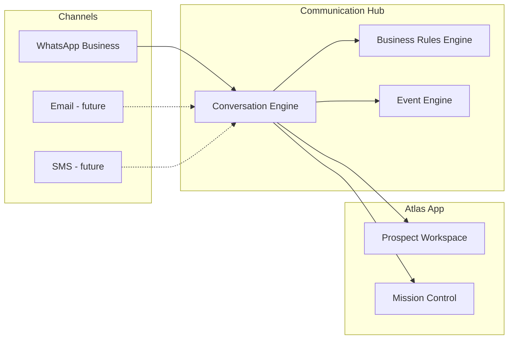

# Communication Hub

## Document control

| Field | Value |
|-------|-------|
| **Document ID** | DOC-0010 |
| **Title** | Communication Hub Architecture |
| **Version** | 0.1 |
| **Status** | Draft |
| **Owner** | Atlas Development Team |
| **Last Updated** | 2026-07-20 |
| **Related Sprint** | 11.4 |
| **Related Release** | Release-11.4 (planned) |

---

## Related documents

- [Current_System_State.md](../00-executive/Current_System_State.md)
- [Sprint-11.4.md](../05-sprints/Sprint-11.4.md)
- [Sprint-11.4-Implementation-Plan.md](../05-sprints/Sprint-11.4-Implementation-Plan.md)
- [README.md](./README.md)
- [../04-meta/Meta_Approval_Portfolio.md](../04-meta/Meta_Approval_Portfolio.md)

---

## Purpose

Define the **Communication Hub** — the unified architecture for inbound and outbound agency communication across channels, starting with WhatsApp Business in Sprint 11.4.

> **Note:** Placeholder for Sprint 11.4 planning. Implementation details will be added when the Conversation Engine sprint begins.

---

## Goals

1. Single conversation thread per prospect across supported channels
2. Policy-aware routing (business rules, opt-in, Meta templates)
3. Auditable message log linked to workflow events
4. Extensibility for future channels without rewriting core engines

---

## Current state (Release-11.3.1)

| Capability | Status |
|------------|--------|
| WhatsApp webhook ingest | Implemented |
| Outbound WhatsApp send | Implemented |
| Unified conversation UI | Partial (Prospect Workspace) |
| Conversation Engine | **Planned — Sprint 11.4** |
| Multi-channel hub | **Architecture only** |

---

## Target architecture (Sprint 11.4+)

---

## Out of scope (this document)

- Meta submission copy → [../04-meta/Meta_Approval_Portfolio.md](../04-meta/Meta_Approval_Portfolio.md)
- Sprint task breakdown → [Sprint-11.4.md](../05-sprints/Sprint-11.4.md)
