# Workflow Sequence Diagrams

**Sprint:** 8A.4 planning — developer documentation  
**Status:** Specification only — no implementation in this document  
**Related:** [WORKFLOW_ENGINE_SPEC.md](./WORKFLOW_ENGINE_SPEC.md), [MILESTONE_DEFINITIONS.md](../06-business/MILESTONE_DEFINITIONS.md), [EVENT_CATALOG.md](../06-business/EVENT_CATALOG.md), [BUSINESS_RULES.md](../06-business/BUSINESS_RULES.md), [ATLAS_GLOSSARY.md](../06-business/ATLAS_GLOSSARY.md)

---

## Legend

| Symbol | Meaning |
|--------|---------|
| **Owner** | Workflow ownership: `ATLAS`, `AGENT`, `WAITING_EVENT`, `CLOSED` |
| **Actor** | Who initiates the step: Atlas, Prospect, Agent, System |
| Events | Structured entries in `workflow_events` (see [EVENT_CATALOG.md](../06-business/EVENT_CATALOG.md)) |
| Message logs | `conversation_logs` rows (parallel to workflow events) |

### Ownership during sequences

```
ATLAS          → Atlas may send automated messages and advance workflow
AGENT          → Automated progression paused; human action required
WAITING_EVENT  → Paused until external trigger (reply, interview time, follow-up date)
CLOSED         → Terminal; no automated outreach
```

---

## 1. New Lead

**Milestone:** `NEW_LEAD`  
**Owner:** `ATLAS`

### Summary

| Field | Value |
|-------|-------|
| **Trigger** | Prospect record created (webhook, recruit API, simulator, manual insert) |
| **Workflow owner** | `ATLAS` |
| **Events emitted** | `ProspectCreated` |
| **Business rule(s)** | BR-001 (schedule within 48h when ready), capacity rules BR-006/BR-007 |
| **Next milestone** | `GREETING_SENT` (after first Atlas outbound) or `QUALIFICATION` (if prospect replies first) |

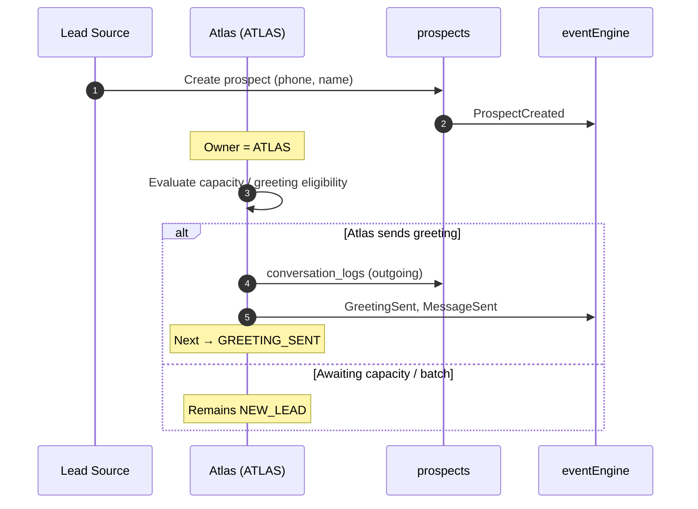

---

## 2. Qualification

**Milestone:** `QUALIFICATION`  
**Owner:** `ATLAS`

### Summary

| Field | Value |
|-------|-------|
| **Trigger** | Prospect inbound message after greeting, or human advancement to `QUALIFICATION` |
| **Workflow owner** | `ATLAS` |
| **Events emitted** | `MessageReceived`, `MessageSent`, `QualificationUpdated` (on field capture) |
| **Business rule(s)** | BR-014 (no repeat questions), BR-018–BR-022 (coverage / interview type), BR-019–BR-021 (local vs Zoom) |
| **Next milestone** | `INTERVIEW_READY` when `getMissingFields()` is empty |

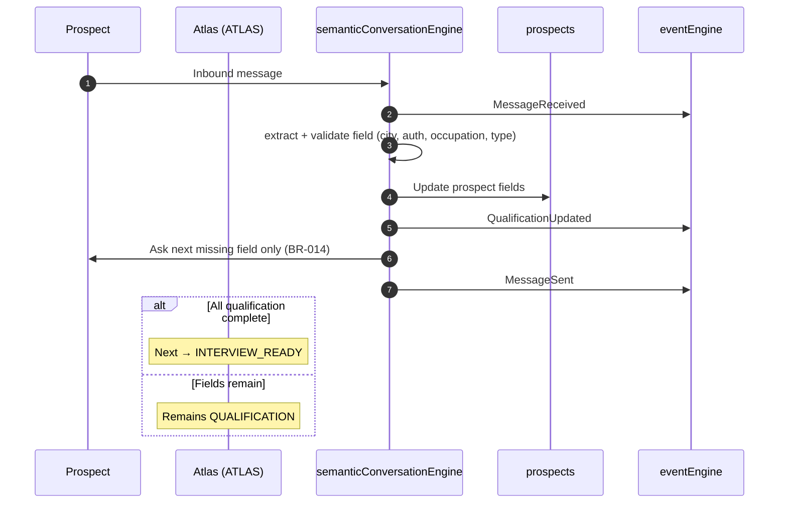

---

## 3. Interview Ready

**Milestone:** `INTERVIEW_READY`  
**Owner:** `ATLAS`

### Summary

| Field | Value |
|-------|-------|
| **Trigger** | All qualification fields complete; no confirmed interview slot |
| **Workflow owner** | `ATLAS` |
| **Events emitted** | `QualificationUpdated`, `MessageSent` (slot offer) |
| **Business rule(s)** | BR-001–BR-004 (scheduling window), BR-006/BR-007 (capacity), BR-005 (working hours preference) |
| **Next milestone** | `INTERVIEW_SCHEDULED` |

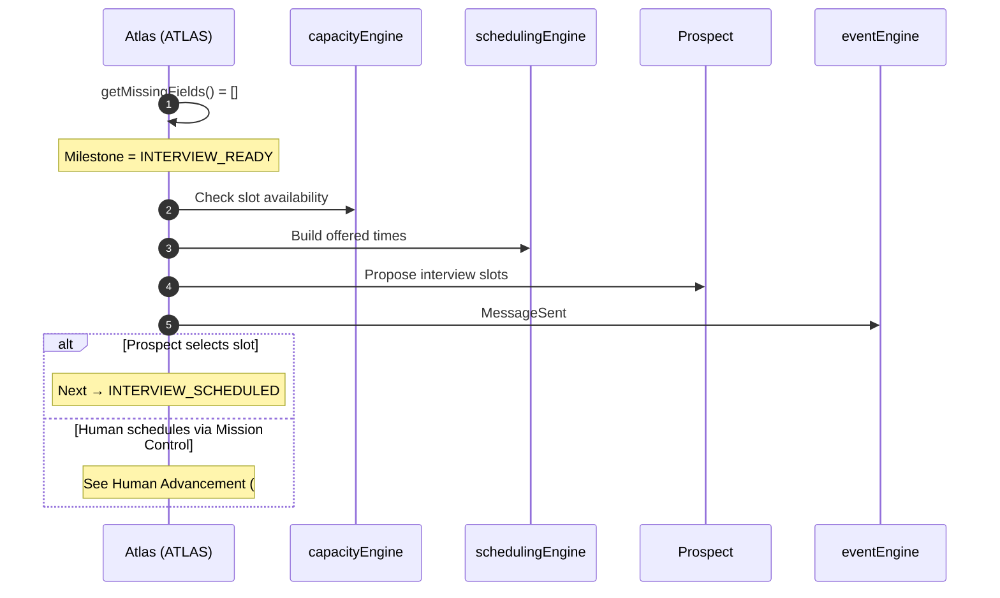

---

## 4. Interview Scheduled

**Milestone:** `INTERVIEW_SCHEDULED` → `INTERVIEW_DUE`  
**Owner:** `WAITING_EVENT`

### Summary

| Field | Value |
|-------|-------|
| **Trigger** | Slot confirmed (automated or human); `current_step = CONFIRMED` |
| **Workflow owner** | `WAITING_EVENT` |
| **Events emitted** | `InterviewScheduled`, `MessageSent`, `ReminderScheduled`, `ReminderSent` |
| **Business rule(s)** | BR-035 §16 (confirmation + details when human schedules — 8A.4), BR-028/BR-029 (resource sends), BR-016 |
| **Next milestone** | `INTERVIEW_DUE` (within 2h) → `INTERVIEW_COMPLETED` (time passed) |

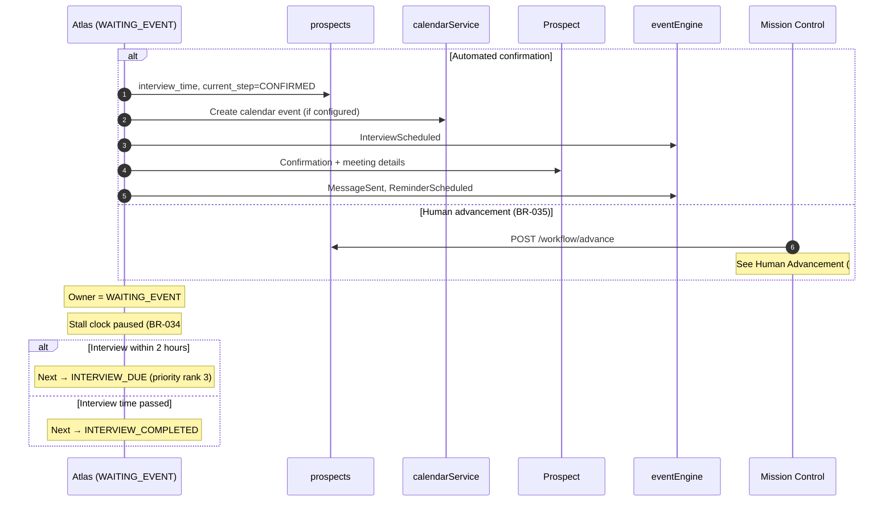

---

## 5. Conversation Stalled

**Milestone:** unchanged (e.g. `QUALIFICATION`, `GREETING_SENT`)  
**Owner:** `ATLAS` → `AGENT`

### Summary

| Field | Value |
|-------|-------|
| **Trigger** | 24h since last Atlas **outbound** with no prospect **inbound** after it; workflow incomplete; not `WAITING_EVENT` exempt |
| **Workflow owner** | `AGENT` |
| **Events emitted** | `ConversationStalled`, `WorkflowOwnershipChanged`, `WorkflowPaused` |
| **Business rule(s)** | BR-034, BR-036, BR-025 (recommended action: `call`) |
| **Next milestone** | Unchanged until human advancement or prospect reply |

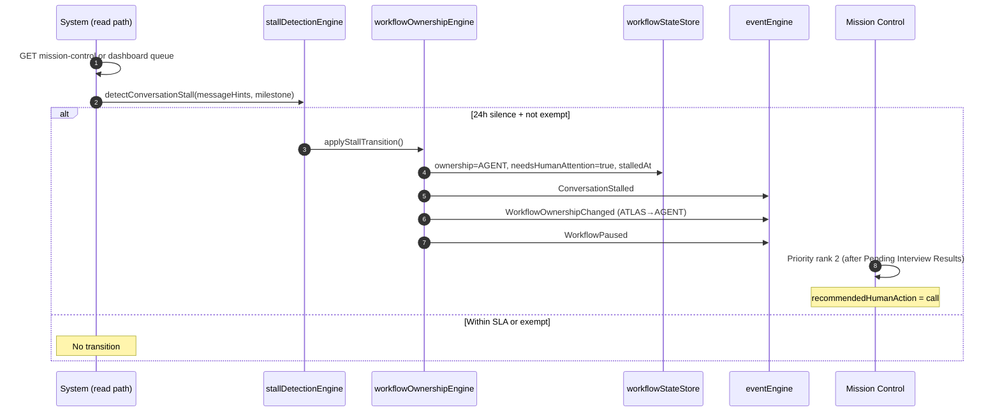

---

## 6. Human Advancement

**Milestone:** any valid target (e.g. `QUALIFICATION` → `INTERVIEW_SCHEDULED`)  
**Owner:** `AGENT` → `ATLAS` or `WAITING_EVENT`

### Summary

| Field | Value |
|-------|-------|
| **Trigger** | Agent `POST /api/mission-control/:phone/workflow/advance` after call or interaction |
| **Workflow owner** | `AGENT` during stall; transitions to derived ownership on save |
| **Events emitted** | `HumanCallCompleted`, `QualificationUpdated`, `InterviewScheduled`, `ProspectAdvanced`, `WorkflowOwnershipChanged`, `WorkflowResumed` |
| **Business rule(s)** | BR-035, BR-037, BR-036, BR-014 |
| **Next milestone** | `targetMilestone` from request (validated) |

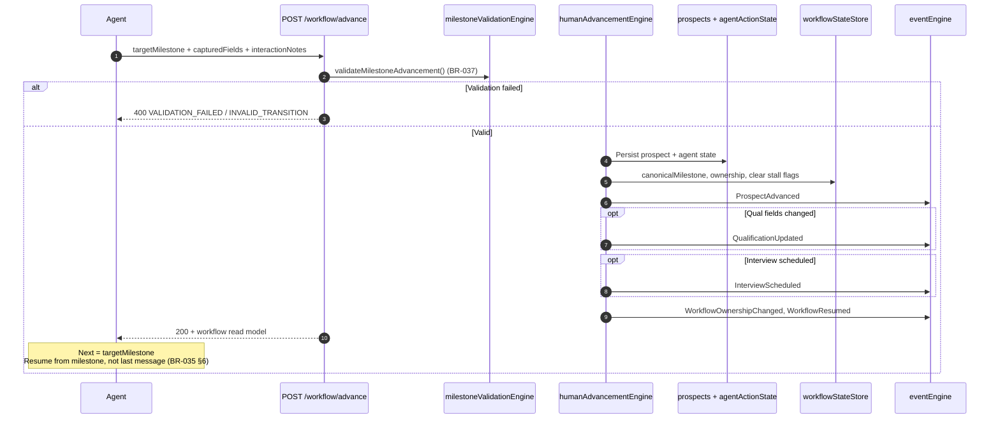

---

## 7. Workflow Resume

**Milestone:** prior milestone unchanged or advanced  
**Owner:** `AGENT` → `ATLAS` or `WAITING_EVENT`

### Summary

| Field | Value |
|-------|-------|
| **Trigger A** | Successful human advancement (BR-035) |
| **Trigger B** | Prospect inbound message after stall (8A.2 — auto-clear) |
| **Trigger C** | Follow-up date reached (future — reminder engine) |
| **Workflow owner** | Restored to `ATLAS` or `WAITING_EVENT` per milestone |
| **Events emitted** | `WorkflowResumed`, `WorkflowOwnershipChanged`, optionally `MessageReceived` |
| **Business rule(s)** | BR-035 §5–§8, BR-036, BR-014 |
| **Next milestone** | Continue from current/highest valid milestone — no “Resume Atlas” button |

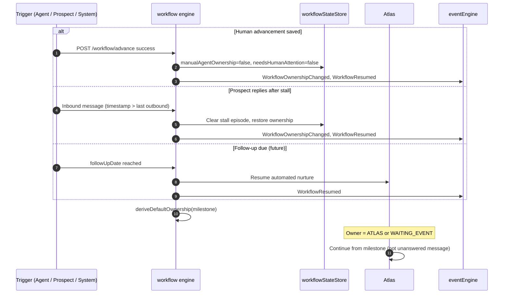

---

## 8. Follow-up

**Milestone:** `FOLLOW_UP`  
**Owner:** `WAITING_EVENT` (until date) → `ATLAS`

### Summary

| Field | Value |
|-------|-------|
| **Trigger** | Interview outcome “Needs More Time” / “No Show”, or human advancement to `FOLLOW_UP` |
| **Workflow owner** | `WAITING_EVENT` until `followUpDate`; then `ATLAS` |
| **Events emitted** | `InterviewResultRecorded`, `FollowUpScheduled`, `ProspectAdvanced`, `MessageSent` (on execute) |
| **Business rule(s)** | BR-035, BR-032 (closure reason variants), BR-037 (`followUpDate` required) |
| **Next milestone** | `QUALIFICATION` or `INTERVIEW_SCHEDULED` on re-engagement |

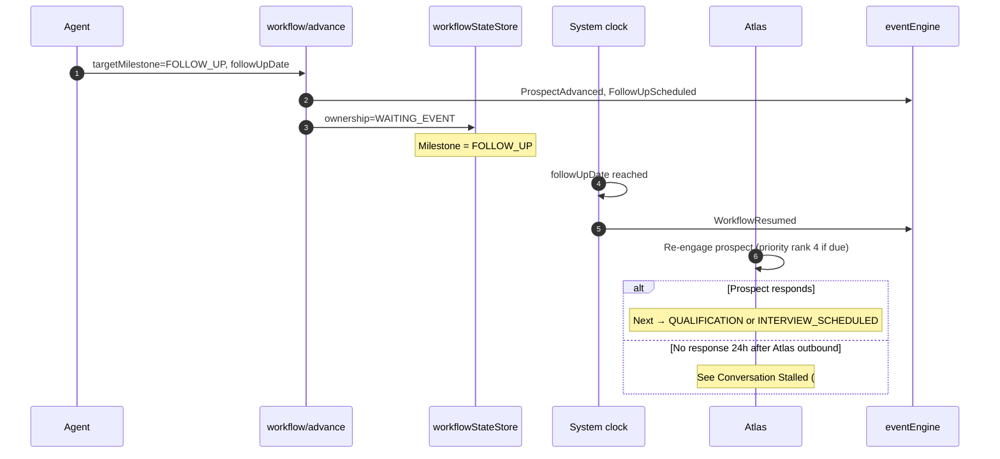

---

## 9. Closed

**Milestone:** `CLOSED`  
**Owner:** `CLOSED`

### Summary

| Field | Value |
|-------|-------|
| **Trigger** | Outcome “Not Interested”, human advancement to `CLOSED`, or automated terminal path |
| **Workflow owner** | `CLOSED` |
| **Events emitted** | `InterviewResultRecorded`, `ProspectClosed`, `WorkflowOwnershipChanged` |
| **Business rule(s)** | BR-008 (no auto-resume), BR-032 (closure reason variants), BR-035, BR-037 |
| **Next milestone** | None (terminal) — reactivation requires explicit rule (see #11) |

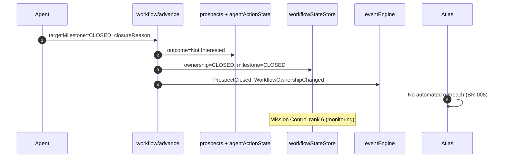

---

## 10. Do Not Contact

**Milestone:** `DO_NOT_CONTACT`  
**Owner:** `CLOSED`

### Summary

| Field | Value |
|-------|-------|
| **Trigger** | Explicit DNC request, compliance flag, or human advancement |
| **Workflow owner** | `CLOSED` |
| **Events emitted** | `DoNotContactApplied`, `WorkflowOwnershipChanged`, `ProspectClosed` |
| **Business rule(s)** | BR-008, BR-035, BR-037; compliance suppression (proposed BR-038) |
| **Next milestone** | None (terminal) |

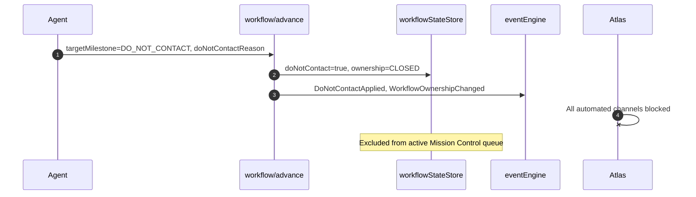

---

## 11. Reactivation

**Milestone:** `CLOSED` / `DO_NOT_CONTACT` → active milestone  
**Owner:** `CLOSED` → `AGENT` → `ATLAS`  
**Status:** **Proposed for Sprint 8A.4+** — not implemented; documented for planning

### Summary

| Field | Value |
|-------|-------|
| **Trigger** | Explicit agent reopen after cooling period; inbound message on closed prospect (does **not** auto-resume per BR-008) |
| **Workflow owner** | `AGENT` during review → `ATLAS` after validated advancement |
| **Events emitted** | `ProspectAdvanced`, `WorkflowOwnershipChanged`, `WorkflowResumed`, `MessageReceived` (if inbound logged) |
| **Business rule(s)** | BR-008 (no **automatic** resume), BR-035/BR-037 (human must select valid milestone), proposed **BR-038** (Reactivation policy) |
| **Next milestone** | Agent-selected: typically `QUALIFICATION`, `FOLLOW_UP`, or `INTERVIEW_SCHEDULED` |

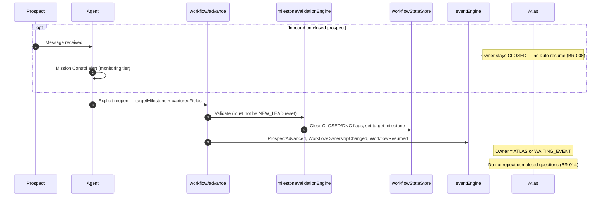

### Reactivation policy (proposed)

1. Only **agent-initiated** — never automatic from inbound alone.
2. **DNC** requires compliance review before reopen.
3. Preserve historical `workflow_events` — append-only audit trail.
4. Recommended target: `FOLLOW_UP` or `QUALIFICATION` based on data freshness.

---

## Cross-Reference: Mission Control Priority During Sequences

| Sequence | Typical priority tier |
|----------|----------------------|
| Interview Result Pending | 1 — Pending Interview Results |
| Conversation Stalled | 2 — Human Escalations |
| Interview Due | 3 — Interview Immediate |
| Follow-up due | 4 — Follow-up Due |
| Qualification / New Lead | 5 — Atlas Active |
| Interview Scheduled (future) | 6 — Monitoring |
| Closed / DNC | 6 — Monitoring (excluded from active queue) |

---

## Document Index

| Document | Purpose |
|----------|---------|
| [WORKFLOW_SIMULATOR_SPEC.md](../03-engineering/WORKFLOW_SIMULATOR_SPEC.md) | Developer simulator for testing these sequences |
| [SPRINT_8A_3.md](../04-api/mission-control-workflow-advance.md) | Human Advancement API |
| [EVENT_CATALOG.md](../06-business/EVENT_CATALOG.md) | Event payloads |
