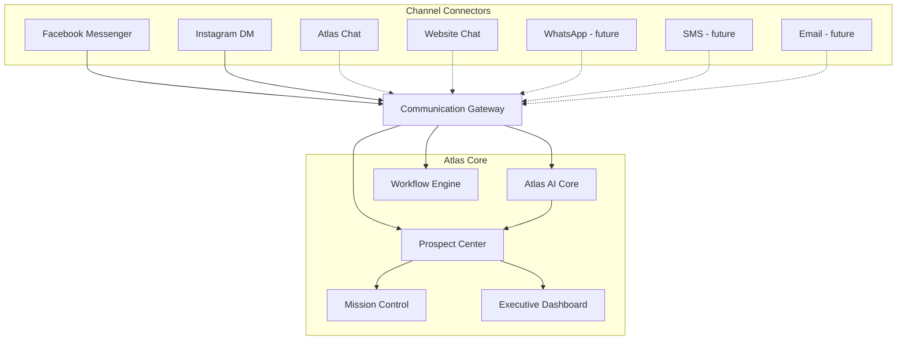

# Atlas Communication Platform

## Document control

| Field | Value |
|-------|-------|
| **Document ID** | DOC-0020 |
| **Title** | Atlas Communication Platform Architecture |
| **Version** | 1.0 |
| **Status** | Approved |
| **Owner** | Atlas Development Team |
| **Last Updated** | 2026-07-21 |
| **Related Sprint** | 12 |
| **Related Release** | Release-12 (planned) |

---

## Related documents

| Document | Description |
|----------|-------------|
| [sprint-11.4-whatsapp-investigation.md](../08-operations/sprint-11.4-whatsapp-investigation.md) | Strategic pivot to multichannel MVP (DOC-0513) |
| [Communication_Hub.md](./Communication_Hub.md) | Communication Hub transport layer (DOC-0010) |
| [ATLAS_CORE_ARCHITECTURE.md](./ATLAS_CORE_ARCHITECTURE.md) | Workflow engine and core platform architecture |
| [00-executive/Current_System_State.md](../00-executive/Current_System_State.md) | Production system state |

---

## Vision

Atlas AI is designed as a **channel-independent communication platform** — not a WhatsApp-based chatbot.

**The platform owns the conversation, not the communication channel.**

---

## Core principle

Every prospect receives a **single Atlas identity**.

Regardless of whether the conversation begins through:

- Facebook Messenger
- Instagram Direct Message
- Atlas Chat
- Website Chat
- WhatsApp (future)
- SMS (future)
- Email (future)

the prospect remains **one person inside Atlas**.

All channels attach to the same prospect record, conversation timeline, and workflow state.

---

## Communication Gateway

Every incoming and outgoing message passes through the **Communication Gateway**.

### Responsibilities

| Responsibility | Description |
|----------------|-------------|
| **Normalize incoming messages** | Map channel-specific payloads to a common Atlas message format |
| **Route conversations** | Direct messages to the correct prospect thread and workflow |
| **Maintain conversation history** | Persist inbound/outbound messages in a unified timeline |
| **Assign workflows** | Trigger or advance Workflow Engine steps based on conversation events |
| **Support AI responses** | Hand off to Atlas AI Core for automated replies |
| **Support Human Takeover** | Allow operators to send messages through the same gateway |

Implementation detail for the transport layer: [Communication Hub](./Communication_Hub.md) (DOC-0010).

---

## Atlas Core

The Communication Gateway connects to Atlas Core components. These remain **independent of any communication platform**:

| Component | Role |
|-----------|------|
| **Atlas AI Core** | Conversation intelligence, qualification logic, automated responses |
| **Workflow Engine** | Milestone-driven process execution and business rules |
| **Prospect Center** | Single prospect identity, history, and workspace |
| **Mission Control** | Operator workflows, queues, and agency operations |
| **Executive Dashboard** | Leadership visibility into pipeline, health, and activity |

Channels are interchangeable **connectors**. Core business logic does not branch on channel-specific APIs.

---

## Human Takeover

Atlas operators can respond **directly from Atlas**.

The customer continues chatting in Messenger, Instagram, WhatsApp, or another channel **without knowing** the operator is working inside Atlas.

| Capability | Behavior |
|------------|----------|
| **AI mode** | Atlas AI Core generates replies via the Communication Gateway |
| **Human mode** | Operator composes in Atlas; gateway delivers on the original channel |
| **Handoff** | Seamless transition between AI and human without channel change for the prospect |
| **Timeline** | All messages — AI and human — appear in one Prospect Center thread |

---

## Supported connectors

### Current MVP (Sprint 12)

| Connector | Status |
|-----------|--------|
| **Facebook Messenger** | Primary — in development |
| **Instagram Direct Messages** | Primary — in development |

### Planned

| Connector | Status |
|-----------|--------|
| **Atlas Chat** | Planned |
| **Website Chat** | Planned |
| **WhatsApp Cloud API** | Deferred — Meta restriction; resume when resolved |
| **SMS** | Planned |
| **Email** | Planned |

### Connector contract

Future connectors should require **no architectural changes** to Atlas Core.

Each connector implements:

1. **Inbound adapter** — webhook or poll → normalized message → Communication Gateway
2. **Outbound adapter** — Gateway message → channel API send
3. **Identity mapping** — channel user ID ↔ Atlas prospect ID

---

## Product philosophy

Atlas is **not** a WhatsApp integration.

**Atlas is the communication operating system for Team Vision Financial.**

| Principle | Meaning |
|-----------|---------|
| **Every communication channel is a connector** | Channels plug into the gateway; core logic stays channel-agnostic |
| **Every person has one timeline** | One prospect, one history, regardless of entry channel |
| **Every workflow is managed from a single platform** | Qualification, scheduling, and handoff run in Atlas — not in Meta Business Suite or channel-native tools |

---

## One-line summary

> **One prospect. One timeline. Every channel is a connector. Atlas owns the conversation.**
