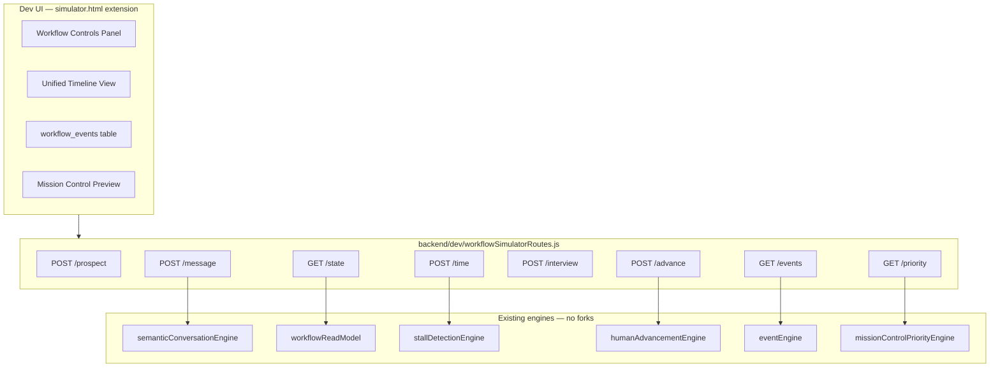

# Workflow Simulator Specification

**Sprint:** 8A.4 planning — developer documentation  
**Status:** Specification only — **no simulator code in this sprint**  
**Audience:** Atlas backend/frontend developers  
**Related:** [WORKFLOW_SEQUENCE_DIAGRAMS.md](../02-architecture/WORKFLOW_SEQUENCE_DIAGRAMS.md), [SPRINT_8A_3.md](../04-api/mission-control-workflow-advance.md), [EVENT_CATALOG.md](../06-business/EVENT_CATALOG.md)

---

## Purpose

Define a **developer-only Workflow Simulator** that exercises the Sprint 8A workflow engine end-to-end without WhatsApp production traffic or Mission Control UI changes.

The simulator complements the existing conversation simulator at `/dev` (`backend/dev/simulatorRoutes.js`, `backend/dev/simulator.html`) by adding **workflow-layer** controls: milestones, ownership, stalls, events, and Mission Control priority.

---

## Goals

| Goal | Description |
|------|-------------|
| **Reproduce sequences** | Run flows documented in [WORKFLOW_SEQUENCE_DIAGRAMS.md](../02-architecture/WORKFLOW_SEQUENCE_DIAGRAMS.md) |
| **Test without production** | No Meta WhatsApp API calls unless explicitly opted in |
| **Inspect workflow state** | Ownership, milestone, stall flags, priority tier |
| **Audit events** | Read `workflow_events` and `conversation_logs` side by side |
| **Accelerate time** | Simulate 24h stalls, interview pass-by, follow-up due dates |
| **Safe defaults** | Dev-only routes; disabled or auth-gated in production |

---

## Non-Goals (8A.4 spec)

- Mission Control UI redesign
- CRM integration
- Production WhatsApp sending (unless dev flag `SIMULATOR_ALLOW_WHATSAPP=true`)
- Replacing automated tests — simulator is manual/exploratory tooling

---

## Relationship to Existing Simulator

| Capability | Existing `/dev` simulator | Workflow Simulator (this spec) |
|------------|---------------------------|--------------------------------|
| Inbound/outbound messages | ✅ via `conversationEngine` | ✅ reuse same pipeline |
| Pipeline stage display | ✅ legacy `PIPELINE_STAGES` | ➕ canonical `MILESTONES` |
| Business rules panel | ✅ | ✅ extend with BR-034–BR-037 |
| Workflow ownership | ❌ | ✅ |
| Milestone advancement API | ❌ | ✅ wraps `POST /workflow/advance` |
| 24h stall simulation | ❌ | ✅ time override |
| `workflow_events` viewer | ❌ | ✅ |
| Mission Control priority | ❌ | ✅ |
| Interview time simulation | partial | ✅ full |

**Recommendation:** Extend `backend/dev/` rather than a separate app. Mount under `/dev/workflow` to keep dev tooling colocated.

---

## Environment & Safety

### Activation

| Variable | Default | Purpose |
|----------|---------|---------|
| `NODE_ENV` | — | Simulator routes only registered when `!== 'production'` **or** |
| `ENABLE_DEV_SIMULATOR` | `false` | Explicit enable in staging |
| `SIMULATOR_TIME_OVERRIDE` | — | ISO datetime for simulated "now" |
| `SIMULATOR_ALLOW_WHATSAPP` | `false` | Allow real sends from simulator actions |

### Guardrails

1. All simulator prospects use prefix `sim-` or dedicated phone namespace (e.g. `sim:{uuid}`).
2. `DELETE /dev/workflow/prospect/:phone` cleans prospect, logs, workflow state, and events.
3. Production deployment returns `404` on `/dev/workflow/*` unless `ENABLE_DEV_SIMULATOR=true`.
4. No simulator endpoint modifies `.env` or organization production settings.

---

## Architecture



---

## Data Stores Touched

| Store | Simulator read | Simulator write |
|-------|----------------|-----------------|
| `prospects` (Supabase) | ✅ | ✅ create/update/delete test rows |
| `conversation_logs` | ✅ | ✅ via message simulation |
| `workflow_events` | ✅ | ✅ via engine emits (never direct UI insert) |
| `workflowState.json` | ✅ | ✅ via engines |
| `agentActionState.json` | ✅ | ✅ via engines |
| `capacity.json` | ✅ | read-only unless dev override endpoint added |

---

## API Specification

Base path: **`/dev/workflow`**

All responses include `"simulator": true` and `"simulatedAt": "<ISO>"` when time override is active.

---

### 1. Create Test Prospect

**`POST /dev/workflow/prospect`**

Creates an isolated test prospect and initializes workflow state.

#### Request

```json
{
  "phone": "sim-test-001",
  "name": "Simulator Prospect",
  "preset": "NEW_LEAD",
  "seedFields": {
    "city": "Miami",
    "state": "FL"
  }
}
```

| Field | Required | Description |
|-------|----------|-------------|
| `phone` | Yes | Must start with `sim-` |
| `name` | No | Display name |
| `preset` | No | `NEW_LEAD`, `QUALIFICATION`, `INTERVIEW_SCHEDULED`, `STALLED`, `CLOSED` |
| `seedFields` | No | Pre-populate prospect columns |

#### Behavior

- Inserts `prospects` row
- Emits `ProspectCreated`
- Lazy-inits `workflowState.json` on first read
- Returns full workflow read model

#### Response `201`

```json
{
  "simulator": true,
  "prospect": { "phone": "sim-test-001", "name": "Simulator Prospect" },
  "workflow": {
    "canonicalMilestone": "NEW_LEAD",
    "workflowOwnership": "ATLAS",
    "needsHumanAttention": false,
    "missionControlPriority": 5,
    "missionControlPriorityTier": "ATLAS_ACTIVE"
  }
}
```

---

### 2. Simulate Inbound / Outbound Messages

**`POST /dev/workflow/message`**

Wraps conversation pipeline without WhatsApp.

#### Request

```json
{
  "phone": "sim-test-001",
  "direction": "incoming",
  "body": "Yes I am authorized to work in the US",
  "asAtlas": false
}
```

| Field | Description |
|-------|-------------|
| `direction` | `incoming` (prospect) or `outgoing` (Atlas/agent) |
| `body` | Message text |
| `asAtlas` | When `outgoing`, route through `semanticConversationEngine` vs raw log only |

#### Behavior

- **`incoming`:** invokes same handler as webhook (`semanticConversationEngine` or `conversationEngine` dev path)
- **`outgoing` + `asAtlas: true`:** runs Atlas reply generation for last inbound
- **`outgoing` + `asAtlas: false`:** writes `conversation_logs` only (agent manual send)
- Re-evaluates workflow read model after message
- Returns updated milestone, ownership, `brain.currentStep`, `missingFields`

#### Events (via engines)

`MessageReceived`, `MessageSent`, `QualificationUpdated`, `GreetingSent` (when applicable)

---

### 3. Advance Milestone (Human Advancement)

**`POST /dev/workflow/advance`**

Thin dev wrapper around production API.

#### Request

Same body as `POST /api/mission-control/:phone/workflow/advance` (see [SPRINT_8A_3.md](../04-api/mission-control-workflow-advance.md)).

#### Behavior

- Delegates to `humanAdvancementEngine.advanceProspectWorkflow()`
- Returns validation errors unchanged (BR-037)
- Includes `eventsEmitted[]` in response

---

### 4. Simulate 24-Hour Stall

**`POST /dev/workflow/time/stall`**

Forces stall evaluation as if 24h passed since last Atlas outbound.

#### Request

```json
{
  "phone": "sim-test-001",
  "mode": "advance_24h"
}
```

| Mode | Description |
|------|-------------|
| `advance_24h` | Sets `SIMULATOR_TIME_OVERRIDE` context to `lastOutbound + 25h`, re-runs `buildWorkflowReadModel` |
| `reset` | Clears time override for phone session |

#### Behavior

- Does **not** mutate `conversation_logs` timestamps (uses override clock)
- Triggers BR-034 detection path
- Expected result: `needsHumanAttention=true`, `workflowOwnership=AGENT`, stall events emitted once (idempotent)

#### Alternative: timestamp injection (dev-only)

Optional `mode: "backdate_outbound"` — shifts last outgoing log `-25h` for persistence testing. **Destructive** — requires confirmation flag `"confirm": true`.

---

### 5. Simulate Interview

**`POST /dev/workflow/interview`**

#### Request

```json
{
  "phone": "sim-test-001",
  "action": "schedule",
  "interviewDateTime": "2026-07-20T14:00:00.000Z",
  "interviewType": "Zoom",
  "email": "sim@example.com",
  "confirmed": true
}
```

| Action | Description |
|--------|-------------|
| `schedule` | Advance to `INTERVIEW_SCHEDULED` via `/workflow/advance` |
| `fast_forward` | Set `SIMULATOR_TIME_OVERRIDE` to interview + 1h → `INTERVIEW_COMPLETED` / `INTERVIEW_RESULT_PENDING` |
| `record_outcome` | POST advance to `ORIENTATION` / `FOLLOW_UP` / `CLOSED` with `outcome` |

#### Events

`InterviewScheduled`, `InterviewCompleted`, `InterviewResultRecorded` (per action)

---

### 6. View Workflow State

**`GET /dev/workflow/state/:phone`**

Unified snapshot for developers.

#### Response `200`

```json
{
  "simulator": true,
  "phone": "sim-test-001",
  "prospect": { },
  "brain": {
    "currentStep": "OCCUPATION",
    "missingFields": ["occupation"]
  },
  "workflow": {
    "canonicalMilestone": "QUALIFICATION",
    "workflowOwnership": "ATLAS",
    "needsHumanAttention": false,
    "stalledAt": null,
    "recommendedHumanAction": null,
    "missionControlPriority": 5,
    "missionControlPriorityTier": "ATLAS_ACTIVE",
    "stall": {
      "isStalled": false,
      "reason": "within_sla"
    }
  },
  "agentState": { },
  "persistedWorkflow": { },
  "simulatedClock": null
}
```

---

### 7. View Emitted Events

**`GET /dev/workflow/events/:phone`**

#### Query params

| Param | Default | Description |
|-------|---------|-------------|
| `limit` | 50 | Max rows |
| `since` | — | ISO filter on `created_at` |

#### Response

```json
{
  "simulator": true,
  "phone": "sim-test-001",
  "events": [
    {
      "id": "uuid",
      "event_type": "ProspectCreated",
      "actor": "SYSTEM",
      "milestone_before": null,
      "milestone_after": "NEW_LEAD",
      "ownership_before": null,
      "ownership_after": "ATLAS",
      "payload": {},
      "created_at": "2026-07-17T..."
    }
  ]
}
```

**Source:** `workflowEventService.listWorkflowEvents()` — read-only.

---

### 8. View Unified Timeline

**`GET /dev/workflow/timeline/:phone`**

Merges message logs and workflow events chronologically.

#### Response item shape

```json
{
  "timestamp": "2026-07-17T20:00:00.000Z",
  "kind": "message | workflow_event",
  "direction": "incoming",
  "summary": "Yes I am authorized to work",
  "eventType": null
}
```

```json
{
  "timestamp": "2026-07-17T21:00:00.000Z",
  "kind": "workflow_event",
  "eventType": "ConversationStalled",
  "summary": "BR-034 stall detected",
  "ownershipAfter": "AGENT"
}
```

---

### 9. View Mission Control Priority

**`GET /dev/workflow/priority`**

Returns `prioritizedWorkflowQueue` for all `sim-*` prospects.

#### Response

```json
{
  "simulator": true,
  "queue": [
    {
      "phone": "sim-stalled-001",
      "canonicalMilestone": "QUALIFICATION",
      "workflowOwnership": "AGENT",
      "needsHumanAttention": true,
      "missionControlPriority": 2,
      "missionControlPriorityTier": "HUMAN_ESCALATION"
    },
    {
      "phone": "sim-interview-001",
      "missionControlPriority": 1,
      "missionControlPriorityTier": "PENDING_INTERVIEW_RESULTS"
    }
  ]
}
```

**Source:** `missionControlPriorityEngine.buildPrioritizedWorkflowQueue()` filtered to simulator phones.

---

### 10. Delete Test Prospect

**`DELETE /dev/workflow/prospect/:phone`**

Removes test data for `sim-*` phones only.

#### Deletes

- `prospects` row
- `conversation_logs` for phone
- `workflow_events` for phone (optional — or soft-mark as test)
- `workflowState.json` entry
- `agentActionState.json` entry

---

## UI Specification (Dev Panel Extension)

Extend `backend/dev/simulator.html` with a **Workflow** tab.

### Panels

| Panel | Contents |
|-------|----------|
| **Prospect** | Create/delete sim prospect, preset selector |
| **Messages** | Inbound/outbound composer, `asAtlas` toggle |
| **Workflow** | Current milestone, ownership badge, stall flags |
| **Advance** | Target milestone dropdown, capturedFields JSON editor, notes |
| **Time** | Simulated clock display, +24h stall button, interview fast-forward |
| **Events** | Table: event_type, actor, milestones, ownership, timestamp |
| **Timeline** | Merged message + event stream |
| **Priority** | Sorted queue of all sim prospects with tier badges |

### Ownership badge colors (dev CSS only)

| Ownership | Color |
|-----------|-------|
| `ATLAS` | Blue |
| `AGENT` | Orange |
| `WAITING_EVENT` | Gray |
| `CLOSED` | Red |

---

## Preset Scenarios

Built-in one-click scenarios for common test paths.

| Preset ID | Initial state | Steps automated |
|-----------|---------------|-----------------|
| `new_lead` | `NEW_LEAD` | Create prospect only |
| `qualifying` | `QUALIFICATION` | Seed city/state, one inbound |
| `interview_scheduled` | `INTERVIEW_SCHEDULED` | Full qual + schedule via advance |
| `stalled` | `QUALIFICATION` + stall | Outbound, +24h override, stall events |
| `result_pending` | `INTERVIEW_RESULT_PENDING` | Schedule + fast-forward past interview |
| `closed` | `CLOSED` | Advance with closureReason |
| `reactivation` | `CLOSED` → `FOLLOW_UP` | Two-step advance (proposed) |

**`POST /dev/workflow/scenario/:presetId`** — runs preset script, returns final state.

---

## Test Scenarios (Acceptance Criteria for Implementation)

When simulator code is built, these scenarios must pass manually:

| # | Scenario | Expected |
|---|----------|----------|
| 1 | Create sim prospect | `ProspectCreated`, milestone `NEW_LEAD`, owner `ATLAS` |
| 2 | Atlas outbound greeting | `GreetingSent`, → `GREETING_SENT` |
| 3 | Inbound qual answer | `MessageReceived`, `QualificationUpdated` |
| 4 | Advance to INTERVIEW_SCHEDULED without datetime | `400 VALIDATION_FAILED` |
| 5 | Advance with full fields | `InterviewScheduled`, owner `WAITING_EVENT` |
| 6 | +24h stall | `ConversationStalled`, owner `AGENT`, priority rank 2 |
| 7 | Advance after stall | Stall cleared, `WorkflowResumed` |
| 8 | Fast-forward interview | → `INTERVIEW_RESULT_PENDING`, priority rank 1 |
| 9 | Close prospect | owner `CLOSED`, no auto-resume on inbound |
| 10 | Priority queue | Correct sort across multiple sim prospects |

---

## Implementation Phases (Post-Approval)

| Phase | Deliverable |
|-------|-------------|
| **8A.4a** | Routes: prospect, message, state, events, timeline |
| **8A.4b** | Time override + stall simulation |
| **8A.4c** | Interview + priority panels |
| **8A.4d** | UI tab in `simulator.html` |
| **8A.4e** | Preset scenarios + `verifySprint8A4.js` |

---

## Dependencies

| Module | Usage |
|--------|-------|
| `humanAdvancementEngine.js` | `/advance` |
| `workflowReadModel.js` | State after every action |
| `stallDetectionEngine.js` | Stall simulation |
| `missionControlPriorityEngine.js` | Priority queue |
| `workflowEventService.js` | Events viewer |
| `timelineService.js` | Message logs |
| `semanticConversationEngine.js` | Inbound message path |

---

## Document Index

| Document | Purpose |
|----------|---------|
| [WORKFLOW_SEQUENCE_DIAGRAMS.md](../02-architecture/WORKFLOW_SEQUENCE_DIAGRAMS.md) | Sequence flows to reproduce |
| [SPRINT_8A_3.md](../04-api/mission-control-workflow-advance.md) | Advance API contract |
| [ATLAS_GLOSSARY.md](../06-business/ATLAS_GLOSSARY.md) | Terminology |

---

**No simulator code is included in this specification.** Implementation awaits Sprint 8A.4 product approval.
