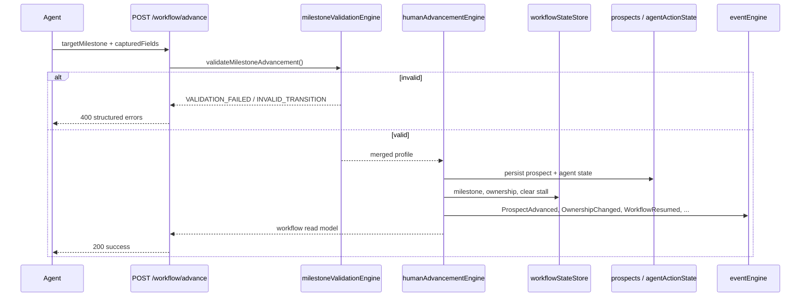

# Sprint 8A.3 — Human Advancement API

**Status:** Implemented  
**Rules:** BR-035, BR-036, BR-037

---

## API Specification

### `POST /api/mission-control/:phone/workflow/advance`

Human records interaction data and advances prospect to a validated milestone.

#### Request body

```json
{
  "targetMilestone": "INTERVIEW_SCHEDULED",
  "capturedFields": {
    "city": "Miami",
    "state": "FL",
    "authorization": true,
    "occupation": "Sales",
    "interviewType": "Zoom",
    "email": "prospect@example.com",
    "interviewDateTime": "2026-07-20T14:00:00.000Z",
    "outcome": "Recruited",
    "followUpDate": "2026-08-01",
    "followUpTime": "10:00",
    "closureReason": "Not interested",
    "doNotContactReason": "Requested removal"
  },
  "interactionNotes": "Called prospect, collected qualification info.",
  "interactionType": "phone"
}
```

| Field | Required | Description |
|-------|----------|-------------|
| `targetMilestone` | Yes | Canonical milestone ID (e.g. `QUALIFICATION`) |
| `capturedFields` | No | Data collected during human interaction |
| `interactionNotes` | No | Free-text agent notes (logged to timeline) |
| `interactionType` | No | `phone`, `whatsapp`, `in_person` |

#### Success response `200`

```json
{
  "success": true,
  "action": "workflow_advance",
  "message": "Prospect advanced successfully.",
  "previousMilestone": "QUALIFICATION",
  "targetMilestone": "FOLLOW_UP",
  "workflowOwnership": "WAITING_EVENT",
  "workflow": { },
  "eventsEmitted": ["HumanCallCompleted", "ProspectAdvanced", "WorkflowOwnershipChanged", "WorkflowResumed"]
}
```

#### Validation error `400`

```json
{
  "success": false,
  "action": "workflow_advance",
  "error": "VALIDATION_FAILED",
  "message": "Required field \"interviewDateTime\" is missing for milestone INTERVIEW_SCHEDULED.",
  "validation": {
    "targetMilestone": "INTERVIEW_SCHEDULED",
    "invalidTransition": false,
    "missingFields": ["interviewDateTime", "email"],
    "errors": [
      {
        "code": "REQUIRED_FIELD_MISSING",
        "field": "interviewDateTime",
        "message": "Required field \"interviewDateTime\" is missing for milestone INTERVIEW_SCHEDULED."
      }
    ]
  }
}
```

#### Invalid transition `400`

```json
{
  "success": false,
  "error": "INVALID_TRANSITION",
  "validation": {
    "invalidTransition": true,
    "errors": [{ "code": "INVALID_TRANSITION", "field": "targetMilestone", "message": "..." }]
  }
}
```

#### Unchanged endpoints

- `GET /api/mission-control/:phone` — unchanged shape; `workflow` reflects new state after advance
- `POST /api/mission-control/:phone/workflow` — Workflow Gate sync preserved
- `POST /api/mission-control/:phone/actions` — unchanged

---

## Validation Matrix (BR-037)

| Target milestone | Required fields | Additional rules |
|------------------|-----------------|------------------|
| `NEW_LEAD` | phone | — |
| `GREETING_SENT` | phone | — |
| `QUALIFICATION` | phone, city | — |
| `INTERVIEW_READY` | city, state, authorization, occupation | Full qualification via `getMissingFields()` |
| `INTERVIEW_SCHEDULED` | city, state, authorization, occupation, interviewDateTime | Qual complete; email if Zoom |
| `INTERVIEW_DUE` | above + confirmed | Interview confirmed |
| `INTERVIEW_COMPLETED` | interviewDateTime | — |
| `INTERVIEW_RESULT_PENDING` | interviewDateTime, outcome | — |
| `FOLLOW_UP` | followUpDate | Default outcome: Needs More Time |
| `ORIENTATION` | — | Default outcome: Recruited |
| `LICENSING` | outcome | — |
| `FAST_START` | outcome | — |
| `CLOSED` | — | Sets outcome Not Interested |
| `DO_NOT_CONTACT` | — | Terminal compliance flag |

**Engine:** `backend/core/milestoneValidationEngine.js` → `MILESTONE_REQUIRED_FIELDS`

---

## Allowed Transitions Table

Documented paths (`ALLOWED_TRANSITIONS`) plus **BR-035 human jump**: any non-terminal target is allowed when BR-037 validation passes.

| From | Allowed next (documented) |
|------|---------------------------|
| `NEW_LEAD` | GREETING_SENT, QUALIFICATION, DO_NOT_CONTACT, CLOSED |
| `GREETING_SENT` | QUALIFICATION, INTERVIEW_READY, CLOSED, DO_NOT_CONTACT |
| `QUALIFICATION` | INTERVIEW_READY, INTERVIEW_SCHEDULED, FOLLOW_UP, CLOSED, DO_NOT_CONTACT |
| `INTERVIEW_READY` | INTERVIEW_SCHEDULED, FOLLOW_UP, CLOSED, DO_NOT_CONTACT |
| `INTERVIEW_SCHEDULED` | INTERVIEW_DUE, FOLLOW_UP, CLOSED, DO_NOT_CONTACT |
| `INTERVIEW_DUE` | INTERVIEW_COMPLETED, FOLLOW_UP |
| `INTERVIEW_COMPLETED` | INTERVIEW_RESULT_PENDING |
| `INTERVIEW_RESULT_PENDING` | FOLLOW_UP, ORIENTATION, CLOSED, QUALIFICATION |
| `FOLLOW_UP` | QUALIFICATION, INTERVIEW_SCHEDULED, CLOSED |
| `ORIENTATION` | LICENSING, FAST_START, CLOSED |
| `LICENSING` | FAST_START, CLOSED |
| `FAST_START` | CLOSED |
| `CLOSED` | *(none)* |
| `DO_NOT_CONTACT` | *(none)* |

**Blocked globally:** → `NEW_LEAD`; any transition from `CLOSED` / `DO_NOT_CONTACT`

---

## Event Flow



### Events on successful advance

| Condition | Events |
|-----------|--------|
| Always | `ProspectAdvanced` |
| Ownership change | `WorkflowOwnershipChanged` |
| Resume Atlas / WAITING_EVENT | `WorkflowResumed` |
| `interactionType: phone` | `HumanCallCompleted` |
| Qualification fields captured | `QualificationUpdated` |
| → INTERVIEW_SCHEDULED | `InterviewScheduled` |
| outcome captured | `InterviewResultRecorded` |
| → CLOSED | `ProspectClosed` |
| → DO_NOT_CONTACT | `DoNotContactApplied` |

---

## Modules

| Module | Role |
|--------|------|
| `milestoneValidationEngine.js` | BR-037 validation |
| `humanAdvancementEngine.js` | BR-035 execution |
| `humanAdvancementEvents.js` | Event emission |
| `workflowAdvanceController.js` | HTTP handler |

---

## Test

```bash
node backend/dev/verifySprint8A3.js
```

---

## Deferred (8A.4+)

- Automated WhatsApp confirmation on human-scheduled interview (BR-035 principle 16)
- Mission Control UI for advancement form
- CRM integration
