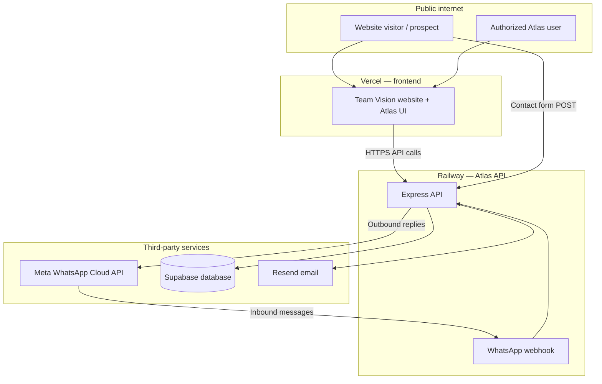
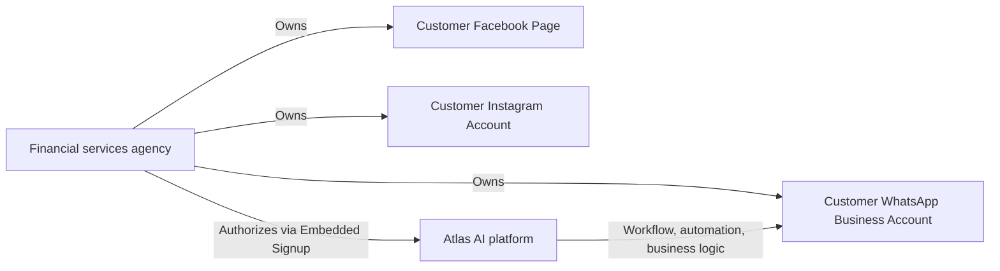
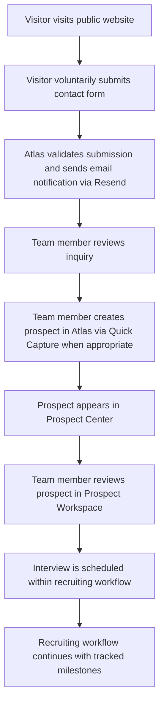

# Meta Approval Portfolio

## Document control

| Field | Value |
|-------|-------|
| **Document ID** | DOC-0002 |
| **Title** | Meta Approval Portfolio |
| **Version** | 1.1 |
| **Status** | Approved |
| **Owner** | Atlas Development Team |
| **Last Updated** | 2026-07-20 |
| **Related Sprint** | 11.4 |
| **Related Release** | Release-11.3.1 |

> **Status values:** Draft · Review · Approved

---

## Related documents

| Document ID | Document | Description |
|-------------|----------|-------------|
| DOC-0001 | [Current_System_State.md](../../00-executive/Current_System_State.md) | Authoritative production state reference |
| DOC-0003 | [../07-security/Privacy_and_Data_Handling.md](../../07-security/Privacy_and_Data_Handling.md) | Privacy and data handling (Meta package) |
| DOC-0004 | [Meta_Review_QA.md](../../07-security/Meta_Review_QA.md) | Meta reviewer Q&A (Meta package) |
| — | [WHATSAPP_EMBEDDED_SIGNUP.md](../WHATSAPP_EMBEDDED_SIGNUP.md) | Technical Embedded Signup guide |
| — | [09-releases/sprints/SPRINT_11_1_LIVE_WHATSAPP.md](../../09-releases/sprints/SPRINT_11_1_LIVE_WHATSAPP.md) | Live WhatsApp pipeline specification |
| — | Privacy Policy (public) | `https://teamvisionfinancial.com/privacy` |
| — | Terms of Service (public) | `https://teamvisionfinancial.com/terms` |
| — | Legal (public) | `https://teamvisionfinancial.com/legal` |

---

## 1. Executive summary

**Team Vision Financial** operates **Atlas AI**, an operational software platform for financial services organizations. Atlas helps licensed professionals and agency teams capture prospects, organize recruiting workflows, schedule interviews, and track recruiting activity — with the goal of improving operational efficiency while maintaining compliant, user-initiated communication.

This document is prepared for **Meta Business Verification**, **WhatsApp Business Platform** review, and **Facebook Developer App Review**. It is written for Meta reviewers who may not be familiar with Atlas.

> **Assurance for Meta reviewers**  
> Atlas is **not** a mass marketing platform. Atlas **does not** generate unsolicited communications. WhatsApp Business is used only in contexts where the user has voluntarily submitted information, initiated a conversation with the business, or is responding within an existing thread. Each customer **owns** their Meta business assets; Atlas provides workflow, automation, and business logic on the customer’s behalf.

| Question | Answer |
|----------|--------|
| What is Atlas? | An operational platform for financial services recruiting and prospect workflow |
| Who uses it? | Licensed professionals and internal agency staff (not the general public) |
| How is Meta used? | WhatsApp Cloud API, Embedded Signup, webhooks, and Graph API for business messaging |
| Is messaging unsolicited? | **No.** Contact begins voluntarily via website form or user-initiated WhatsApp message |
| Who owns Meta assets? | The customer (agency). Atlas does not own customer WABAs, Pages, or Instagram accounts |

---

## 2. Company overview

| Field | Detail |
|-------|--------|
| **Legal / brand name** | Team Vision Financial |
| **Industry** | Financial services — life insurance, retirement planning, financial education |
| **Primary market** | Individuals and families in the United States |
| **Public website** | [teamvisionfinancial.com](https://teamvisionfinancial.com) |
| **Contact phone** | (786) 752-8080 |
| **Contact email** | info@teamvisionfinancial.com |
| **Office address** | 2500 NW 79th Ave, Suite 189, Doral, FL 33122 |

Team Vision Financial provides educational guidance and access to financial products through licensed professionals. The public website explains services, publishes legal and privacy disclosures, and offers a voluntary consultation request form. Authorized agency staff use Atlas AI as the internal operations platform behind those business activities.

---

## 3. Business legitimacy

**Team Vision Financial** is a **legitimate financial services organization** operating in the United States. The company provides educational guidance and access to financial products through licensed professionals at a published business address and public contact channels.

**Atlas AI** is an **internal operational platform** developed by Team Vision Financial to improve:

- Recruiting operations
- Prospect management
- Interview scheduling
- Communication workflows

The platform supports **legitimate business activities**, including recruiting, scheduling interviews, and managing prospect relationships. Atlas exists to help licensed professionals and agency teams operate more efficiently — not to broadcast messages to the public.

| Statement | Detail |
|-----------|--------|
| Business type | Financial services organization (United States) |
| Platform type | Internal operational software for authorized agency staff |
| Primary users | Licensed agents and internal recruiting teams |
| Public access | Marketing website only; Atlas application requires authentication |

> **Important distinction for Meta reviewers**  
> Atlas is **not** a consumer messaging application. Atlas is **not** designed for anonymous communication or mass messaging. The Atlas application is accessible only to authenticated agency staff. WhatsApp Business messaging occurs in established, user-initiated business contexts under customer-owned accounts — never as unsolicited outreach to unknown recipients.

---

## 4. About Atlas AI

Atlas AI is the **operational platform** used by Team Vision Financial and partner financial services agencies to run day-to-day recruiting and prospect management workflows.

Atlas helps organizations:

| Capability | Description |
|------------|-------------|
| **Capture prospects** | Record prospect information from agent entry or user-initiated WhatsApp conversations |
| **Organize prospects** | Searchable pipeline views and single-prospect workspaces |
| **Manage recruiting workflows** | Structured milestone progression with business rules |
| **Schedule interviews** | Interview coordination within recruiting workflows |
| **Track recruiting activity** | Activity feeds, workflow events, and executive visibility |
| **Improve operational efficiency** | Centralized Mission Control queue and dashboards for agency teams |

Atlas is **not** a consumer social application. The public interacts with the Team Vision Financial marketing website. Authorized users access the private Atlas application at `/app` after authentication.

| Surface | Audience | Access |
|---------|----------|--------|
| Public website | Prospects, clients, partners | Open; no Atlas login required |
| Atlas application | Licensed agents and internal staff | Authenticated access only (`/app/*`) |

> **Important distinction**  
> Atlas is an **operational workflow platform**, not a broadcast or lead-generation marketing engine. It does not purchase contact lists, send bulk promotional messages, or message users without prior interaction.

---

## 5. Business purpose

Atlas exists to support legitimate financial services and recruiting operations:

1. **Voluntary prospect intake** — Individuals request information through the public website contact form, referrals, agent entry, or by initiating a WhatsApp conversation with the business.
2. **Recruiting workflow management** — Structured qualification, interview scheduling, follow-up, and milestone tracking for career and client opportunities.
3. **Conversation visibility** — Secure logging and agent visibility for user-initiated WhatsApp threads connected to the business.
4. **Policy-aligned automation** — Business rules govern interview types, workflow gates, do-not-contact handling, and messaging context.

Atlas supports agency productivity and compliance-oriented workflow. It does **not** replace licensed professional judgment, underwriting decisions, or carrier relationships.

---

## 6. Platform overview

### 6.1 Current business flow (production)

The diagram below shows the **current production business flow** from public website contact through recruiter review. WhatsApp Business messaging occurs only after voluntary contact and within user-initiated or established conversation contexts.

```
Public Website
        │
        ▼
 Contact Form
        │
        ▼
 Team Vision
        │
        ▼
     Atlas AI
        │
        ▼
 Prospect Center
        │
        ▼
 Recruiter Review
        │
        ▼
 WhatsApp Business
```

> **Note:** The contact form delivers an email notification to the business team (Resend). An authorized agent may create a prospect record in Atlas via Quick Capture. WhatsApp messaging follows user-initiated contact — Atlas does not send WhatsApp messages as the first touchpoint after a website form submission.

### 6.2 Planned architecture

> 🟡 **Planned Architecture — not current production**

The following diagram describes a **future** multi-channel architecture (Communication Hub). It is included for transparency and **must not** be interpreted as live functionality in Release-11.3.1.

```
Website / Facebook / Instagram
              │
              ▼
      Communication Hub
              │
              ▼
           Atlas AI
              │
              ▼
     Prospect Management
              │
              ▼
      Human Recruiter
```

### 6.3 Production architecture (technical)



### 6.4 Infrastructure components

| Component | Role | Production status |
|-----------|------|-------------------|
| **Vercel** | Hosts public website and Atlas web application | **Live** |
| **Railway** | Hosts Atlas API and WhatsApp webhook endpoint | **Live** |
| **Supabase** | PostgreSQL database for prospects, logs, sessions, workflow events | **Live** |
| **Resend** | Delivers contact-form email notifications (server-side only) | **Live** |
| **Meta** | WhatsApp Business Platform — Embedded Signup, Cloud API, webhooks | **Live** (backend pipeline) |

### 6.5 Communication ownership model

Each financial services customer connects and **owns** their own Meta business assets. Atlas manages workflow, automation, and business logic — but **does not own** customer Meta assets.



| Asset | Owner | Atlas role |
|-------|-------|------------|
| WhatsApp Business Account (WABA) | Customer | Operate messaging on customer’s behalf after authorization |
| Registered WhatsApp phone number | Customer | Send/receive via Cloud API for connected number |
| Facebook Page | Customer | Required business asset during Meta onboarding |
| Instagram account | Customer | May be linked to customer Meta business portfolio; Atlas does not operate Instagram DMs in production today |

---

## 7. Current production features

The following section lists capabilities **implemented and deployed** as of **Release-11.3.1**, aligned with [Current_System_State.md](../../00-executive/Current_System_State.md) (DOC-0001). Planned capabilities are listed separately in [Section 15](#15-future-roadmap-planned-features).

### ✅ Production Features

#### Authentication

| Feature | Status | Description |
|---------|--------|-------------|
| Session bootstrap | **Live** | Authorized users authenticate to Atlas via bootstrap token and bearer session (`POST /api/auth/session`) |
| Protected API routes | **Live** | Internal endpoints (e.g. Quick Capture) require authenticated Atlas user |
| Public site separation | **Live** | Marketing pages are public; `/app/*` requires authentication |

> **Note:** Full multi-user login with formal role-based access control is **planned** (see [Section 15](#15-future-roadmap-planned-features)). Current production uses interim bootstrap authentication for internal agency use.

#### Public website

| Feature | Status | Description |
|---------|--------|-------------|
| Corporate homepage | **Live** | Services, about, careers, and contact sections |
| Privacy Policy | **Live** | `/privacy` |
| Legal disclosures | **Live** | `/legal` |
| Terms of Service | **Live** | `/terms` |
| Atlas Sign In | **Live** | Routes to private application at `/app` |

#### Contact form

| Feature | Status | Description |
|---------|--------|-------------|
| Voluntary inquiry form | **Live** | Name, email, and message submitted by visitor |
| Server-side validation | **Live** | Input validation and sanitization |
| Spam protection | **Live** | Honeypot field and rate limiting (5 submissions per IP per 15 minutes) |
| Email delivery | **Live** | `POST /api/contact` on Railway → Resend → business inbox |

> The contact form delivers an email notification to the business team. It does **not** send WhatsApp messages to the visitor.

#### Atlas application modules

| Module | Route | Status | Description |
|--------|-------|--------|-------------|
| **Executive Dashboard** | `/app` | **Live** | Agency leadership metrics, focus areas, and recommendations |
| **Mission Control** | `/app/mission-control` | **Live** | Agent queue for active prospect workflows |
| **Prospect Center** | `/app/prospect-center` | **Live** | Searchable prospect pipeline |
| **Prospect Workspace** | `/app/prospect-workspace/:phone` | **Live** | Single-prospect profile, activity feed, and details |
| **Quick Capture** | `/app/quick-capture` | **Live** | Agent-initiated prospect entry with duplicate detection |
| **WhatsApp Connect** | `/app/settings/whatsapp` | **Live** | Meta Embedded Signup to link customer-owned WABA |

#### Email notifications

| Feature | Status | Description |
|---------|--------|-------------|
| Contact form notification | **Live** | Resend delivers inquiry email to configured business inbox (`CONTACT_FORM_TO_EMAIL`) |
| Reply-To header | **Live** | Set to visitor email for direct team reply |

#### WhatsApp and messaging (backend — Sprint 11.1)

| Feature | Status | Description |
|---------|--------|-------------|
| Webhook verification | **Live** | `GET /webhook` with verify token |
| Inbound message pipeline | **Live** | Signed `POST /webhook`; parse, deduplicate, resolve/create prospect, log message |
| Outbound send path | **Live** | Send replies via WhatsApp Cloud API with logging |
| Embedded Signup exchange | **Live** | Server-side OAuth code exchange; encrypted token storage when configured |
| Workflow event audit | **Live** | Events such as `MessageReceived`, `MessageSent`, `ProspectCreated`, `ConversationStarted` |

#### Infrastructure integrations

| Integration | Status | Description |
|-------------|--------|-------------|
| **Railway backend** | **Live** | Express API at production Railway host |
| **Vercel frontend** | **Live** | React application; API calls via `VITE_API_BASE_URL` |
| **Supabase** | **Live** | Persistent storage for prospects, conversation logs, sessions, workflow events |
| **Resend** | **Live** | Transactional email for contact form only |

#### UI placeholders (not production functionality)

The following Atlas application pages exist as **UI shells only** and do not provide production functionality:

| Feature | Status |
|---------|--------|
| Standalone Conversations page | UI shell — no standalone public messaging interface |
| Appointments, Analytics, Settings (except WhatsApp) | UI shell |

---

## 8. User journey

Atlas supports recruiting workflows that begin **only after the user voluntarily provides information or initiates contact**. The platform does not message users who have not interacted with the business.

### 8.1 Primary journey — website contact form



| Step | What happens | Communication initiated by |
|------|----------------|---------------------------|
| 1 | Visitor browses teamvisionfinancial.com | Visitor (voluntary) |
| 2 | Visitor submits contact form with name, email, message | **Visitor (voluntary)** |
| 3 | Atlas delivers email to business inbox | System notification (not WhatsApp to visitor) |
| 4 | Team reviews inquiry and responds by email or phone during business hours | Business response to voluntary inquiry |
| 5 | Authorized agent enters prospect record in Atlas (Quick Capture) when qualifying | Internal workflow |
| 6 | Prospect visible in Prospect Center and Prospect Workspace | — |
| 7 | Interview scheduling and recruiting milestones proceed per business rules | **Opt-in / established relationship context** |

> **Policy alignment:** Communications with the prospect begin **only after the user voluntarily submits their information** through the contact form (or otherwise initiates contact). Atlas does not send WhatsApp messages as the first touchpoint following a website form submission.

### 8.2 Secondary journey — user-initiated WhatsApp

| Step | What happens |
|------|----------------|
| 1 | User discovers Team Vision through website, referral, advertisement, or existing relationship |
| 2 | User **initiates** a WhatsApp message to the business number (e.g. Click-to-WhatsApp) |
| 3 | Meta delivers message to Atlas via webhook |
| 4 | Atlas logs message, creates or links prospect record, emits workflow events |
| 5 | Authorized agents view conversation in Mission Control / Prospect Workspace |
| 6 | Agents or workflow steps **reply within the existing conversation** — never as unsolicited first contact |

### 8.3 Administrator journey — WhatsApp Business connection

| Step | What happens |
|------|----------------|
| 1 | Authorized Atlas user opens Settings → Connect WhatsApp Business |
| 2 | User completes Meta Embedded Signup for their **own** WABA |
| 3 | Atlas exchanges authorization server-side and stores encrypted credentials |
| 4 | Webhook subscription enables inbound/outbound messaging for the connected number |

---

## 9. Intended WhatsApp Business use

WhatsApp Business will be used **only** for legitimate, context-appropriate business messaging:

| Use case | Description | Initiation type |
|----------|-------------|-----------------|
| **Answering questions** | Respond to prospect or client inquiries within an active thread | User-initiated or response |
| **Scheduling interviews** | Coordinate interview date, time, and location | Opt-in / established workflow |
| **Interview reminders** | Remind prospect of scheduled interview | Related to prior opt-in and scheduling |
| **Recruiting follow-up** | Follow up on an ongoing recruiting conversation | Response within existing thread |
| **Responding to prospect requests** | Provide requested information about careers or services | User-initiated request |

### 9.1 What Atlas does not do

| Prohibited use | Atlas policy |
|----------------|--------------|
| Spam or bulk promotional broadcasts | **Not permitted** |
| Purchased contact lists | **Not used** |
| Messaging without prior interaction | **Not permitted** |
| Cold outreach to unknown numbers | **Not permitted** |
| Non-financial-services unrelated content | **Not permitted** |

> **Clear statement for Meta reviewers**  
> Atlas does **not** send spam. Atlas does **not** purchase contact lists. Atlas does **not** message users without prior interaction. All WhatsApp activity occurs within user-initiated conversations or authorized business workflow contexts tied to voluntary contact.

### 9.2 Session and template compliance

Outbound WhatsApp messaging follows WhatsApp Business Platform rules, including customer care session windows and approved message templates where required outside the 24-hour session window.

---

## 10. Responsible messaging policy

Team Vision Financial and Atlas AI commit to responsible messaging practices aligned with Meta Business Messaging policies.

### 10.1 Core commitments

| Commitment | Description |
|------------|-------------|
| **Voluntary contact only** | Atlas only communicates with users who **voluntarily initiate contact** through approved business channels — including the public website contact form, user-initiated WhatsApp messages, referrals, or established ongoing conversations |
| **Purpose-limited communications** | All messages are **directly related** to the user's request for employment information, financial services information, or interview scheduling |
| **Human recruiters in control** | Atlas improves response time and consistency of recruiting workflows while **keeping human recruiters in control** of prospect review, interview decisions, and outbound messaging |
| **No unsolicited messages** | Atlas does **not** send unsolicited messages |
| **No purchased lists** | Atlas does **not** purchase contact lists |
| **No bulk marketing** | Atlas does **not** send bulk marketing campaigns |

### 10.2 Operational implementation

| Principle | Implementation |
|-----------|----------------|
| **Voluntary contact first** | Website form submission or user-initiated WhatsApp message precedes conversational messaging |
| **No unsolicited outreach** | Atlas is not used for first-contact promotional blasts to unknown numbers |
| **Do-not-contact respect** | Workflow supports do-not-contact and closed prospect states per business rules |
| **Human oversight** | Agents review prospects and conversations in Mission Control and Prospect Workspace |
| **Abuse prevention** | Contact form rate limiting; server-side validation; honeypot spam field |
| **Content scope** | Messages relate to financial services, recruiting, appointments, and requested information |
| **Customer asset ownership** | Each agency owns its WABA; Atlas operates only with customer authorization |
| **Session compliance** | Outbound WhatsApp messaging follows WhatsApp Business Platform session and template rules |

> **Clear statement for Meta reviewers**  
> Atlas does **not** send spam. Atlas does **not** purchase contact lists. Atlas does **not** message users without prior interaction. Atlas does **not** send bulk marketing campaigns. All WhatsApp activity occurs within user-initiated conversations or authorized business workflow contexts tied to voluntary contact.

Violations of Meta Business Messaging policies are grounds for disabling integrations, retraining staff, and corrective action.

---

## 11. Compliance statement

Atlas AI is designed to support **responsible business communications** in accordance with **Meta Business Messaging policies**.

| Statement | Detail |
|-----------|--------|
| **User-initiated contact** | The platform communicates only with users who **initiate contact** or **explicitly request information** through approved channels |
| **Human oversight** | Human oversight remains part of **every recruiting workflow** — agents review prospects, conversations, and interview decisions in Mission Control and Prospect Workspace |
| **Administrative automation** | Atlas exists to **automate administrative tasks** (logging, workflow tracking, notification delivery, conversation visibility) — **not** to replace business decisions made by licensed professionals |
| **Policy alignment** | Messaging practices follow Meta session rules, template requirements, and business rules governing do-not-contact and workflow gates |
| **Transparency** | Production capabilities and planned features are clearly separated in this document |

Atlas is not a mass messaging tool. It is an operational platform that helps financial services organizations respond responsibly to users who have chosen to engage.

---

## 12. Privacy and data protection

### 12.1 Public disclosures

Published on the production website:

| Page | URL |
|------|-----|
| Privacy Policy | `https://teamvisionfinancial.com/privacy` |
| Legal | `https://teamvisionfinancial.com/legal` |
| Terms of Service | `https://teamvisionfinancial.com/terms` |

### 12.2 Data collected (typical)

| Source | Data types | Purpose |
|--------|------------|---------|
| Contact form | Name, email, message | Respond to voluntary inquiry |
| WhatsApp webhook | Phone number, message content, timestamps, Meta message IDs | Conversation management and audit |
| Atlas application | Prospect profile fields entered by authorized agents | Recruiting workflow |
| Authentication | Session tokens | Secure access to Atlas application |

### 12.3 Data practices

- Personal information is **not sold** to third parties.
- Data is used to operate services, respond to inquiries, manage recruiting workflows, and comply with legal obligations.
- Service providers (Vercel, Railway, Supabase, Resend) process data under appropriate contractual and technical safeguards.
- Access to the Atlas application is restricted to **authenticated internal users**.
- Meta credentials and API keys are stored **server-side only** and are not exposed in public frontend bundles.

For complete policy language, refer to the live Privacy Policy at teamvisionfinancial.com.

---

## 13. Security overview

Atlas implements the following **existing** security measures. This section does **not** claim third-party certifications (e.g. SOC 2, ISO 27001) that are not in place.

| Control | Description |
|---------|-------------|
| **HTTPS / TLS** | Production frontend (Vercel) and API (Railway) served over HTTPS |
| **Authentication** | Atlas `/app` routes and protected API endpoints require valid session |
| **Environment variables** | Secrets (Meta app secret, Resend API key, Supabase credentials, bootstrap token) stored in deployment environment — not in source code |
| **Server-side validation** | Contact form and API inputs validated on the server |
| **Webhook verification** | Meta webhook subscription verify token; `x-hub-signature-256` validation when app secret is configured |
| **Token encryption** | WhatsApp access tokens encrypted at rest (AES-256-GCM) when `META_TOKEN_ENCRYPTION_KEY` is configured |
| **Secure deployment separation** | Frontend on Vercel; API on Railway; database on Supabase |
| **Access control** | Prospect data and internal workflows are not publicly accessible; Atlas app requires authentication |
| **Rate limiting** | Contact form limited to 5 submissions per IP per 15 minutes |
| **CORS / API client** | Frontend calls dedicated API host via configured base URL; secrets excluded from Vite public build |

> **Planned enhancement:** Formal multi-user login with role-based access control is on the product backlog and is not yet production functionality.

---

## 14. Meta product usage

| Meta product | How Atlas uses it | Production status |
|--------------|-------------------|-------------------|
| **WhatsApp Cloud API** | Send and receive business messages; message logging | **Live** |
| **WhatsApp Business Platform — Embedded Signup** | Agencies connect customer-owned WABA | **Live** |
| **Facebook Login for Business** | OAuth during Embedded Signup flow | **Live** |
| **Graph API** | Token exchange, WABA subscription, health checks | **Live** |
| **Webhooks** | Inbound message and delivery status notifications | **Live** |
| **Facebook Page** | Customer-owned business asset required during onboarding | **Customer-owned** |
| **Instagram** | May be linked to customer Meta business portfolio | **Customer-owned; Atlas does not operate Instagram DMs in production** |
| **Messenger** | — | **Not implemented** |

### 14.1 Permissions scope (conceptual)

Atlas requests only the permissions required to:

- Complete Embedded Signup for the connecting business administrator
- Subscribe the customer’s WABA to Atlas webhooks
- Receive inbound messages delivered to the connected business number
- Send messages within policy-compliant conversation contexts

Atlas does **not** use Meta products for unrelated consumer social features, advertising automation, or messaging outside the described business purposes.

---

## 15. Future roadmap (planned features)

> ⚠️ **PLANNED WORK — NOT CURRENT PRODUCTION**  
> The capabilities below are on the Atlas product roadmap. They are included for transparency with Meta reviewers and **must not** be interpreted as live features in Release-11.3.1.

### 🟡 Planned Features

| Planned capability | Description | Status |
|--------------------|-------------|--------|
| **AI Conversation Engine** | Structured, policy-aware conversation automation (Sprint 11.4) | 🟡 Planned |
| **Communication Hub** | Unified architecture for multi-channel messaging coordination (see [Section 6.2](#62-planned-architecture)) | 🟡 Planned |
| **WhatsApp Integration (expanded)** | Deeper conversation orchestration UI and automation beyond current backend pipeline | 🟡 Planned |
| **Instagram Messaging** | Business messaging via Instagram Direct | 🟡 Planned — not implemented |
| **Messenger Integration** | Facebook Messenger business messaging | 🟡 Planned — not implemented |
| **Google Calendar Automation** | Automated calendar sync for interview scheduling | 🟡 Planned — not implemented |
| **Executive Intelligence** | Advanced analytics and AI-assisted leadership insights beyond current dashboard | 🟡 Planned |
| **Workflow Automation** | Expanded rule-driven automation across recruiting milestones | 🟡 Planned |
| **Formal user authentication** | Multi-user login replacing interim bootstrap token | 🟡 Planned |
| **Automated AI conversational replies** | Policy-aware automated responses within Conversation Engine | 🟡 Planned — not implemented |

All planned features will maintain the same core principles: **voluntary user contact**, **customer-owned Meta assets**, **human oversight**, and **Meta policy compliance**.

---

## 16. Business value

Atlas AI delivers operational value to financial services organizations while maintaining human control over recruiting decisions:

| Value | Description |
|-------|-------------|
| **Reduced administrative work** | Automates prospect logging, workflow tracking, activity feeds, and conversation visibility |
| **Improved recruiter efficiency** | Centralizes prospect pipeline, Mission Control queue, and single-prospect workspace views |
| **Faster response times** | Surfaces inbound inquiries and WhatsApp messages to authorized agents promptly |
| **Consistent recruiting workflows** | Applies structured milestones and business rules across the prospect lifecycle |
| **Human control preserved** | Recruiters review prospects, schedule interviews, and decide when and how to respond — Atlas supports; it does not replace judgment |

Atlas is designed to help organizations **respond faster and more consistently** to users who have voluntarily initiated contact — not to increase message volume or reach unknown audiences.

---

## 17. Conclusion

**Team Vision Financial** operates **Atlas AI** as a production operational platform for financial services organizations. The public website provides transparent information and a voluntary contact channel. The private Atlas application supports prospect management, recruiting workflows, and user-initiated WhatsApp business messaging under **customer-owned** WhatsApp Business Accounts.

**Summary for Meta review:**

| Statement | Status |
|-----------|--------|
| Atlas is a legitimate financial services operational platform | ✅ Accurate |
| Atlas is not a mass marketing or spam platform | ✅ Accurate |
| Users voluntarily submit information or initiate WhatsApp contact before messaging begins | ✅ Accurate |
| Atlas does not send unsolicited messages or bulk marketing campaigns | ✅ Accurate |
| Human recruiters remain in control of recruiting decisions | ✅ Accurate |
| Each customer owns and connects their Meta business assets | ✅ Accurate |
| Planned features are clearly separated from production capabilities | ✅ Accurate |

We welcome Meta Business Verification, WhatsApp Business Platform review, and Facebook Developer App Review. For technical integration detail, see [WHATSAPP_EMBEDDED_SIGNUP.md](../WHATSAPP_EMBEDDED_SIGNUP.md), [09-releases/sprints/SPRINT_11_1_LIVE_WHATSAPP.md](../../09-releases/sprints/SPRINT_11_1_LIVE_WHATSAPP.md), and [Current_System_State.md](../../00-executive/Current_System_State.md) (DOC-0001).

---

## Document revision history

| Version | Date | Author | Changes |
|---------|------|--------|---------|
| 1.1 | 2026-07-20 | Atlas Development Team | Finalized after architectural review — Business Legitimacy, Compliance Statement, Business Value, production/planned separation, and messaging policy expansion |
| 1.0 | 2026-07-20 | Atlas Development Team | Initial Meta Approval Portfolio draft for Meta Business Verification and WhatsApp Platform review |
