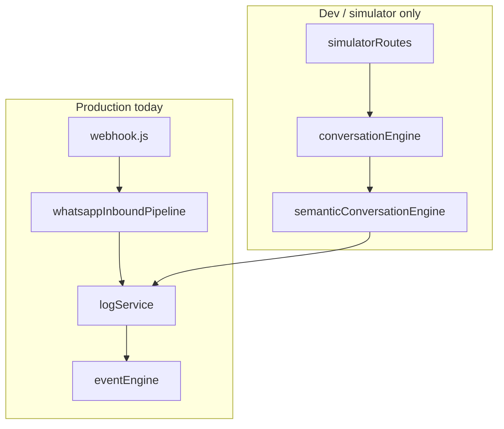
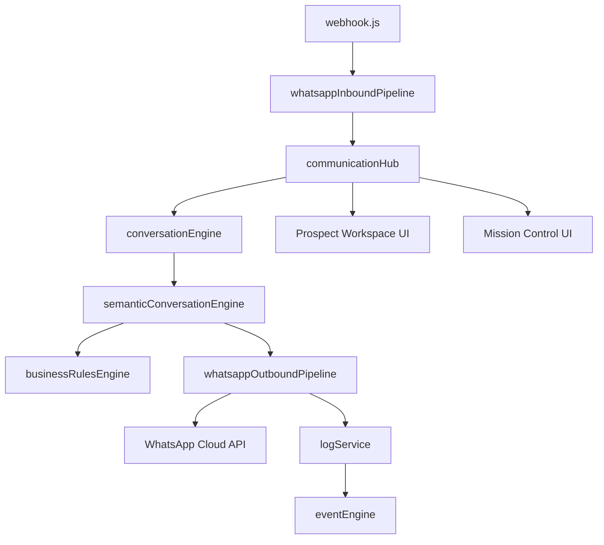
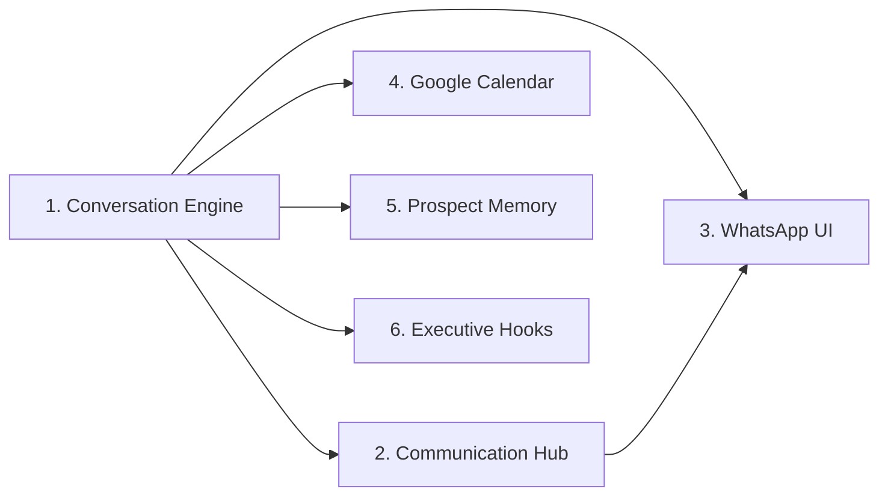

# Sprint 11.4 — Implementation Plan

## Document control

| Field | Value |
|-------|-------|
| **Document ID** | DOC-0512 |
| **Title** | Sprint 11.4 Implementation Plan |
| **Version** | 1.0 |
| **Status** | Draft |
| **Owner** | Atlas Development Team |
| **Last Updated** | 2026-07-20 |
| **Related Sprint** | 11.4 |
| **Related Release** | Release-11.4 (planned) |

> **Status values:** Draft · Review · Approved

---

## Related documents

| Document ID | Document | Description |
|-------------|----------|-------------|
| DOC-0511 | [Sprint-11.4.md](./Sprint-11.4.md) | Sprint specification and acceptance criteria |
| DOC-0010 | [Communication_Hub.md](../02-architecture/Communication_Hub.md) | Communication Hub architecture |
| DOC-0001 | [Current_System_State.md](../00-executive/Current_System_State.md) | Production baseline (Release-11.3.1) |
| — | [SPRINT_11_1_LIVE_WHATSAPP.md](../SPRINT_11_1_LIVE_WHATSAPP.md) | Live WhatsApp pipeline (do not bypass layers) |
| — | [EVENT_CATALOG.md](../EVENT_CATALOG.md) | Workflow event types |
| — | [BUSINESS_RULES.md](../BUSINESS_RULES.md) | BR-001+ source of truth |

---

## Purpose

Engineering blueprint for **Sprint 11.4**. This document guides implementation — it is **not** user-facing documentation and **not** a Meta submission artifact.

**Baseline:** Release-11.3.1 (production). WhatsApp 11.1 pipeline persists inbound/outbound messages but does **not** invoke the Conversation Engine on live webhooks.

---

## 1. Sprint objective

Wire the **existing Conversation Engine** into the **live WhatsApp pipeline**, establish the **Communication Hub** module boundaries, and deliver **UI integration** for agent-visible conversation orchestration — while preserving business rules, event auditability, and Meta policy compliance.

**Success criteria (sprint level):**

1. Inbound WhatsApp message → Conversation Engine → outbound reply via WhatsApp Cloud API (production path)
2. Communication Hub module defines channel adapter contract (WhatsApp first)
3. Prospect Workspace and Mission Control show actionable conversation state
4. `backend/dev/verifySprint11_4.js` passes
5. No bypass of 11.1 pipeline layers (webhook → inbound → engine → outbound → log → events)

---

## 2. Architecture overview

### 2.1 Current state (Release-11.3.1)



### 2.2 Target state (Sprint 11.4)



### 2.3 Layer rules (non-negotiable)

Per [SPRINT_11_1_LIVE_WHATSAPP.md](../SPRINT_11_1_LIVE_WHATSAPP.md):

- Do **not** bypass `whatsappInboundPipeline` or `whatsappOutboundPipeline`
- Do **not** send WhatsApp messages directly from UI or engine without outbound pipeline
- All messages emit workflow events via existing event bridge
- Business rules evaluated before outbound send (BR-008 and related)

---

## 3. Features to build

Build in priority order below.

---

### Feature 1 — AI Conversation Engine (live wiring)

| Field | Detail |
|-------|--------|
| **Priority** | 1 |
| **Business objective** | Respond to user-initiated WhatsApp messages with timely, policy-compliant replies; reduce manual agent burden while keeping humans in control |
| **Technical objective** | Connect `whatsappInboundPipeline` to `conversationEngine.handleIncomingMessage()` and route engine replies through `whatsappOutboundPipeline` |

**Files likely to change:**

| File | Change |
|------|--------|
| `backend/core/whatsappInboundPipeline.js` | Invoke Communication Hub / Conversation Engine after persist |
| `backend/core/conversationEngine.js` | Ensure production-safe entry; return structured reply payload |
| `backend/core/semanticConversationEngine.js` | Return outbound text; avoid dev-only assumptions |
| `backend/core/whatsappOutboundPipeline.js` | Accept engine-initiated sends; idempotent correlation IDs |
| `backend/routes/webhook.js` | No logic change expected — keep fast 200 |
| `backend/dev/verifySprint11_4.js` | **New** — end-to-end verification |

**Dependencies:**

- Sprint 11.1 pipeline (complete)
- `businessRulesEngine.js`, `eventEngine.js`, `logService.js`
- WhatsApp credentials (`WHATSAPP_ACCESS_TOKEN`, `WHATSAPP_PHONE_NUMBER_ID`)

**Acceptance criteria:**

- [ ] Live inbound webhook triggers Conversation Engine after message persist
- [ ] Engine reply sent via outbound pipeline with `MessageSent` event
- [ ] BR-008 and related rules gate outbound content
- [ ] Idempotent handling on duplicate Meta message IDs (existing 11.1 dedup preserved)
- [ ] Simulator and production paths share same engine entry point
- [ ] `verifySprint11_4.js` passes

---

### Feature 2 — Communication Hub

| Field | Detail |
|-------|--------|
| **Priority** | 2 |
| **Business objective** | Single internal boundary for all channels; prepare for future email/SMS without rewriting engines |
| **Technical objective** | Introduce `communicationHub` module with channel adapter interface; WhatsApp as first adapter |

**Files likely to change:**

| File | Change |
|------|--------|
| `backend/core/communicationHub.js` | **New** — route inbound/outbound by channel |
| `backend/core/communicationHubTypes.js` | **New** — adapter contract, message envelope |
| `backend/core/whatsappChannelAdapter.js` | **New** — wraps inbound/outbound pipelines |
| `docs/02-architecture/Communication_Hub.md` | Update from placeholder to reflect implemented boundaries |

**Dependencies:**

- Feature 1 (engine wiring)
- [Communication_Hub.md](../02-architecture/Communication_Hub.md) (DOC-0010)

**Acceptance criteria:**

- [ ] All production WhatsApp traffic routes through Communication Hub
- [ ] Adapter interface documented with typed message envelope
- [ ] No direct webhook → engine calls outside hub
- [ ] Event emission unchanged (channel-agnostic per EVENT_CATALOG)
- [ ] Future channel adapters can register without modifying Conversation Engine

---

### Feature 3 — WhatsApp UI Integration

| Field | Detail |
|-------|--------|
| **Priority** | 3 |
| **Business objective** | Agents see conversation threads and can review engine replies; human override remains available |
| **Technical objective** | Upgrade Mission Control and Prospect Workspace conversation surfaces from preview-only to functional thread views |

**Files likely to change:**

| File | Change |
|------|--------|
| `frontend/src/components/ConversationPanel.jsx` | Full thread display; agent compose (via API) |
| `frontend/src/pages/ProspectWorkspace.jsx` | Embed conversation panel |
| `frontend/src/pages/Dashboard.jsx` | Mission Control conversation integration |
| `frontend/src/services/missionControlService.js` | Conversation fetch/send endpoints |
| `frontend/src/services/prospectWorkspaceService.js` | Thread data for workspace |
| `backend/routes/missionControl.js` | Expose conversation thread if not present |
| `backend/controllers/agentActionController.js` | Agent-initiated send via outbound pipeline |
| `frontend/src/pages/Conversations.jsx` | Evaluate: implement or defer (currently UI shell) |

**Dependencies:**

- Feature 1 (messages flowing)
- Feature 2 (hub provides consistent message model)
- `prospectActivityFeedReadModel.js` (existing activity feed)

**Acceptance criteria:**

- [ ] Mission Control shows multi-message thread (not last-message preview only)
- [ ] Prospect Workspace includes conversation section with activity feed parity
- [ ] Agent manual send uses same outbound pipeline as engine
- [ ] UI polls or refreshes on focus (existing 15–20s pattern)
- [ ] No WhatsApp credentials in frontend

---

### Feature 4 — Google Calendar Integration

| Field | Detail |
|-------|--------|
| **Priority** | 4 |
| **Business objective** | Automate interview scheduling confirmations when Conversation Engine completes scheduling flow |
| **Technical objective** | Connect semantic engine scheduling path to production `calendarService` with proper OAuth/token management |

**Files likely to change:**

| File | Change |
|------|--------|
| `backend/services/calendarService.js` | Production token loading; error handling |
| `backend/core/semanticConversationEngine.js` | Scheduling confirmation → calendar create |
| `backend/core/schedulingEngine.js` | Align with capacity engine |
| `backend/core/capacityEngine.js` | Slot release on cancel/reschedule |
| `backend/scripts/generateRefreshToken.js` | Document production token setup |
| `.env.example` | Google Calendar env vars |

**Dependencies:**

- Feature 1 (engine live)
- Existing `calendarService` (implemented; used in simulator)
- BR scheduling rules

**Acceptance criteria:**

- [ ] Interview confirmation in engine creates Google Calendar event (when configured)
- [ ] Calendar failures degrade gracefully (logged; agent notified in UI)
- [ ] Capacity slots updated on create/cancel
- [ ] No calendar calls when `GOOGLE_*` env not configured (dev-safe)
- [ ] Verification script covers scheduling path (mock or test calendar)

---

### Feature 5 — Prospect Memory

| Field | Detail |
|-------|--------|
| **Priority** | 5 |
| **Business objective** | Conversation Engine retains prospect context across sessions for consistent recruiting dialogue |
| **Technical objective** | Persist and load conversation profile / memory state per prospect; integrate with `memoryUpdater` and profile engines |

**Files likely to change:**

| File | Change |
|------|--------|
| `backend/services/memoryUpdater.js` | Production persistence path |
| `backend/core/informationModel.js` | Profile schema alignment |
| `backend/core/informationExtractor.js` | Extract and merge inbound facts |
| `backend/core/semanticConversationEngine.js` | Load memory on inbound; save on state change |
| `backend/services/supabaseService.js` | Prospect profile fields (if schema extension needed) |
| `backend/database/migrations/` | **Possible** — prospect memory columns |

**Dependencies:**

- Feature 1 (engine live)
- Supabase prospect records
- `prospectWorkspaceProfileEngine.js`

**Acceptance criteria:**

- [ ] Inbound message loads existing prospect memory before engine run
- [ ] Scheduling and FAQ answers reflect prior conversation context
- [ ] Memory updates persisted after engine turn
- [ ] No memory leakage across prospects (phone-keyed isolation)
- [ ] Activity feed reflects memory-driven milestone changes

---

### Feature 6 — Executive Intelligence hooks

| Field | Detail |
|-------|--------|
| **Priority** | 6 |
| **Business objective** | Leadership visibility into conversation engine performance and recruiting pipeline impact |
| **Technical objective** | Emit read-model hooks from Conversation Engine events; extend executive dashboard with engine metrics (not full AI analytics) |

**Files likely to change:**

| File | Change |
|------|--------|
| `backend/core/executiveDashboardReadModel.js` | Conversation engine metrics hooks |
| `backend/core/agencyPulseEngine.js` | Response time / queue depth signals |
| `backend/routes/dashboard.js` | New metrics endpoints if needed |
| `frontend/src/components/executive/FocusCards.jsx` | Surface engine-driven focus items |
| `frontend/src/components/executive/RecommendationCards.jsx` | Engine status recommendations |
| `frontend/src/engines/executiveDashboardViewModel.js` | View model for new metrics |

**Dependencies:**

- Feature 1 (events flowing)
- Existing executive dashboard (Release-11.3.1)
- `workflowEventService.js`

**Acceptance criteria:**

- [ ] Executive dashboard shows conversation activity counts (inbound/outbound/engine-handled)
- [ ] Metrics derived from workflow events (no duplicate counting)
- [ ] Placeholder premium metrics remain placeholder (do not invent data)
- [ ] No blocking dependency for Features 1–3

---

## 4. Technical risks

| Risk | Impact | Mitigation |
|------|--------|------------|
| **Engine sends before BR validation** | Meta policy / compliance violation | Enforce `businessRulesEngine` gate on all outbound paths |
| **Duplicate replies on webhook retry** | User receives multiple messages | Preserve 11.1 dedup; add engine-level idempotency key |
| **24-hour session window violations** | Message delivery failures | Template path for out-of-window; document in engine |
| **Google Calendar token expiry** | Scheduling confirmations fail silently | Health check; graceful fallback message to agent |
| **Engine latency on webhook** | Meta timeout/retry | Keep webhook 200 immediate; async engine processing |
| **Simulator/production drift** | Regressions in live only | Single engine entry point; shared verify script |
| **Bootstrap auth unchanged** | Security gap for multi-user | Document as out of scope; no regression |

---

## 5. Open questions

| # | Question | Owner | Blocking? |
|---|----------|-------|-----------|
| 1 | Should engine auto-reply be toggleable per agency/WABA? | Product | Feature 1 |
| 2 | Agent compose in Mission Control — same session rules as engine? | Engineering | Feature 3 |
| 3 | Which WhatsApp templates are pre-approved for interview reminders? | Business / Meta | Feature 1, 4 |
| 4 | Prospect memory schema — extend Supabase or JSON column? | Engineering | Feature 5 |
| 5 | `/app/conversations` — implement in 11.4 or defer? | Product | Feature 3 |
| 6 | Google Calendar — single shared calendar or per-agent? | Business | Feature 4 |

---

## 6. Suggested implementation order

| Phase | Features | Duration guidance | Exit gate |
|-------|----------|-------------------|-----------|
| **Phase A — Core loop** | Feature 1 | First | `verifySprint11_4.js` green; live reply on test number |
| **Phase B — Architecture** | Feature 2 | After Phase A | All WhatsApp traffic through hub |
| **Phase C — Agent UI** | Feature 3 | Parallel after Phase A | Thread visible in Mission Control + Workspace |
| **Phase D — Scheduling** | Feature 4 | After Phase A | Calendar event on confirmed interview |
| **Phase E — Memory** | Feature 5 | After Phase A | Multi-turn context persists |
| **Phase F — Leadership** | Feature 6 | Last | Dashboard metrics live |



---

## 7. Verification plan

```bash
# Existing baseline
node backend/dev/verifySprint11_1.js

# Sprint 11.4 (to create)
node backend/dev/verifySprint11_4.js
```

**`verifySprint11_4.js` should cover:**

1. Inbound webhook payload → engine invoked
2. Engine reply → outbound pipeline → logged
3. Workflow events emitted (`MessageReceived`, `MessageSent`)
4. Business rules block prohibited outbound
5. Duplicate message ID → single reply
6. Communication Hub routes WhatsApp channel

---

## 8. Out of scope (Sprint 11.4)

- Full user authentication (bootstrap token remains)
- Email / SMS channels
- Instagram / Messenger messaging
- WhatsApp template admin UI
- Contact form → automatic prospect creation
- i18n completion for all backend strings

---

## Document revision history

| Version | Date | Author | Changes |
|---------|------|--------|---------|
| 1.0 | 2026-07-20 | Atlas Development Team | Initial Sprint 11.4 implementation blueprint |
