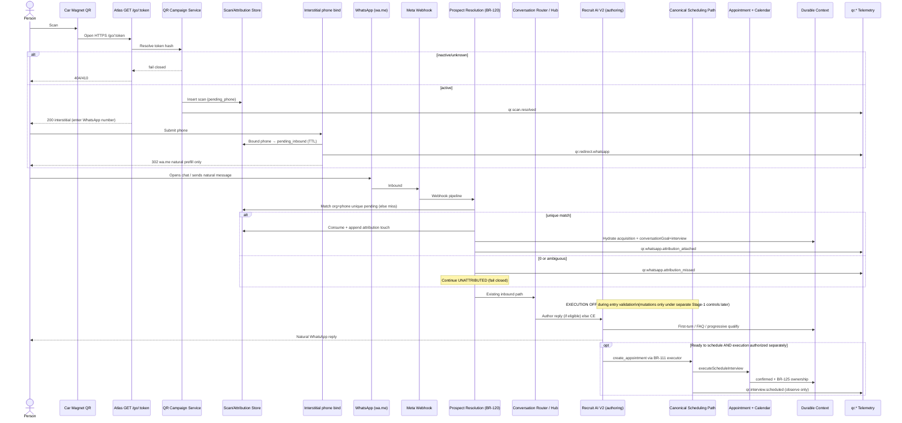

# Car Magnet V1 — Design Document

**Status:** Phase 1 entry + Phase 2 attribution/goal hydration implemented · Phase 3 QR-aware conversation **not** implemented · design refined after review (channel-hop + multi-touch)  
**Canonical rules:** BR-128 … BR-133 (on `main`)  
**Campaign key:** `car_recruiting_01`  
**Source label:** `car_magnet`  
**Default `conversationGoal`:** `interview`  
**Production posture during build/validation:** Recruit AI V2 execution **OFF**  
**First after acceptance:** seed one Team Vision campaign owned by primary RVP (no Admin UI required)

This document designs the smallest safe V1 for a recruiting car magnet QR that attributes entry, opens WhatsApp naturally, and progresses toward interview scheduling via the **existing** canonical Recruit AI / appointment path. It does **not** authorize implementation, migrations, env changes, WhatsApp sends, or appointment mutations.

---

## A. User journey

Exact sequence (happy path):

1. Person sees the car magnet (physical print).
2. Person scans the QR → opens Atlas public URL `https://<atlas-public-host>/go/:token` (**not** raw `wa.me`).
3. Atlas public entry resolves the opaque token server-side to campaign `car_recruiting_01` (org-scoped, active).
4. Atlas records a **scan** + server-side handoff session. Emits funnel telemetry intent `qr.scan.*`.
5. Atlas presents a brief **bind interstitial** (preferred V1) → person confirms their WhatsApp number → handoff becomes **phone-bound** on the server.
6. Atlas redirects into WhatsApp (`wa.me`) with a **natural** prefill only (no visible correlation token in the preferred path).
7. Person sends/edits the natural first WhatsApp message.
8. Meta delivers inbound webhook → Atlas inbound pipeline.
9. Atlas correlates inbound **phone + org** to the unique pending phone-bound scan (fail closed if ambiguous/missing) and recognizes:
   - `organizationId` (WABA/org binding ∩ campaign org)
   - `campaignId` / key `car_recruiting_01`
   - `source=car_magnet`
   - `entry_method=QR`
   - default `conversationGoal=interview`
   - first-touch + append-only touch history (see §D)
10. Atlas authors a **natural first-turn** (BR-131) — not universal forced city/state.
11. Person may ask opportunity questions; Atlas answers (FAQ), then continues conversion.
12. Qualification proceeds **progressively** (only next useful missing field for goal=`interview`).
13. Atlas moves toward interview scheduling (offers slots / confirm when ready).
14. **Canonical** scheduling path creates the appointment (BR-039/050/111 family) — QR never mutates.
15. Campaign attribution (first-touch **and** last-touch / touch history) survives into appointment/outcome analytics.
16. Funnel metrics become queryable by org/campaign (BR-133).

**Non-happy paths** are defined in §N.

---

## B. Public entry route

### Preferred pattern

```text
GET /go/:token
```

- Host: Atlas-controlled public host (same apex or dedicated short host later).
- `:token` = opaque public campaign token (high entropy). **Not** campaign key, not UUID in sequential form if guessable.
- Query string must **never** be authoritative for campaign/source/goal (BR-129). Optional non-authoritative analytics crumbs (`utm_*`) may be logged as `raw_query` metadata only and must not override token resolve.

Future-friendly: same `/go/:token` serves all QR campaign types (`recruiting_magnet`, `event_badge`, `policy_review_flyer`, …) via `campaign_type` on the campaign row.

### Request

| Item | Spec |
|------|------|
| Method | `GET` (idempotent for browsers; each hit may create a new scan row) |
| Path | `/go/:token` |
| Auth | None (public) |
| Body | None |
| Headers | `User-Agent`, `X-Forwarded-For` / CF-Connecting-IP for rate limit + hash retention policy |

### Lookup

1. Normalize token (charset, length bounds).
2. Lookup by **token hash** (store `public_token_hash`, never log raw token at info level if avoidable).
3. Load campaign row: `org_id`, `owner_user_id`, `status`, `source`, `default_conversation_goal`, `destination`.

### Validation (fail closed)

| Check | On fail |
|-------|---------|
| Token format invalid | `404` generic (no existence leak) |
| Unknown token | `404` generic |
| `status != active` | `410` or branded inactive page (**no** WhatsApp redirect with that campaign attribution) |
| Org not eligible / WABA unbound | Safe error page; no attributed redirect |
| Owner missing | See §N — still allow redirect **without** assignment mapping, or fail closed (V1 recommend: redirect attributed, assignment falls back BR-080 default; alert ops) |
| Rate limit exceeded | `429` |

Enumeration resistance: constant-time-ish responses where practical; identical generic copy for unknown vs malformed; no JSON dump of campaign catalog on public routes.

### Response / redirect (active campaign)

**Preferred V1 (phone-bound server session — natural WhatsApp text):**

1. Insert `qr_scans` row (`correlation_id`, `campaign_id`, `org_id`, `handoff_mode=phone_bind`, TTL, `status=pending_phone`).
2. Emit `qr.scan.received` / `qr.scan.resolved`.
3. Return **200 HTML interstitial** (not immediate 302): ask for WhatsApp number + “Continuar en WhatsApp”.
4. On submit: bind normalized phone to that scan (see §C algorithm) → emit `qr.redirect.whatsapp` → `302`/`wa.me` with **natural prefill only**.

**Fallback mode (zero interstitial — only if product accepts a micro-code):** see §C Mode B. Still starts from `/go/:token`, never from printed raw `wa.me`.

### Failure states

| State | HTTP | User visible | Attribution |
|-------|------|--------------|-------------|
| Invalid / unknown | 404 | Generic “Link unavailable” | none |
| Inactive | 410 | “This QR is no longer active” + org contact | scan may log `inactive` only |
| Rate limited | 429 | Retry later | optional scan `throttled` |
| Internal error | 500 | Generic | no forged campaign |

---

## C. WhatsApp handoff & channel-hop correlation

### Hard constraint (why “cookie session alone” cannot cross the hop)

```text
Browser /go/:token  →  wa.me / WhatsApp app  →  Meta Cloud webhook
```

- Atlas can create a secure **server-side** scan/handoff row at `/go`.
- Browser cookies / interstitial session **do not** accompany the Meta inbound webhook.
- Meta does **not** forward our `/go` session id for a generic `wa.me` deep link (unlike some Click-to-WhatsApp **ad** referral payloads, which are out of scope for printed magnet `/go` V1).
- Therefore a join key that exists on **both** sides is required: typically **phone** (bound before redirect) and/or an **opaque code** carried in the first message.

**Timing-only or IP/UA “last scan in org” matching is not authoritative** and must not be used alone. When ambiguous → **fail closed** (unattributed). Incorrect cross-campaign / cross-tenant attribution is worse than a missed attribution.

### Preferred UX (message the prospect should see)

```text
Hola, quiero conocer más sobre la oportunidad.
```

No `TV-…` line in the preferred path.

### Mode A — Preferred: phone-bound server-side handoff (natural prefill)

**Idea:** bind the scan to the prospect’s WhatsApp number **on Atlas before** opening WhatsApp; inbound webhook then joins on `org + normalized_phone` to a unique pending scan.

#### Exact correlation algorithm (Mode A)

**At `/go/:token` (GET)**

1. Resolve campaign by opaque token hash (org-scoped, active) — else fail closed (§B).
2. Create `qr_scans` with:
   - `handoff_mode = phone_bind`
   - `status = pending_phone`
   - `correlation_id` (UUID)
   - `expires_at` (short TTL, V1 recommend **10–15 minutes**)
   - campaign/org/owner snapshots
3. Render interstitial (same origin): WhatsApp number field + CTA “Continuar en WhatsApp”.
4. Do **not** redirect yet.

**At bind submit (POST, CSRF-resistant scan id / signed form)**

1. Validate scan still `pending_phone`, unexpired, same org/campaign as token.
2. Normalize phone to E.164 storage form; reject invalid.
3. **Pending uniqueness:** for `(org_id, bound_phone_normalized)` allow at most **one** open pending phone-bind scan.
   - If another open pending exists for that phone → **supersede** it (`status=superseded`) and keep the newest bind (document in telemetry). Do not leave two consumable rows for the same phone.
4. Set `bound_phone_normalized`, `status = pending_inbound`, `bound_at`.
5. Emit `qr.redirect.whatsapp`.
6. Redirect:
   ```text
   https://wa.me/<org_waba_digits>?text=<urlencode("Hola, quiero conocer más sobre la oportunidad.")>
   ```
7. Prefill contains **no** campaign id, token, handoff id, or org/user/prospect ids.

**At WhatsApp inbound (Meta → Atlas)**

1. Resolve inbound org via existing WABA → org binding.
2. Normalize inbound `from` phone.
3. Query open scans where:
   - `org_id` = inbound org
   - `handoff_mode = phone_bind`
   - `status = pending_inbound`
   - `bound_phone_normalized` = inbound phone
   - `expires_at > now`
   - `consumed_at IS NULL`
4. **Ambiguity / fail-closed rules:**

| Matches | Behavior |
|---------|----------|
| Exactly **1** | Consume scan (`consumed_at`, `status=consumed`). Attach trusted attribution (BR-129). Emit `qr.whatsapp.attribution_attached`. Strip nothing from message (natural text). |
| **0** | Continue conversation **unattributed**. Emit `qr.whatsapp.attribution_missed` (`reason=no_pending_scan`). Do **not** invent campaign from recent org scans. |
| **≥2** | Should be prevented by supersede rule; if found, **fail closed**: mark all conflicting open rows `status=ambiguous_conflict`, attach **no** campaign, emit `attribution_missed` (`reason=ambiguous_pending_scans`). Prefer ops alert. |

5. Tenant check: scan.campaign.org_id must equal inbound org — else fail closed, no attach.
6. Proceed to prospect create/locate (BR-120). Record touch history (§D). Hydrate `conversationGoal` default from campaign when this is a successful attribute attach on create / first trusted QR attach.

**Residual risk (documented):** a third party could bind **someone else’s** phone to a campaign during the short TTL. Mitigations: short TTL, supersede-on-rebind, rate-limit binds per IP/token, interstitial copy (“usa **tu** número de WhatsApp”), and accept that **missed attribution > wrong attribution**. Do not add timing-only “boosts” that override fail-closed.

### Mode B — Fallback only: opaque micro-code in prefill

Use **only** if product rejects the interstitial/phone bind (e.g. mandatory one-tap). Prefer Mode A for Car Magnet V1.

Prefill example (natural sentence + unobtrusive opaque code on its **own line**):

```text
Hola, quiero conocer más sobre la oportunidad.
· xK9mQ2pL
```

Requirements if Mode B is enabled:

- Code is short, opaque, single-use, expiring, org/campaign bound via **server** `qr_scans` row (hash-at-rest).
- Never trust the code without server validation.
- Extract + **consume** in inbound **before** CE/V2 language interpretation.
- Never echo, ask about, or discuss the code with the prospect.
- Not PII; not org/user/prospect/campaign UUIDs.
- Replay → fail closed (already consumed / expired → unattributed).
- Ambiguous multi-match → fail closed (should be impossible if codes unique).

### Mode ranking (V1)

| Rank | Mode | Message UX | Authority |
|------|------|------------|-----------|
| **1 (preferred)** | A phone-bound server session | Natural sentence only | Server bind + inbound phone equality |
| 2 (fallback) | B micro-code | Natural sentence + code line | Server code hash |
| ❌ forbidden | Timing/IP-only last scan | Natural | Ambiguous — never sole authority |
| ❌ forbidden | Trust `?campaign=` / `?goal=` | — | BR-129 violation |

Permanent printed QR remains `/go/:token` so campaigns can be disabled and WhatsApp routing can change without reprinting magnets.

---

## D. Attribution model (first-touch + subsequent touches)

### Lifecycle

```text
QR campaign → scan → WhatsApp inbound → prospect → conversation →
appointment → appointment outcome → recruit conversion
```

### Canonical marketing attribution vs conversation goal

- **Marketing attribution** (campaign/source/touches) and **`conversationGoal`** are separate.
- A returning prospect may scan another campaign (new touch) **without** identity reset (BR-120 / BR-080).
- Goal changes follow BR-130 and do **not** rewrite first-touch marketing fields.

### First-touch (immutable)

Once established on a prospect (first successful trusted QR attach), these never silently change:

| Field | Example V1 |
|-------|------------|
| `firstTouchCampaignId` | UUID of `car_recruiting_01` row |
| `firstTouchSource` | `car_magnet` |
| `firstTouchAt` | timestamptz of first trusted attach |
| `firstTouchCorrelationId` | optional stitch to first scan |

Forged query params never create or overwrite first-touch.

### Subsequent touches (append-only)

Every later **trusted** QR attach (Mode A or B succeed) appends a touch record. Do **not** discard later scans.

**Recommended store:** `qr_attribution_touches` (append-only) **and/or** link `qr_scans.id` once consumed to `prospect_id`.

Touch row (logical):

| Field | Notes |
|-------|-------|
| `id` | UUID |
| `org_id` | tenant |
| `prospect_id_core` | BR-120 core id |
| `scan_id` | FK `qr_scans` |
| `campaign_id` | FK |
| `source` | snapshot |
| `touched_at` | consume time |
| `correlation_id` | from scan |
| `sequence` | monotonic per prospect |

**Derived (not separately mutated as SoR):**

| Derived | Definition |
|---------|------------|
| `lastTouchCampaignId` | campaign_id of latest touch row |
| `lastTouchSource` | source of latest touch |
| `lastTouchAt` | touched_at of latest touch |

Projection may cache last-touch on prospect for query speed; **append-only history remains authoritative** if cache disagrees.

### Rules

1. First-touch is immutable once established.
2. Subsequent trusted scans are recorded (append / scan relationship).
3. Later scans do **not** overwrite first-touch.
4. Appointment / outcome / recruit analytics **may inspect both** first-touch and last-touch (and full history).
5. Returning prospects can scan another campaign without identity reset; BR-080 does not steal owner on repeat inbound.
6. `conversationGoal` changes remain separate from marketing attribution changes.
7. Unattributed inbound creates **no** touch row and **no** forged campaign.

### Entry fields on attach

| Field | Meaning | Canonical? |
|-------|---------|------------|
| `organizationId` | Tenant | **Yes** |
| `entry_method` | `QR` when attributed | **Yes** |
| `source` / lead_source detail | e.g. `car_magnet` | **Yes** (with touch history) |
| `owner_user_id` | Campaign owner for **first-touch** assignment mapping when applicable | BR-080 |
| `correlationId` | Per-scan stitch | Metadata / events |
| `conversationGoal` | BR-130 | Separate SoR |

### Existing reuse vs new

| Reuse | New (V1) |
|-------|----------|
| Legacy `source` / `entry_method` | `qr_campaigns`, `qr_scans` |
| Core `lead_source` JSONB | `firstTouch*` fields + `qr_attribution_touches` (or equivalent JSON history) |
| BR-080 owner | Phone-bind / micro-code handoff |
| Business-event `correlation_id` | `qr.*` funnel events |

---

## E. Conversation goal (BR-130) for Car Magnet V1

### Initial

On successful QR attribution attach:

```text
conversationGoal = interview   // default from campaign
```

Persist on:

1. Prospect attribution snapshot (core customFields / lead_source extension **and/or** dedicated column later).
2. **Durable** Recruit AI conversation context acquisition slice (required when V2 context exists).
3. CE-readable state for non-V2 turns.

### Default ≠ immutable

| Trigger | New goal | Audit reasonCode (examples) |
|---------|----------|------------------------------|
| Explicit “quiero revisar mi póliza / policy review” | `policy_review` | `EXPLICIT_POLICY_REVIEW_INTENT` |
| Explicit “quiero entrevista / quiero trabajar / agendar entrevista” while unresolved | `interview` | `EXPLICIT_INTERVIEW_INTENT` |
| FAQ only (“¿cuánto pagan?”, “¿de qué se trata?”) | **no change** | — |
| Forged `?goal=` | **ignore** | — |
| Cross-org handoff mismatch | fail closed; no goal write | `GOAL_TENANT_MISMATCH` |

### Transition rules

1. Transitions require **explicit** user intent classifier outcome (deterministic allowlist phrases / intent codes) — not sentiment drift.
2. Persist previous goal, new goal, reasonCode, inboundMessageId, actor=`system`, orgId, prospectId.
3. Emit `qr.goal.changed` (BR-133 family).
4. After `policy_review` transition, V1 must **not** invent a full policy-review booking funnel (BR-132 deferred). Safe V1 behavior: acknowledge, set goal, offer human/Agent handoff or “we’ll help you schedule a policy review” without calling interview `create_appointment`. Do not book `recruiting_interview` under `policy_review` goal.
5. No cross-tenant / cross-identity goal copy.

---

## F. First-turn experience (BR-131) — Car Magnet V1

### Principles

1. Answer immediate substantive question first (when present).
2. Ask only the next useful missing field for **active** goal.
3. Preserve conversion objective (`interview` → schedule interview).
4. Avoid repetitive scripted loops; resume known facts.
5. Never open **solely** because chat is new with universal “Hola, ¿en qué ciudad y estado vives?”.

### Example matrix

| Inbound | Desired Atlas behavior |
|---------|------------------------|
| `Hola` | Natural opportunity-aware greeting (Team Vision / recruiting context from `car_magnet`). Invite to ask questions **or** offer to help schedule an interview. **Do not** force city/state as line 1. |
| `¿De qué se trata?` | Brief opportunity explanation (existing FAQ/content), then soft CTA toward interview qualification. |
| `¿Cuánto pagan?` | Compensation FAQ answer (BR-104 family), then continue toward interview. |
| `Quiero trabajar con ustedes` | Treat as strong interview intent; enter qualification/scheduling sequence at next missing field (may now ask city/state if required and unknown). |
| `Quiero revisar mi póliza` | Explicit goal → `policy_review` (audited). Do not run interview create. Safe ack + handoff path for V1. |
| Returning prospect | Resume durable/legacy known state; do not restart as blank QR lead; BR-080 no-reassign. |

### Progressive qualification (interview goal)

Order remains business-defined (typically location → authorization → schedule prefs → …), but **entry tip** is context-aware:

- Greeting / FAQ turns: answer → optional single nudge (“¿Te gustaría agendar una entrevista?”).
- Explicit schedule / work intent: jump to next missing required field (city/state only if still missing **and** needed).

---

## G. Scheduling boundary (critical)

```text
┌──────────────────────────── QR Channel (BR-128–131, 133) ────────────────────────────┐
│  /go token resolve · scan · handoff · attribution stamp · conversationGoal hydrate   │
│  first-turn / FAQ routing influence · funnel telemetry                               │
└──────────────────────────────────────────┬───────────────────────────────────────────┘
                                           │ hands off context only
                                           ▼
┌──────────────────── Existing Recruit AI + Appointment path (DO NOT FORK) ────────────┐
│  CE and/or V2 authoring (BR-049/081/114)                                              │
│  authorizeSideEffects / BR-111 · live path BR-112                                    │
│  executeScheduleInterview / sideEffectExecutor                                        │
│  BR-120 identity · BR-121–127 protections · Calendar · durable confirmed · BR-125    │
└──────────────────────────────────────────────────────────────────────────────────────┘
```

### QR Channel may

- Provide trusted attribution and correlation.
- Establish default `conversationGoal`.
- Influence first-turn routing and copy selection.
- Emit QR funnel telemetry.

### QR Channel must NOT

- Create / confirm / cancel appointments or Calendar events.
- Bypass canonical prospect identity (BR-120).
- Weaken BR-120–127, idempotency, workflow validation, durable ownership.
- Introduce a second mutation owner.
- Enable execution env flags as part of QR work.

**Execution remains OFF** during Car Magnet entry validation. Scheduling validation later uses separately accepted Stage-1 controls only.

---

## H. Data model (minimum V1 — design only)

### `qr_campaigns`

| Column | Notes |
|--------|-------|
| `id` | UUID PK |
| `org_id` | required, indexed |
| `owner_user_id` | Atlas user (primary RVP for V1) |
| `name` | display, e.g. “Car Recruiting 01” |
| `campaign_key` | unique per org, `car_recruiting_01` |
| `public_token_hash` | unique; raw token shown once at create |
| `campaign_type` | `car_magnet` / `recruiting_qr` … |
| `source` | `car_magnet` |
| `default_conversation_goal` | `interview` \| `policy_review` \| `unresolved` |
| `status` | `active` \| `inactive` |
| `destination_channel` | `whatsapp` |
| `whatsapp_e164` | optional override; default org WABA number |
| `created_at` / `updated_at` | timestamptz |

### `qr_scans`

| Column | Notes |
|--------|-------|
| `id` | UUID PK |
| `campaign_id` | FK |
| `org_id` | denormalized tenant |
| `correlation_id` | UUID |
| `handoff_mode` | `phone_bind` (preferred) \| `micro_code` (fallback) |
| `status` | `pending_phone` \| `pending_inbound` \| `consumed` \| `expired` \| `superseded` \| `ambiguous_conflict` \| `inactive` \| `throttled` |
| `handoff_code_hash` | nullable; required for `micro_code` mode |
| `handoff_expires_at` / `expires_at` | TTL |
| `bound_phone_normalized` | set on Mode A bind submit |
| `bound_at` | timestamptz |
| `consumed_at` | nullable |
| `scanned_at` | timestamptz |
| `redirect_result` | `interstitial` \| `redirected` \| `inactive` \| `invalid` \| `throttled` |
| `ip_hash` | keyed hash or null per retention policy |
| `user_agent_class` | coarse (mobile/desktop) |
| `prospect_id_core` | set after inbound consume |

### `qr_attribution_touches` (append-only)

| Column | Notes |
|--------|-------|
| `id` | UUID PK |
| `org_id` | tenant |
| `prospect_id_core` | BR-120 core id |
| `scan_id` | FK `qr_scans` |
| `campaign_id` | FK |
| `source` | snapshot (`car_magnet`, …) |
| `correlation_id` | from scan |
| `touched_at` | consume time |

### Prospect / conversation attribution

| Location | V1 content |
|----------|------------|
| Prospect attribution SoR | `firstTouchCampaignId`, `firstTouchSource`, `firstTouchAt` (immutable); cached `lastTouch*` derived from touches |
| `qr_attribution_touches` | Append-only history (authoritative for last-touch derivation) |
| Legacy `prospects` | `entry_method=QR` when attributed; avoid clobbering unrelated manual sources on return |
| Core `lead_source` | typed acquisition aligned with first-touch |
| Durable V2 context | `acquisition: { firstTouch…, lastTouch…, conversationGoal, correlationId }` |
| `conversationGoal` | Separate from marketing touches; on prospect snapshot + durable context |

**No migration in this design mission.** Implementation phases introduce migrations later.

---

## I. Telemetry (BR-133 event intent — no runtime)

Family prefix: `qr.*` — **distinct** from BR-113 / Stage-1 `recruit_ai_v2.*`.

| Event | Purpose | Key fields (no raw PII) | Org/campaign scoped |
|-------|---------|-------------------------|---------------------|
| `qr.scan.received` | Hit `/go` | correlationId, tokenHashPrefix, ipHash? | org if known post-lookup |
| `qr.scan.resolved` | Active campaign matched | campaignId, campaignKey, source, ownerUserId | yes |
| `qr.scan.invalid` | Unknown/malformed | reasonCode | org optional |
| `qr.scan.inactive` | Campaign inactive | campaignId | yes |
| `qr.redirect.whatsapp` | Redirect/bind complete | campaignId, handoffMode, scanId | yes |
| `qr.whatsapp.attribution_attached` | Inbound consumed handoff | campaignId, prospectId, correlationId, touchSequence | yes |
| `qr.whatsapp.attribution_missed` | Fail closed / no match | reasonCode | org if known |
| `qr.conversation.started` | First attributed turn | campaignId, goal | yes |
| `qr.goal.resolved` | Initial goal stamp | conversationGoal | yes |
| `qr.goal.changed` | Audited transition | from, to, reasonCode | yes |
| `qr.interview.scheduled` | Observed canonical schedule success | campaignId, appointmentId | yes |
| `qr.appointment.outcome` | Outcome recorded | campaignId, outcome | yes |
| `qr.conversion.recruit` | Recruit conversion if available | campaignId | yes |

PII: exclude raw phone from public scan logs; use normalized phone hash or ids only in secured pipelines consistent with existing WhatsApp logging policy.

---

## J. Admin / RVP experience

### V1 options

| Option | Description | Risk |
|--------|-------------|------|
| **A — Seed one campaign** | Ops/engineer seeds `car_recruiting_01` for Team Vision + primary RVP; generate token + QR offline | **Lowest** — recommended V1 |
| **B — Minimal admin UI** | Create/disable + QR download in Atlas | Higher scope; defer |

**Recommendation:** **Option A** for Car Magnet V1. One controlled printed/test QR. Admin UI = Phase 5.

### Longer-term UI (post-V1)

Campaign name, owner, type, default goal, status, QR PNG/SVG download, destination preview, scans, conversations, appointments, outcomes, conversion rate — org-scoped.

---

## K. QR image generation

| Requirement | Design |
|-------------|--------|
| Encodes | `https://<host>/go/<public_token>` — **not** raw `wa.me` |
| Disable without reprint | `status=inactive` stops attributed redirect |
| Routing changes | Path stays `/go/:token`; backend may evolve |
| Format later | PNG + SVG download; V1 can be generated offline (e.g. qrencode / design tool) |
| Error correction | **Quartile (Q)** or **High (H)** for windshield/car-body wear and glare |

Do not generate artwork/QR in this design mission.

---

## L. Car Magnet content (copy)

**Recommended V1 (short):**

```text
¿BUSCAS UNA OPORTUNIDAD?
Escanea para conocer más
[QR]
Team Vision
```

**Evaluation:** Clear CTA, low cognitive load, bilingual market–friendly Spanish, brand present, no PII, no phone number required on magnet (WhatsApp revealed after scan). Acceptable as V1.

**Optional micro-variant (if legal/HR wants softer framing):**

```text
¿TE INTERESA UNA CARRERA EN SEGUROS?
Escanea y conversa con nosotros
[QR]
Team Vision
```

Prefer the shorter original unless compliance requests the career framing. No artwork in this mission.

---

## M. Security / threat model

| Threat | Mitigation |
|--------|------------|
| Token guessing | High-entropy token; hash-at-rest; generic 404 |
| Campaign enumeration | No public list; identical failures |
| Forged attribution | Ignore query params; phone-bind / micro-code server validation only |
| Open redirect | Redirect target allowlist = org WhatsApp `wa.me` only |
| Malicious redirect | Never take destination from query |
| Spam/bots | Rate limit `/go` + bind POST; handoff TTL; no appointment side effects |
| Scan flooding | 429 + metrics; does not amplify webhook writes unboundedly |
| Replay handoff | Single-use consume; expired/superseded ignored |
| Planted phone bind | Short TTL; supersede prior pending; interstitial “tu número”; miss > wrong |
| Cross-org leakage | Campaign org must equal inbound WABA org |
| Disabled campaign | No attributed redirect |
| Deleted owner | Alert; BR-080 fallback; don’t forge owner |
| Campaign reassignment | Audited owner change; new scans use new owner; first-touch history preserved |
| PII in URL | Forbidden on printed `/go/:token` |
| IP/UA / phone-on-scan retention | Hash IP; coarse UA; minimize phone retention on unconsumed scans; TTL purge |
| Phone association | Mode A bind before WA; Mode B after code consume — never invent phones from scans alone |

Fail closed on tenant mismatch, invalid/expired/ambiguous handoff (continue chat **unattributed**).

---

## N. Failure modes

| Failure | Behavior |
|---------|----------|
| Unknown token | 404 generic; `qr.scan.invalid` |
| Inactive campaign | 410 page; no WA attributed redirect |
| Owner unavailable | Redirect OK after bind; assignment BR-080 fallback; ops alert |
| Org disabled | No redirect / safe error |
| WhatsApp destination unavailable | Error page; do not send users to random URL |
| Scan recorded, never messages | Funnel shows scan without conversation; TTL expires handoff |
| Bind phone never inbound | Expire pending; no touch |
| Inbound without QR context | Normal WhatsApp path; **unattributed**; no forged campaign |
| Multiple pending for same phone | Supersede on bind; if ≥2 consumable at inbound → ambiguous fail closed |
| Timing-only temptation | Forbidden as authority |
| Returning prospect new campaign | Append touch; update derived last-touch; **keep** first-touch; no owner steal |
| Explicit goal change | Audited BR-130 transition; marketing touches unchanged |
| Duplicate webhook | Existing inbound idempotency; scan consume idempotent |
| Scheduling later fails | Canonical reconcile/rollback (BR-121/122); QR does not compensate Calendar |

---

## O. Sequence diagram



---

## P. Implementation phases

| Phase | Scope | Likely modules | Migration | Tests | Rollout risk | Touches scheduling path? |
|-------|-------|----------------|-----------|-------|--------------|--------------------------|
| **1** | Campaign + token + `/go` + scan + **bind interstitial** | new `qrCampaign*` service, `routes/publicGo.js`, seed script | `qr_campaigns`, `qr_scans` | token resolve, inactive, rate limit, phone bind | Low | **No** |
| **2** | WA correlation (phone match) + first/last-touch + goal hydrate | `whatsappProspectResolver`, durable `buildReconstructionInput` | `firstTouch*` + `qr_attribution_touches` | unique match, ambiguous miss, touch append | Medium | **No** (identity write only) |
| **3** | Goal-aware first turn (BR-131) | `teamVisionWorkflowCopy`, V2 `decisionEngine` / `responseRenderer`, CE FAQ gate | none or copy-only | greeting/FAQ/matrix cases | Medium (UX) | **No** mutation |
| **4** | Funnel telemetry `qr.*` | event emitters near go + resolver + observe schedule success | none or event catalog | event shape tests | Low | Observe-only hook |
| **5** | Minimal admin + QR download | frontend Admin page, PNG/SVG | none | authz org scope | Low | **No** |
| **6** | Policy-review QR campaigns | BR-132 workflow branch | purpose-scoped | no interview milestone bleed | Higher | **Yes** (purpose branch) — after interview V1 stable |

Phase 1–3 sufficient for Car Magnet V1 product claim; 4–5 strongly recommended before mass print.

---

## Q. Test strategy

- **Unit:** token hash lookup; phone normalize/bind; pending supersede; expire; goal transition allowlist; redirect URL allowlist; micro-code parse/strip (fallback only).
- **Integration:** `/go` → bind → mock inbound same phone → attribution + touch append; inbound wrong phone → miss.
- **Tenant isolation:** campaign org A must not attach on WABA org B.
- **Token security:** unknown/inactive/enumeration response parity.
- **Ambiguity:** force ≥2 pending → no attach.
- **Redirect:** only `wa.me` of configured number; prefill natural sentence (Mode A).
- **Attribution:** first-touch immutable; second scan appends touch and moves last-touch only.
- **Returning prospect:** resume context; no owner steal.
- **Goal change:** FAQ no-op; explicit policy-review audits; touches unchanged.
- **CE/V2 ownership:** BR-114/125 unchanged; QR doesn’t author via executor.
- **Execution OFF speak-only:** full QR entry path creates **zero** appointments.
- **Scheduling regression:** existing Recruit AI / BR-120–127 suites remain green.
- **Funnel telemetry:** shapes + no PII in public fields.
- **Policy-review future:** goal can flip without calling interview create.

---

## R. Release strategy

1. **Local** — seed campaign; `/go` + phone-bind unit/integration.
2. **Staging** — end-to-end with staging WABA if available.
3. **Production dark launch** — seed `car_recruiting_01` for **primary RVP only**, execution **OFF**, no public print.
4. **One controlled test QR** — validate interstitial bind → natural WhatsApp → attribution + first-turn.
5. **Speak-only scheduling talk-track** — confirm progressive qualify without mutation.
6. **Scheduling under accepted Stage-1 controls only** — separate authorization; not part of QR entry enablement.
7. **No broad magnet print/distribution** until attribution + first-turn acceptance criteria pass.
8. **No Admin UI** required for first controlled test (seed only).

---

## S. Acceptance criteria — READY FOR IMPLEMENTATION

Car Magnet V1 design is **READY FOR IMPLEMENTATION** when reviewers accept all of:

1. `/go/:token` + opaque token + fail-closed inactive/unknown; printed QR is Atlas `/go`, not raw `wa.me`.
2. **Mode A** phone-bound server handoff + natural WhatsApp prefill (Mode B only as documented fallback).
3. Ambiguity → fail closed unattributed (never timing-only authority).
4. First-touch immutable + append-only touch history with derived last-touch.
5. Scheduling boundary frozen (QR never mutates appointments); BR-120–127 authoritative; BR-128–133 satisfied.
6. First-turn example matrix accepted (no universal forced city/state opener).
7. Option A seeding for primary RVP; no Admin UI for first controlled test.
8. Magnet copy accepted (or recorded variant).
9. Threat model + failure modes accepted (including planted-phone residual risk).
10. Phases 1–3 scoped as V1 build; Phase 6 out of V1.
11. Execution remains OFF for entry validation; no env writes in QR phases.
12. Checklist in §U confirmed.

---

## T. Final recommendation (summary)

1. **Executive summary:** Attributed car-magnet WhatsApp interviews without forking scheduling. `/go/:token` → phone-bound server session → natural `wa.me` prefill → inbound join on org+phone → hydrate goal → progressive first turns → canonical booking later.
2. **Architecture:** Public Go + interstitial bind → Campaign/Scan store → WhatsApp → existing Hub/CE/V2 → canonical mission scheduling.
3. **V1 boundaries:** `car_recruiting_01` / `car_magnet` / `interview`; seed primary RVP; no Admin UI; execution OFF for entry validation; no policy-review booking runtime.
4. **Data model:** `qr_campaigns` + `qr_scans` + `qr_attribution_touches` + immutable `firstTouch*` + derived `lastTouch*`.
5. **Attribution:** Preferred Mode A phone-bind; Mode B micro-code fallback only; first-touch immutable; subsequent touches append-only.
6. **Goal:** Default `interview`; audited explicit transitions only; independent of marketing touches.
7. **First-turn:** Opportunity-aware; FAQ-first; progressive qualify.
8. **Scheduling boundary:** Context in; mutations only via existing path.
9. **Security:** Opaque tokens, allowlisted redirect, rate limits, tenant match, fail closed on ambiguity.
10. **Telemetry:** `qr.*` funnel distinct from BR-113 / Stage-1.
11. **Admin:** Seed campaign only for first controlled test.
12. **Copy:** Keep short magnet Spanish CTA.
13. **Sequence:** §O (interstitial + natural prefill).
14. **Phases:** §P (1–3 = V1).
15. **Tests:** §Q including ambiguity miss.
16. **Release:** §R.
17. **Migrations:** Phase 1–2 when implementing — **not now**.
18. **Affected modules (future):** public go + bind routes, qr services, prospect resolver, durable hydrate, first-turn templates — **not** side-effect executor.
19. **Findings:**  
    - **BLOCKER:** none for implementation design acceptance.  
    - **MAJOR:** Pure cookie/session cannot cross Meta webhook; Mode A interstitial is the preferred way to keep natural WhatsApp text. Residual planted-phone risk mitigated by short TTL + fail-closed policy (miss > wrong).  
    - **MINOR:** Mode B micro-code remains documented fallback; current FACEBOOK/CTWA hardcode must be generalized on attributed QR create.
20. **Verdict:** **READY FOR IMPLEMENTATION** (design), pending this refinement acceptance — still **no runtime** until a separate implementation mission.

---

## U. Design confirmations (post-refinement)

| # | Statement | Status |
|---|-----------|--------|
| 1 | QR Channel provides attribution/context only | Confirmed |
| 2 | No QR-specific appointment mutation path | Confirmed |
| 3 | BR-120–127 remain authoritative | Confirmed |
| 4 | BR-128–133 remain satisfied | Confirmed |
| 5 | V1 = `car_recruiting_01` / `car_magnet` / defaultGoal `interview` | Confirmed |
| 6 | Phase 1 seeds one campaign for primary RVP only | Confirmed |
| 7 | No Admin UI required for first controlled test | Confirmed |
| 8 | Printed QR = `/go/:token`, not raw `wa.me` | Confirmed |
| 9 | Printed QR remains valid if WhatsApp routing changes | Confirmed |
| 10 | Execution stays OFF through QR entry/attribution validation | Confirmed |

---

## Explicit non-goals (this mission)

- No runtime code, branch, PR, migration, env change, WhatsApp send, appointment/Calendar mutation, allowlist widening, or Recruit AI scheduling behavior change.

**STOP FOR REVIEW.**
