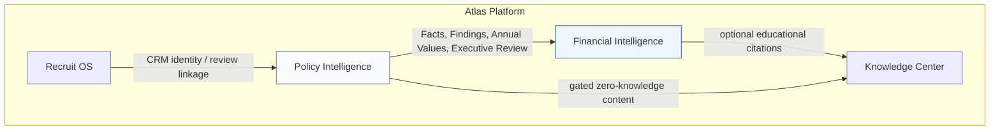
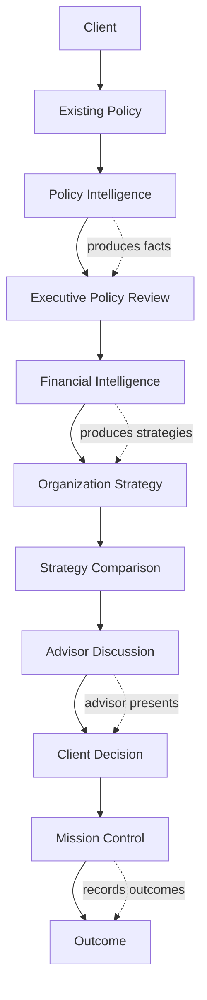

# Atlas Financial Intelligence Architecture

## AI Summary

Atlas Financial Intelligence is a **bounded context above Policy Intelligence**. It does **not** replace Policy Intelligence and must **never** redesign the frozen Policy Intelligence pipeline. Policy Intelligence answers *what the client currently owns* (objective analysis). Financial Intelligence answers *what strategy our organization would present* (organization strategy evaluation). **RC2 is APPROVED** as the architectural baseline for all future Financial Intelligence work. Canonical governance includes **BR-066 — Human Recommendation Boundary**: Atlas informs; advisors recommend; clients decide.

## Purpose

Define the next major Atlas bounded context that **consumes** Policy Intelligence outputs and combines them with an organization-specific **Strategy Catalog** to produce educational, organization-aligned strategy presentations — while preserving a hard separation between **analysis** and **recommendation**, and keeping human professional judgment in the loop.

## Status

**APPROVED** — RC2 Financial Intelligence Architecture  
**RC3 Phase A** — **IMPLEMENTED** Invest-the-Difference Strategy Evaluation foundation  
**RC3 Phase B** — **IMPLEMENTED** live API-backed runtime integration (backend calculation authority)  
**Deferred (RC4+):** official Primerica quote integration; verified fund catalog; PDF export; automated eligibility; suitability workflow

## Business Rules

| Existing (Policy Intelligence — frozen) | Role |
|----------------------------------------|------|
| [BR-051](../06-business/BUSINESS_RULES.md#br-051--policy-intelligence-foundation) … [BR-061](../06-business/BUSINESS_RULES.md#br-061--policy-intelligence-comparison-engine) | Govern Policy Intelligence only |

| Canonical (Financial Intelligence governance) | Role |
|-----------------------------------------------|------|
| [**BR-066** — Human Recommendation Boundary](../06-business/BUSINESS_RULES.md#br-066--human-recommendation-boundary) | Atlas analyzes/educates/compares; never replaces licensed advisor judgment or client decisions |

| Approved / enforceable (RC3 Phase A) | Intent |
|--------------------------------------|--------|
| [**BR-062**](../06-business/BUSINESS_RULES.md#br-062--financial-intelligence-boundary) — Financial Intelligence Boundary | FI consumes PI; never modifies Facts / Findings / Annual Values / shared PI reports |
| [**BR-063**](../06-business/BUSINESS_RULES.md#br-063--strategy-catalog-ownership) — Strategy Catalog Ownership | Organization-specific strategies live only in FI; PI never references them |
| [**BR-064**](../06-business/BUSINESS_RULES.md#br-064--active-product-presentation-rule) — Active Product Presentation Rule | ACTIVE products only when catalog exists; RC3 does not invent eligibility |
| [**BR-065**](../06-business/BUSINESS_RULES.md#br-065--analysis-vs-strategy-evaluation-separation) — Analysis vs Strategy Evaluation Separation | PI = analysis; FI = educational strategy evaluation (subject to BR-066) |
| [**BR-067**](../06-business/BUSINESS_RULES.md#br-067--invest-the-difference-same-outlay-rule) … [**BR-073**](../06-business/BUSINESS_RULES.md#br-073--missing-inputs-must-be-exposed) | Invest-the-Difference formulas, quote source, projections, risk emphasis, replacement, versioning, missing inputs |

## RC3 implementation map

| Concern | Location |
|---------|----------|
| Module | `backend/modules/financial-intelligence/` |
| PI adapter | `domain/adapters/currentIulSnapshotAdapter.js` |
| Strategy engine | `domain/engines/investTheDifferenceEngine.js` |
| Projections | `domain/projections/*` |
| Persistence | `atlas_fi_strategy_evaluations` (migration 025) |
| APIs | `/api/financial-intelligence` |
| UI section | `DiscussionScenariosSection` — Possible Discussion Scenarios for the Primerica Representative |
| Print | Print-friendly CSS in RC3; PDF deferred |

---

# Section 1 — Architecture Overview

## Atlas bounded contexts

```
Atlas
├── Recruit OS
│     Prospect lifecycle, conversations, scheduling, Mission Control
├── Policy Intelligence
│     Objective policy analysis (frozen pipeline)
├── Financial Intelligence          ← THIS CONTEXT (new)
│     Organization strategy presentation (consumes PI)
└── Knowledge Center
      Educational content indexing & retrieval
```



### Responsibilities

| Bounded context | Answers | Owns | Must not |
|-----------------|---------|------|----------|
| **Recruit OS** | Who is the prospect / what is the recruiting workflow? | Prospects, appointments, conversations, missions | Policy mechanics analysis; org product recommendation logic |
| **Policy Intelligence** | What does the client currently own? | Extract, Facts, Annual Values, Rules, Findings, PI Recommendations, Executive Review, Comparison | Recommend Team Vision products; mutate CRM identity |
| **Financial Intelligence** | What strategy would our organization present? | Strategy Catalog, Strategy Builder, FI Recommendation outputs | Modify PI outputs; run carrier-independent analysis as if it were PI |
| **Knowledge Center** | What educational material is available? | Indexed knowledge content | Invent Facts or Findings; own product eligibility engines |

### Core principle

```
ANALYSIS  ≠  RECOMMENDATION

Policy Intelligence  →  ANALYSIS
Financial Intelligence → RECOMMENDATION (organization strategy)
```

These responsibilities are **completely independent**. Sharing data is one-way: **PI → FI** (read-only consumption).

---

# Section 2 — Policy Intelligence (frozen)

Policy Intelligence RC1 is **COMPLETE** and **FROZEN**.

## Frozen pipeline (must not change)

```
Illustration
      ↓
Atlas Extract
      ↓
Insurance Facts
      ↓
Annual Values Engine
      ↓
Insurance Language Layer
      ↓
Rule Engine
      ↓
Findings
      ↓
Recommendations          ← PI educational / review recommendations only
      ↓
Executive Policy Review
      ↓
AI Narrative
```

Comparison Engine consumes pipeline outputs; it does not redesign the pipeline.

## Characteristics (non-negotiable)

| Attribute | Meaning |
|-----------|---------|
| **Carrier independent** | Analyzes any carrier illustration using canonical Insurance Language |
| **Objective** | Evidence-based mechanics only |
| **Evidence-based** | Findings cite immutable Insurance Facts / Annual Values |
| **Deterministic** | Rule Engine and Annual Values produce repeatable results |
| **Zero-Knowledge** | No client name, policy number, address, email, phone, beneficiaries (BR-054 / BR-056) |

## Hard stop

**Policy Intelligence NEVER recommends company (Team Vision) products.**

Its responsibility **ends after the Executive Policy Review** (plus AI Narrative that explains Facts + Findings only).

PI may emit educational recommendations such as “Request In-force Illustration” or “Stress Test at 5%.” Those are **analysis follow-ups**, not product placement.

---

# Section 3 — Financial Intelligence

Financial Intelligence begins **AFTER** Policy Intelligence.

## Consumption model

```
Policy Intelligence outputs (read-only)
        │
        ├── Insurance Facts
        ├── Findings
        ├── Annual Values
        └── Executive Review
                │
                ▼
        Financial Intelligence
                │
                ├── Strategy Catalog (org-specific)
                ├── Strategy Builder
                └── Strategy Presentation / FI Recommendations
```

## Rules

1. FI **consumes** Insurance Facts, Findings, Annual Values, and Executive Review.
2. FI **never modifies** those outputs.
3. FI **never** invents Insurance Facts.
4. FI **never** re-runs or forks the PI Rule Engine for analysis ownership.
5. FI may **reference** PI Findings as inputs to eligibility / education framing.
6. FI outputs are a **separate layer**: Strategy Candidates, Strategy Comparisons, Organization Recommendations.

## Independence statement

| Question | Owner |
|----------|-------|
| What does the client currently own? | Policy Intelligence |
| What strategy would our organization present? | Financial Intelligence |

If either context is deleted, the other must still be conceptually valid:

- PI without FI = objective policy review still works.
- FI without PI = cannot responsibly build client-specific strategy (missing analysis inputs).

---

# Section 4 — Strategy Catalog

## Canonical component

**Name:** Strategy Catalog  
**Owner:** Financial Intelligence  
**Consumers:** Strategy Builder, FI Recommendation surfaces  
**Non-consumers:** Policy Intelligence (must never reference)

## Purpose

Store **organization-specific planning strategies** — products, philosophies, eligibility, premium rules, and investment assumptions used when presenting a Team Vision (or tenant) strategy.

## Team Vision catalog contents (illustrative)

### Insurance products

| Product | Notes |
|---------|-------|
| **PowerTerm** | Organization term strategy product |
| **PrecisionTerm** | Organization term strategy product |

### Investment philosophy

| Philosophy | Notes |
|------------|-------|
| **Invest the Difference** | Compare term + invest difference vs current permanent design (educational framing) |

### Product rules (examples)

| Rule class | Example |
|------------|---------|
| Term selection | Longest Eligible Term |
| Jurisdiction | NY maximum 30-year |
| Eligibility | Age / state / underwriting class gates |
| Premium calculation | Catalog-defined rate / modal premium methods |
| Investment assumptions | Assumed return bands used in “invest the difference” illustrations (explicit, configurable, never hidden) |

## Catalog principles

1. **Tenant-scoped** — each organization owns its catalog.
2. **Versioned** — strategy definitions are versioned for auditability.
3. **Deterministic inputs** — eligibility and premium methods must be rule-explicit.
4. **Not Facts** — catalog entries are not Insurance Facts and must not be written into PI Fact stores.
5. **Invisible to PI** — Policy Intelligence codepaths, rules, and Executive Review must not import Strategy Catalog.

## Logical shape (architecture — not a migration)

```
StrategyCatalog
  organizationId
  version
  products[]
  philosophies[]
  rules[]
  assumptions[]
```

> Sprint RC2: document only. No database tables in this sprint.

---

# Section 5 — Product Lifecycle

Financial Intelligence products have three lifecycle states.

| State | Meaning | FI may newly present as strategy evaluation? | PI may analyze? |
|-------|---------|-----------------------------------------------|-----------------|
| **ACTIVE** | Eligible for new strategy evaluations | Yes | Yes |
| **LEGACY** | Supported for review only | **No** | Yes |
| **RETIRED** | Historical reference only | **No** | Yes (if illustration exists) |

## Examples (Team Vision)

| Product | Lifecycle |
|---------|-----------|
| PowerTerm | **ACTIVE** |
| PrecisionTerm | **ACTIVE** |
| TermNow | **LEGACY** |
| Custom Advantage | **LEGACY** |

## Critical distinction

- **Policy Intelligence supports ALL products** (any carrier / any design appearing in an illustration), because it is carrier-independent analysis.
- **Financial Intelligence may newly present ACTIVE products only** as strategy evaluations (still subject to BR-066 — advisors recommend; clients decide).

LEGACY products may appear in FI only as:

- “Existing organization product under review” (context), or
- Historical comparison footnotes,

…never as a **new** strategy placement evaluation.

---

# Section 6 — Strategy Builder

## Purpose

The **Strategy Builder** is the Financial Intelligence engine that assembles one or more **Strategy Candidates** from:

1. Read-only Policy Intelligence outputs, and  
2. The organization Strategy Catalog.

It performs **deterministic strategy construction**, not carrier OCR, not Fact invention, and not PI rule re-authoring.

## Position in flow

```
Executive Policy Review (PI) ──read-only──▶ Strategy Builder
Strategy Catalog (FI)        ──read-only──▶ Strategy Builder
                                              │
                                              ▼
                                     Strategy Candidates[]
                                              │
                                              ▼
                                   Strategy Presentation
```

## Inputs (read-only)

| Source | Inputs used by Builder |
|--------|------------------------|
| Insurance Facts | Issue age, risk class, face amount, premium, death benefit option, durations, product type, etc. |
| Findings | Severity-ranked findings (e.g. High Illustration Dependency) for framing constraints |
| Annual Values | Funding / CV / COI trajectories for educational comparison baselines |
| Executive Review | Summary status / sustainability posture (presentation context) |
| Strategy Catalog | ACTIVE products, philosophies, eligibility, premium methods, assumptions |

## Responsibilities

1. **Eligibility resolution** — which ACTIVE catalog products the anonymous attributes can consider.
2. **Term / design selection** — apply catalog rules (e.g. Longest Eligible Term, NY max 30-year).
3. **Premium estimation** — catalog-defined premium calculation (explicit method + assumptions).
4. **Philosophy application** — e.g. Invest the Difference scenarios using published assumptions.
5. **Candidate assembly** — produce comparable Strategy Candidate objects.
6. **Traceability** — each candidate cites catalog version, rules applied, and PI `reviewId` / Fact snapshot reference (not mutated Facts).

## Outputs

### Strategy Candidate (canonical)

```
StrategyCandidate
  candidateId
  organizationId
  reviewId                  // PI review reference only
  catalogVersion
  productCode               // e.g. PowerTerm
  productLifecycle          // must be ACTIVE for new strategy evaluation
  philosophyCode            // e.g. InvestTheDifference | null
  eligibility
    eligible: boolean
    reasons[]               // deterministic reason codes
  design
    termYears
    faceAmount
    deathBenefitStyle
  premium
    modalPremium
    mode                    // monthly | annual | ...
    methodRef               // catalog premium method id
  assumptions
    investmentReturn        // if philosophy requires
    horizonYears
  comparisonHooks
    baselinePremium         // from PI Facts / Annual Values (reference)
    notes[]                 // educational, not advice claims
  evidence
    factRefs[]              // keys read from PI Facts
    findingRefs[]           // PI finding ruleIds considered
    catalogRuleRefs[]
```

### Non-responsibilities

| Strategy Builder does **not** | Owner instead |
|-------------------------------|---------------|
| Create / edit Insurance Facts | Atlas Extract / PI |
| Emit PI Findings | PI Rule Engine |
| Recommend LEGACY/RETIRED as new | Blocked by lifecycle rules |
| Call OCR / LLM to decide eligibility | Deterministic catalog rules only |
| Write into Recruit OS prospect fields as truth | CRM / Recruit OS |

## Determinism

Given the same:

- PI Fact snapshot + Findings + Annual Values summary, and  
- Strategy Catalog version,

the Strategy Builder must produce the **same Strategy Candidates**.

AI may later **explain** candidates; AI must not **select** eligibility or invent premiums.

---

# Section 7 — Strategy Presentation Layer

## Purpose

Turn Strategy Candidates into an advisor-facing **Strategy Presentation** suitable for client meetings — parallel in quality to Executive Policy Review, but clearly labeled as **organization strategy**, not objective policy analysis.

## Suggested surfaces (future PX)

1. **Strategy Summary** — what Team Vision would present and why (educational).
2. **Candidate Cards** — ACTIVE products that passed eligibility.
3. **Invest the Difference View** — side-by-side educational framing vs current policy metrics (from PI).
4. **Assumption Disclosure** — all investment / term assumptions visible.
5. **Boundary Banner** — “Policy analysis by Policy Intelligence · Strategy options by Financial Intelligence.”

## Separation from Executive Policy Review

| Executive Policy Review (PI) | Strategy Presentation (FI) |
|------------------------------|----------------------------|
| Objective ownership analysis | Organization strategy options |
| Carrier-independent | Catalog-dependent |
| Never names Team Vision products as recommendations | Presents ACTIVE catalog strategies |
| Ends PI responsibility | Begins FI responsibility |

---

# Section 8 — Hard Boundaries

```
┌──────────────────────────────────────────────┐
│              Policy Intelligence              │
│  Facts · Annual Values · Rules · Findings    │
│  Executive Review · AI Narrative (explain)   │
└───────────────────────┬──────────────────────┘
                        │ read-only publish
                        ▼
┌──────────────────────────────────────────────┐
│            Financial Intelligence             │
│  Strategy Catalog · Strategy Builder         │
│  Strategy Presentation · FI Recommendations  │
└──────────────────────────────────────────────┘
```

### Forbidden

- FI writing into `InsuranceFacts` or Annual Values stores  
- PI importing Strategy Catalog  
- Mixing PI Findings with FI product pitches in a single undifferentiated “AI answer”  
- Recommending LEGACY / RETIRED products as new  
- Claiming FI output is carrier-objective analysis  

### Allowed

- FI reading PI outputs by `reviewId`  
- FI citing Finding rule IDs as educational context  
- Knowledge Center storing explanations of philosophies (not Fact invention)  
- Recruit OS linking a prospect to a `reviewId` without giving FI CRM PII ownership

---

# Section 9 — AI Role (future)

| Layer | AI may | AI must not |
|-------|--------|-------------|
| Policy Intelligence | Explain Facts + Findings | Create Facts; invent Findings; recommend org products |
| Financial Intelligence | Explain Strategy Candidates & assumptions | Choose eligibility; invent premiums; alter PI outputs |

AI remains subordinate to deterministic engines in both contexts.

---

# Section 10 — Non-Goals (Sprint RC2)

This architecture sprint explicitly **does not**:

- Write production code  
- Create database migrations  
- Modify Policy Intelligence engines  
- Redesign Atlas Extract, Facts, Annual Values, Language Layer, Rule Engine, Findings, Recommendations, Comparison Engine, or Executive Review  
- Implement Strategy Builder or Strategy Catalog runtime  
- Change Meta Review Mode navigation  

---

# Section 11 — Suggested implementation phases (future)

| Phase | Deliverable | Depends on |
|-------|-------------|------------|
| **FI-0** | Approve BR-062…BR-065 language in BUSINESS_RULES.md | RC2 baseline + BR-066 |
| **FI-1** | Strategy Catalog domain model + admin UX (tenant-scoped) | FI-0 |
| **FI-2** | Strategy Builder v1 (eligibility + term rules + premium methods) | FI-1, PI RC1 |
| **FI-3** | Invest the Difference philosophy module | FI-2 |
| **FI-4** | Strategy Presentation PX | FI-2 |
| **FI-5** | Optional AI explanation over FI candidates | FI-4 |

---

# Section 13 — Decision Flow

## Canonical workflow

```
Client
  ↓
Existing Policy
  ↓
Policy Intelligence
  ↓
Executive Policy Review
  ↓
Financial Intelligence
  ↓
Organization Strategy
  ↓
Strategy Comparison
  ↓
Advisor Discussion
  ↓
Client Decision
  ↓
Mission Control
  ↓
Outcome
```



## Stage explanations

| Stage | What happens | Who / what owns it |
|-------|----------------|--------------------|
| **Client** | Person seeking understanding of an existing policy and options | Human |
| **Existing Policy** | Current in-force (or illustrated) coverage under review | Carrier / real world |
| **Policy Intelligence** | Objective, zero-knowledge analysis of what is owned | Atlas PI (frozen) |
| **Executive Policy Review** | Advisor-facing presentation of Facts, Findings, Annual Values, sustainability | Atlas PI PX |
| **Financial Intelligence** | Organization strategy evaluation using Strategy Catalog + PI outputs (read-only) | Atlas FI |
| **Organization Strategy** | ACTIVE catalog strategies assembled as candidates (educational) | Atlas FI Strategy Builder |
| **Strategy Comparison** | Side-by-side evaluation of strategies / assumptions (deterministic) | Atlas FI (+ may reuse comparison patterns; does not alter PI) |
| **Advisor Discussion** | Licensed professional presents analysis and strategy evaluations | Human advisor |
| **Client Decision** | Client chooses whether / how to proceed | Human client |
| **Mission Control** | Operational recording of follow-ups, missions, and workflow | Recruit OS |
| **Outcome** | Documented result of the engagement path | Recruit OS / timeline |

## Emphasis (non-negotiable)

1. **Policy Intelligence produces facts** (and evidence-based findings).  
2. **Financial Intelligence produces strategies** (organization strategy evaluations — not suitability determinations).  
3. **Advisor presents.**  
4. **Client decides.**  
5. **Mission Control records outcomes.**

Atlas never collapses these stages into an automated purchase or replacement decision.

---

# Section 14 — Human Decision Boundary

## Atlas SHALL NOT

- Recommend purchasing a product  
- Recommend replacing a policy  
- Recommend surrendering a policy  
- Determine suitability  
- Replace professional judgment  
- Make legal, tax, or regulatory decisions  

## Atlas SHALL

- Analyze policies  
- Compare strategies  
- Calculate projections  
- Explain findings  
- Educate  
- Support advisor discussions  
- Document assumptions  
- Record outcomes  

## Boundary statement

Atlas is an **intelligence and education platform** for financial professionals. It informs discussions. It does not close sales, approve suitability, or substitute for a license.

Canonical rule: **[BR-066 — Human Recommendation Boundary](../06-business/BUSINESS_RULES.md#br-066--human-recommendation-boundary)**.

---

# Section 15 — Atlas Philosophy

Atlas exists to help financial professionals **understand before they recommend**.

## Core principles

| Principle | Meaning |
|-----------|---------|
| **Facts before opinions** | Insurance Facts and evidence precede narrative |
| **Evidence before conclusions** | Findings cite Facts / Annual Values |
| **Education before recommendations** | Explain mechanics and assumptions before any strategy framing |
| **Transparency before persuasion** | Assumptions, methods, and limitations are visible |
| **Privacy by design** | Zero-knowledge Policy Intelligence; CRM owns identity |
| **Explainable intelligence over black-box intelligence** | Deterministic engines first; AI explains, does not decide |
| **Human judgment remains essential** | Licensed advisors own professional recommendations |

## Closing creed

```
Atlas informs.
Advisors recommend.
Clients decide.
```

---

# Section 16 — Governance

## Engine isolation

| Rule | Detail |
|------|--------|
| No cross-mutation | No engine may modify another engine’s outputs |
| PI immutability | Policy Intelligence outputs (Facts, derived Findings snapshots, Annual Values sets used as analysis truth) are immutable to consumers |
| FI read-only consume | Financial Intelligence consumes PI outputs read-only |
| Knowledge Center | Never changes Facts |
| AI | Never changes calculations |
| Business Rules | Remain deterministic |
| Explainability | Every strategy evaluation must be explainable |
| Assumptions | Every projection must expose assumptions |

## Governance checklist for future FI sprints

1. Does this change modify PI engines or Fact stores? → **Reject / redesign.**  
2. Does this hide assumptions? → **Reject.**  
3. Does this auto-recommend buy/replace/surrender? → **Reject (BR-066).**  
4. Does this determine suitability? → **Reject (BR-066).**  
5. Can an advisor explain the output from evidence + catalog rules? → **Required.**

---

# Section 17 — Business Rule BR-066

Canonical text lives in [BUSINESS_RULES.md — BR-066](../06-business/BUSINESS_RULES.md#br-066--human-recommendation-boundary).

**Summary:** Atlas generates analysis, education, comparisons, and strategy evaluations. Atlas never replaces the professional judgment of a licensed advisor. Atlas does not determine suitability. Atlas does not recommend purchasing or replacing products. Final recommendations belong to the licensed financial professional. Final decisions belong to the client.

---

# Section 18 — Architecture Freeze (RC2)

## RC2 Freeze declaration

The following bounded contexts are **architecturally stable** as of RC2 approval:

| Bounded context | Freeze posture |
|-----------------|----------------|
| **Recruit OS** | Extend; do not redesign core prospect / mission model for FI |
| **Policy Intelligence** | **Frozen pipeline** — extend only via approved BR-aligned additions |
| **Financial Intelligence** | Architecture baseline approved — implement capabilities without redesigning the context boundary |
| **Knowledge Center** | Educational index; never Fact authority |

## Freeze rules

1. Future work should **extend** these contexts rather than redesign them.  
2. Architecture changes require **explicit approval**.  
3. None of the capability examples in Section 19 may alter the frozen Policy Intelligence architecture.  
4. BR-066 applies to all contexts that present analysis, education, or strategy evaluations.

---

# Section 19 — Next Phase

RC2 closes the **architecture** phase for Financial Intelligence. Future development shifts from architecture to **capability**.

## Capability examples (non-exhaustive)

- Strategy Catalog expansion  
- Primerica Premium Engine  
- Eligibility Engine  
- Investment Projection Engine  
- Retirement Modeling  
- Tax Modeling  
- Knowledge Expansion  
- Executive Reporting  
- Stress Testing improvements  
- Additional carrier support  

## Constraint

**None of these may alter the frozen Policy Intelligence architecture.**

Each capability sprint must:

- Cite RC2 + BR-066  
- Consume PI read-only where analysis inputs are required  
- Keep human decision boundary intact  
- Prefer new FI modules over PI redesign  

---

# Technical Notes

| Topic | Decision |
|-------|----------|
| Context type | Bounded context above PI |
| Direction of dependency | FI → reads PI; PI ↛ FI |
| Catalog visibility | FI only |
| Lifecycle enforcement | FI strategy-evaluation path (ACTIVE only; BR-066) |
| Zero-Knowledge | PI remains ZK; FI should prefer anonymous attributes from PI Facts for mechanics; CRM identity remains Recruit OS / CRM-owned |
| Doc location | `docs/08-financial-intelligence/` (architecture pack; distinct from `docs/08-operations/`) |

## API

N/A — architecture only.

## Database

None in this sprint. Future catalog / candidate persistence must not alter PI tables or Fact immutability.

---

# Related Documents

- [Policy Intelligence](../04-architecture/policy-intelligence/POLICY_INTELLIGENCE.md)
- [BUSINESS_RULES.md](../06-business/BUSINESS_RULES.md) (BR-051–BR-061; **BR-066**; propose BR-062–BR-065)
- [ATLAS_CORE_v1.md](../04-architecture/ATLAS_CORE_v1.md)
- [AI Guidelines](../12-ai/AI_GUIDELINES.md)
- [DEVELOPMENT_WORKFLOW.md](../03-engineering/DEVELOPMENT_WORKFLOW.md)
- [Sprint RC2 record](../09-releases/sprints/SPRINT_RC2_FINANCIAL_INTELLIGENCE_ARCHITECTURE.md)

---

# Decision History

| Date | Decision |
|------|----------|
| 2026-08-03 | Sprint RC2 — Financial Intelligence architecture documented; PI pipeline remains frozen; analysis vs recommendation separated |
| 2026-08-03 | Strategy Catalog is FI-owned; PI never references org products |
| 2026-08-03 | FI presents ACTIVE products only for new strategy evaluations; PI analyzes all products |
| 2026-08-03 | Strategy Builder defined as deterministic consumer of PI outputs + catalog |
| 2026-08-03 | **RC2 APPROVED** — Decision Flow, Human Decision Boundary, Philosophy, Governance, BR-066, Architecture Freeze, Next Phase documented |

---

# Migration Notes

None — no runtime artifacts in Sprint RC2. Capability sprints must not migrate PI Fact immutability away.
