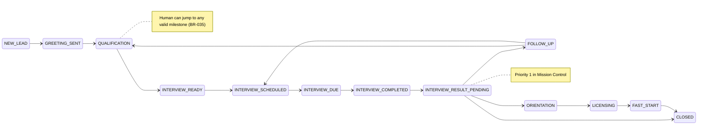

# Workflow Engine Specification

**Sprint:** 8A — Atlas Core Workflow Engine  
**Status:** Specification — pending documentation review  
**Related:** [ATLAS_CORE_ARCHITECTURE.md](./ATLAS_CORE_ARCHITECTURE.md), [MILESTONE_DEFINITIONS.md](./MILESTONE_DEFINITIONS.md), [EVENT_CATALOG.md](./EVENT_CATALOG.md), [BUSINESS_RULES.md](./BUSINESS_RULES.md)

---

## Purpose

Define the **canonical workflow engine** for Atlas: ownership, milestones, transitions, Mission Control priority, and formal business rules **BR-034** and **BR-035**.

This spec **extends** existing engines; it does not replace `semanticConversationEngine`, `agentActionEngine`, or `businessRulesEngine`.

---

## Workflow Ownership

Every active prospect MUST have exactly one ownership value at all times.

| Value | Automated messaging | Mission Control behavior |
|-------|---------------------|--------------------------|
| `ATLAS` | Allowed per milestone rules | Normal queue; Atlas drives next step |
| `AGENT` | **Paused** | Needs Human Attention; recommended action shown |
| `SYSTEM_WAITING` | Paused until trigger | Monitoring; lower urgency unless trigger missed |
| `CLOSED` | **Never** | Excluded from active queue (monitoring tier only) |

### Ownership transition rules

| From | To | Trigger |
|------|-----|---------|
| `ATLAS` | `AGENT` | BR-034 stall, BR-015 manual takeover, BR-024 coordinator handoff *(conversation)* |
| `ATLAS` | `SYSTEM_WAITING` | Interview scheduled, reminder scheduled, awaiting scheduled event |
| `AGENT` | `ATLAS` | BR-035 human save with valid milestone; no further human gate required |
| `AGENT` | `ATLAS` | Prospect inbound message after stall *(optional auto-resume — see open questions)* |
| `*` | `CLOSED` | Closed or Do Not Contact milestone applied |
| `CLOSED` | `ATLAS` | **Invalid** — manual reopen only via explicit product rule |

**Principle 8:** Returning to `ATLAS` after human interaction must **not** require a “Resume Atlas” button. Saving the interaction + milestone is sufficient.

---

## Canonical Milestones

Milestones are the **single progress axis** for workflow logic. See [MILESTONE_DEFINITIONS.md](./MILESTONE_DEFINITIONS.md) for full definitions.

| Canonical ID | Maps from (existing) | Notes |
|--------------|---------------------|-------|
| `NEW_LEAD` | Dashboard “new lead”, no `current_step` | Entry |
| `GREETING_SENT` | After first Atlas outbound, before prospect reply | **Proposed** — not explicit in DB today |
| `QUALIFICATION` | `GREETING` … `INTERVIEW_TYPE`, milestone “Qualifying” | Sub-progress via `current_step` |
| `INTERVIEW_READY` | All qual fields complete, not yet scheduled | Derived from `getMissingFields()` empty |
| `INTERVIEW_SCHEDULED` | `SCHEDULE` / `EMAIL`, “Interview Scheduled” | Appointment proposed or pending confirm |
| `INTERVIEW_DUE` | `CONFIRMED` + within 2h of start | Queue priority tier 3 |
| `INTERVIEW_COMPLETED` | Interview time passed | Physical completion |
| `INTERVIEW_RESULT_PENDING` | Workflow Gate active, no outcome | **Highest MC priority** |
| `FOLLOW_UP` | Outcome: Needs More Time, No Show, reschedule path | |
| `ORIENTATION` | Outcome: Recruited + orientation scheduled | Maps “Orientation Scheduled” |
| `LICENSING` | — | **Proposed** — post-recruit journey |
| `FAST_START` | — | **Proposed** — post-recruit journey |
| `CLOSED` | Not Interested, terminal outcomes | |
| `DO_NOT_CONTACT` | — | **Proposed** — explicit DNC |

### Legacy mapping reference

**Engine `current_step`** (`informationModel.js` → `deriveCurrentStep()`):

```
NEW → NEW_LEAD
GREETING → QUALIFICATION (or GREETING_SENT if outbound sent, no inbound)
WORK_AUTHORIZATION, OCCUPATION, INTERVIEW_TYPE → QUALIFICATION
SCHEDULE, EMAIL → INTERVIEW_SCHEDULED
CONFIRMED → INTERVIEW_SCHEDULED or INTERVIEW_DUE (time-based)
HANDOFF → AGENT ownership; milestone unchanged
```

**Frontend `MILESTONES`** (`types/milestones.js`):

| Frontend label | Canonical |
|----------------|-----------|
| New Lead | NEW_LEAD |
| Qualifying | QUALIFICATION |
| Interview Scheduled | INTERVIEW_SCHEDULED |
| Interview Confirmed | INTERVIEW_SCHEDULED / INTERVIEW_DUE |
| Interview Complete | INTERVIEW_COMPLETED |
| Recruited | ORIENTATION (or FOLLOW_UP if not yet oriented) |
| Orientation Scheduled | ORIENTATION |
| Onboarding | LICENSING / FAST_START *(TBD)* |
| Follow Up | FOLLOW_UP |
| Closed | CLOSED |

---

## State Machine (High Level)



**Human advancement (BR-035):** Any milestone may transition to any **valid** target per the allowed-next table in [MILESTONE_DEFINITIONS.md](./MILESTONE_DEFINITIONS.md), subject to required-data validation.

---

## BR-034 — Conversation Stalled / Intelligent Human Escalation

**Status:** Proposed — add to `BUSINESS_RULES.md` after doc review  
**Implements principles:** 4, 9, 11, 12, 13

### Trigger (all required)

1. No **inbound prospect** response for **24 hours** after Atlas’s **last outbound** message.
2. Workflow is **incomplete** (not `CLOSED`, not `DO_NOT_CONTACT`).
3. Prospect is **not** already awaiting a scheduled event where `SYSTEM_WAITING` is appropriate (e.g. confirmed interview in the future — stall clock may pause; see open questions).
4. Milestone is not terminal.

### Behavior

| Action | Detail |
|--------|--------|
| Pause automated progression | `semanticConversationEngine` does not send proactive follow-ups |
| Transfer ownership | `workflowOwnership → AGENT` |
| Flag attention | `needsHumanAttention = true` |
| Mission Control | Priority item **after** Pending Interview Results (rank 2) |
| Recommend action | Early conversation → **phone call** (BR-025 `call` action); context-specific copy via `agentActionCopy` |
| Preserve state | Current milestone and all collected data unchanged |
| Resume | Automatic after agent records interaction and advances/confirms milestone (BR-035) — **no Resume Atlas button** |

### Events

- `ConversationStalled`
- `WorkflowOwnershipChanged` (ATLAS → AGENT)
- `WorkflowPaused`

### Invalid / exclusions

- Do not fire if `workflowOwnership = CLOSED`
- Do not fire for `DO_NOT_CONTACT`
- Do not duplicate if already `needsHumanAttention` for same stall episode *(idempotent)*

---

## BR-035 — Human Advancement

**Status:** Proposed — add to `BUSINESS_RULES.md` after doc review  
**Implements principles:** 5, 6, 7, 8, 14, 15, 16, 17, 19

### Behavior

1. Agent records information collected during call or other human interaction.
2. Agent selects **target milestone** from allowed transitions (any valid milestone per state machine).
3. **Workflow engine validates** required data for target milestone (reuse `getMissingFields()` / validation engine).
4. On successful save:
   - Persist fields to prospect record
   - Set canonical milestone
   - Emit timeline/workflow events (see [EVENT_CATALOG.md](./EVENT_CATALOG.md))
   - If interview scheduled by human → Atlas executes: confirmation message, meeting details, reminders, calendar/timeline events (principle 16)
   - Return ownership to `ATLAS` when automated path can continue
   - Resume from **new milestone**, not last unanswered message (principle 7)
   - **Do not repeat** completed qualification questions (BR-014, principle 17)

### Events

- `HumanCallStarted` / `HumanCallCompleted` *(when call actions used)*
- `ProspectAdvanced`
- `QualificationUpdated` *(if fields changed)*
- `InterviewScheduled` / `InterviewRescheduled` *(if applicable)*
- `WorkflowOwnershipChanged` (AGENT → ATLAS or SYSTEM_WAITING)
- `WorkflowResumed`

### API shape (proposed)

```
POST /api/mission-control/:phone/workflow/advance
{
  "targetMilestone": "INTERVIEW_SCHEDULED",
  "capturedFields": { ... },
  "interactionNotes": "...",
  "interactionType": "phone" | "whatsapp" | "in_person"
}
```

Extends existing `POST /api/mission-control/:phone/workflow` (Workflow Gate sync) without breaking current clients.

---

## Mission Control Priority Engine

Backend-owned priority (replaces frontend-only ordering over time):

| Rank | Key | Detection |
|------|-----|-----------|
| 1 | `PENDING_INTERVIEW_RESULTS` | `milestone = INTERVIEW_RESULT_PENDING` OR Workflow Gate active |
| 2 | `HUMAN_ESCALATION` | `needsHumanAttention` + BR-034 stall |
| 3 | `INTERVIEW_IMMEDIATE` | `INTERVIEW_DUE`, start within 2 hours |
| 4 | `FOLLOW_UP_DUE` | `followUpDate <= today` |
| 5 | `ATLAS_ACTIVE` | `ownership = ATLAS`, incomplete workflow |
| 6 | `MONITORING` | Future confirmed interview, closed, passive |

Within tier, sort by: urgency timestamp → last activity → phone.

---

## Integration with Existing Rules

| Rule | Relationship |
|------|--------------|
| BR-014 | No repeat qualification — enforced on resume after BR-035 |
| BR-015 | Manual takeover → `AGENT` ownership |
| BR-016 | Human Mode — aligns with `AGENT` *(not yet in code)* |
| BR-024 | Coordinator handoff — conversation-level; may set `AGENT` |
| BR-025–032 | Next Actions visibility — extend with ownership + milestone gates |
| BR-008 | Closed prospects — no auto-resume |

---

## Invalid Transitions (Global)

- Any → `NEW_LEAD` *(except admin reset — out of scope)*
- `CLOSED` / `DO_NOT_CONTACT` → automated `ATLAS` without explicit reopen
- Milestone advance with missing required fields
- Automated outbound while `ownership = AGENT` *(except explicit agent-triggered sends via action engine)*

---

## Open Questions (Product Owner)

1. Does 24h stall clock **pause** during `SYSTEM_WAITING` (confirmed interview in future)?
2. Should inbound prospect message after stall auto-return to `ATLAS` without human save?
3. Is `GREETING_SENT` a persisted milestone or derived from message timestamps?
4. Journey packages: are `LICENSING` and `FAST_START` in scope for 8A implementation or documentation-only?
5. `DO_NOT_CONTACT` vs `CLOSED` — separate legal/compliance handling?
6. Reopen closed prospect — allowed milestones and who can trigger?

---

## Recommended First Implementation Task

After documentation approval:

**8A.1 — Workflow persistence schema + read path**

- Add `workflowOwnership`, `canonicalMilestone`, `needsHumanAttention`, `stalledAt` to prospect/workflow store
- Extend `GET /api/mission-control/:phone` to return these fields
- Map existing `current_step` + agent outcome to canonical milestone (read-only, no behavior change)

This unblocks priority engine, BR-034 detection, and BR-035 API without altering conversation flow.
