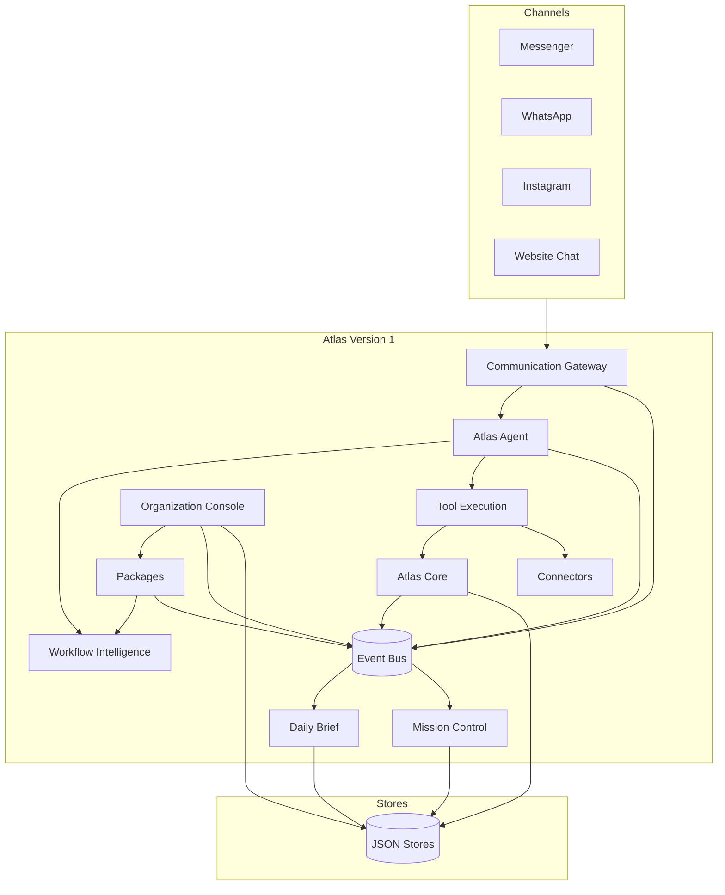
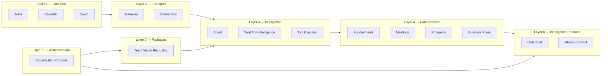
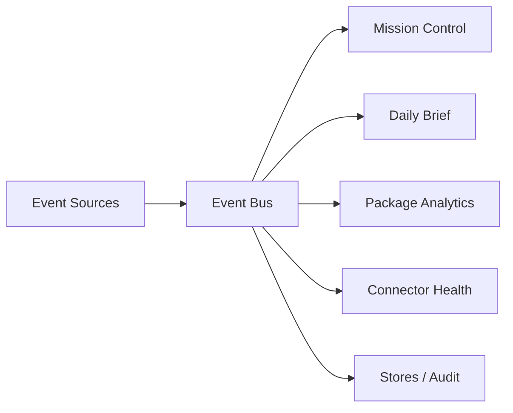
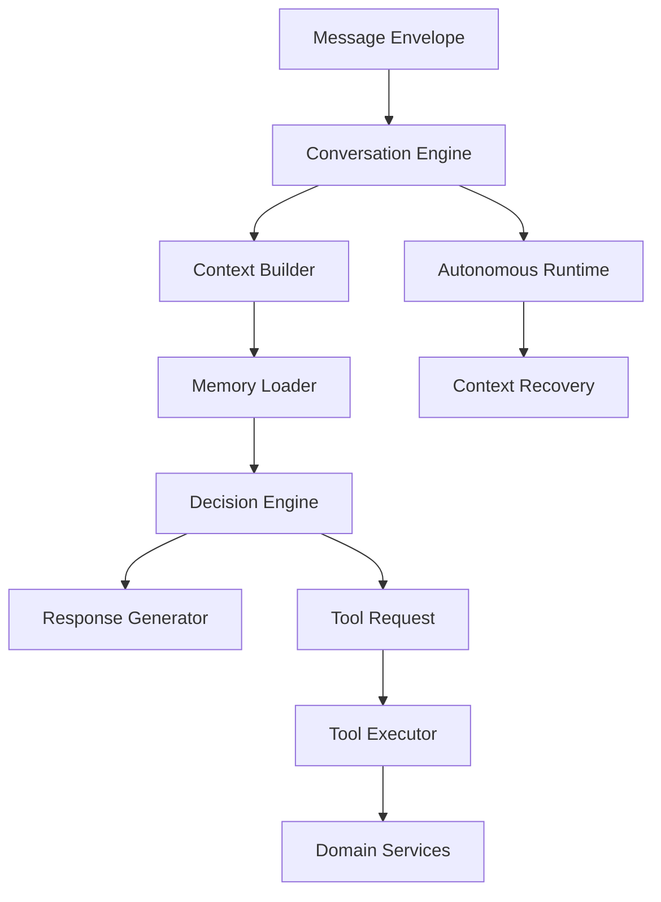

# Atlas Platform Version 1

**Document type:** Architecture — Platform Freeze  
**Status:** FROZEN  
**Version:** 1.0  
**Last Updated:** 2026-07-21  
**Audience:** Engineering, Product, Operations  

**Related:** [ARCHITECTURE_DECISIONS.md](./ARCHITECTURE_DECISIONS.md), [../vision/WHY_ATLAS_EXISTS.md](../vision/WHY_ATLAS_EXISTS.md), [../roadmap/ROADMAP.md](../roadmap/ROADMAP.md), [../releases/RELEASE_HISTORY.md](../releases/RELEASE_HISTORY.md), [../rfcs/README.md](../rfcs/README.md)

---

## Purpose

This document is the **official architectural reference for Atlas Version 1**. It describes the platform as frozen at Release 1.4 — not aspirational design.

A new engineer should be able to understand Atlas without reverse-engineering the repository.

---

## Platform Overview

Atlas is an **event-driven AI operating system for business workflows**. It is not a CRM, not a chatbot, and not a single-application monolith.

Atlas Version 1 consists of:

| Layer | Role |
|-------|------|
| **Atlas Core (v1.0)** | Conversation, workflow, scheduling, business rules, prospect identity |
| **Communication Gateway** | Channel-neutral message transport |
| **Atlas Agent** | Decision brain — intent, memory, tools, autonomous conversations |
| **Connectors** | Production integrations (Meta, Google Calendar, Zoom) |
| **Packages** | Industry-specific workflow extensions (Team Vision Recruiting) |
| **Organization Console** | Administration and configuration without code changes |
| **Daily Brief** | Executive intelligence — what happened |
| **Mission Control** | Operational intelligence — what is happening now |



---

## Layered Architecture



**Dependency rule:** Upper layers consume lower layers through contracts (RFCs). Packages never modify Core. Organization configuration never embeds package internals.

---

## Domain Map

| Domain | Path | Responsibility | Release |
|--------|------|----------------|---------|
| Atlas Core | `backend/core/` | Business rules, scheduling, read models, conversation copy | v1.0 |
| Communication Gateway | `backend/gateway/` | Message envelope, inbound/outbound routing | Journey #6 |
| Legacy Gateway | `backend/communication/` | Sprint 12 communication platform | Pre-Journey |
| Atlas Agent | `backend/agent/` | Conversation engine, decisions, memory | Journey #5 |
| Agent Runtime | `backend/agent/runtime/` | Autonomous sessions, context recovery | Journey #5 Inc 4 |
| Tool Execution | `backend/agent/tools/` | Tool registry, validation, execution history | Journey #5 Inc 3 |
| Workflow Intelligence | `backend/workflows/intelligence/` | Workflow contracts, state, navigation | Journey #5 Inc 2 |
| Workflow Engine | `backend/workflows/` | Workflow runner, recruiting definitions | Sprint 13+ |
| Appointments | `backend/appointments/` | Booking, confirmation | Journey #2 |
| Meetings | `backend/meetings/` | Calendar, Zoom, reminders, lifecycle | Journey #3 |
| Prospects | `backend/prospects/` | Atlas ID, prospect factory, repository | Journey #6 |
| Connectors | `backend/connectors/` | Meta, Google Calendar, Zoom production connectors | Journey #7 |
| Organization Console | `backend/organizations/` | Profile, branding, offices, packages, policies | Release 1.2 |
| Daily Brief | `backend/intelligence/` | Snapshot, metrics, trends, recommendations | Release 1.3 |
| Mission Control | `backend/mission-control/` | Live state, timeline, alerts, health | Release 1.4 |
| Team Vision Package | `backend/packages/teamvision/` | Recruiting workflow, qualification, analytics | Release 1.1 |
| Operators | `backend/operators/` | Assignment engine | Sprint 12.5 |
| Executive Dashboard | `backend/executive-dashboard/` | Read-model services | Sprint 12+ |

---

## Folder Structure

```
atlas-ai/
├── backend/
│   ├── agent/                 # Atlas Agent + runtime + tools
│   ├── appointments/          # Journey #2
│   ├── communication/         # Sprint 12 communication platform
│   ├── connectors/            # Journey #7 production connectors
│   ├── core/                  # Atlas Core — LOCKED
│   ├── data/                  # JSON persistence stores
│   ├── dev/                   # Verification scripts
│   ├── gateway/               # Journey #6 unified gateway
│   ├── intelligence/          # Release 1.3 Daily Brief
│   ├── meetings/              # Journey #3
│   ├── mission-control/       # Release 1.4 + Sprint 12.5
│   ├── organizations/         # Release 1.2 Organization Console
│   ├── packages/teamvision/   # Release 1.1 — LOCKED
│   ├── prospects/             # Prospect domain
│   ├── workflows/             # Workflow engine + intelligence
│   └── server.js              # Express API entry
├── frontend/                  # React UI (not part of V1 freeze scope)
└── docs/
    ├── architecture/          # Platform and agent architecture
    ├── vision/                # Why Atlas exists
    ├── roadmap/               # Future direction
    ├── rfcs/                  # Permanent contracts
    ├── releases/              # Release notes and history
    └── onboarding/            # Journey documentation
```

---

## Event Architecture

Atlas Version 1 is **event-driven**. Domains communicate through a shared `EventBus` (`backend/communication/events/EventBus.js`).



### Event namespaces

| Namespace | Examples | Defined in |
|-----------|----------|------------|
| `gateway.*` | `gateway.message.received` | `backend/gateway/GatewayEvents.js` |
| `agent.*` | `agent.decision.created` | `backend/agent/AgentEvents.js` |
| `conversation.*` | `conversation.started` | `backend/agent/runtime/SessionEvents.js` |
| `workflow.*` | `workflow.step.completed` | `backend/workflows/intelligence/WorkflowEvents.js` |
| `agent.tool.*` | `agent.tool.executed` | `backend/agent/tools/ToolEvents.js` |
| `package.*` | `package.interview.scheduled` | `backend/packages/teamvision/PackageEvents.js` |
| `organization.*` | `organization.created` | `backend/organizations/OrganizationEvents.js` |
| `brief.*` | `brief.generated` | `backend/intelligence/BriefEvents.js` |
| `mission.*` | `mission.updated` | `backend/mission-control/MissionEvents.js` |
| `connector.*` | `connector.connected` | `backend/connectors/shared/ConnectorEvents.js` |
| `appointment.*` | `appointment.scheduled` | `backend/appointments/AppointmentEvents.js` |
| `meeting.*` | `meeting.ready` | `backend/meetings/MeetingEvents.js` |

**Contract:** See [RFC-002 Event Naming](../rfcs/RFC-002-event-naming.md) and [RFC-010 Event Bus Principles](../rfcs/RFC-010-event-bus-principles.md).

---

## Communication Gateway

**Path:** `backend/gateway/`  
**Journey:** #6  
**RFC:** [RFC-001 Message Envelope](../rfcs/RFC-001-message-envelope.md)

The Gateway is the **only entry point** for channel messages into Atlas intelligence.

| Module | Responsibility |
|--------|----------------|
| `MessageEnvelope.js` | Permanent internal message contract |
| `ChannelAdapter.js` | Adapter interface |
| `InboundRouter.js` | Webhook → normalized envelope → Agent |
| `OutboundRouter.js` | Agent response → channel adapter |
| `CommunicationGateway.js` | Orchestrator |
| `GatewayStore.js` | Inbound/outbound audit persistence |

**Principle:** Channels are dumb transport. The Agent never receives platform-specific payloads.

---

## Agent Architecture

**Path:** `backend/agent/`  
**Journey:** #5  
**Design doc:** [ATLAS_AGENT_ARCHITECTURE.md](./ATLAS_AGENT_ARCHITECTURE.md)



| Component | Path | Role |
|-----------|------|------|
| Conversation Engine | `ConversationEngine.js` | Turn processing, fact extraction |
| Decision Engine | `DecisionEngine.js` | Next action: answer, ask, tool, escalate |
| Tool Executor | `tools/ToolExecutor.js` | Validates and executes tool requests |
| Autonomous Runtime | `runtime/` | Multi-turn sessions, interruptions, summaries |

**Boundary:** Agent requests work; domain services perform side effects.

---

## Workflow Intelligence

**Path:** `backend/workflows/intelligence/`  
**Journey:** #5 Increment 2  
**RFC:** [RFC-004 Workflow Contract](../rfcs/RFC-004-workflow-contract.md)

| Module | Responsibility |
|--------|----------------|
| `WorkflowRegistry.js` | Registered workflow contracts |
| `WorkflowLoader.js` | Load workflow by name |
| `WorkflowState.js` | Per-conversation workflow state |
| `WorkflowNavigator.js` | Step transitions |
| `WorkflowValidator.js` | Contract validation |

Packages register workflows. Core provides the engine; packages provide definitions.

---

## Tool Execution

**Path:** `backend/agent/tools/`  
**Journey:** #5 Increment 3  
**RFC:** [RFC-003 Tool Contract](../rfcs/RFC-003-tool-contract.md)

Tools are the **only approved mechanism** for the Agent to cause side effects.

Flow: `ToolRequest` → `ToolValidator` → `ToolExecutor` → domain service → `ToolResult`

Events: `agent.tool.requested`, `agent.tool.executed`, `agent.tool.failed`, `agent.tool.completed`

---

## Organization Console

**Path:** `backend/organizations/`  
**Release:** 1.2  
**RFC:** [RFC-006 Organization Model](../rfcs/RFC-006-organization-model.md)

Administration layer — everything organization-specific lives in configuration.

| Capability | Module |
|------------|--------|
| Profile, branding | `OrganizationProfile`, `OrganizationBranding` |
| Offices | `OrganizationLocations` |
| Users, roles | `OrganizationUsers`, `OrganizationRoles` |
| Packages | `OrganizationPackages` |
| Connectors | `OrganizationConnectors` |
| Policies | `OrganizationPolicies` |
| Validation | `ConfigurationValidator` |

**Store:** `backend/data/organizationConsole.json`

---

## Daily Brief

**Path:** `backend/intelligence/`  
**Release:** 1.3  
**RFC:** [RFC-008 Daily Brief Schema](../rfcs/RFC-008-daily-brief-schema.md)

Answers: **"If I only had one minute, what do I need to know?"**

Pipeline: Snapshot → Metrics → Trends → Insights → Priorities → Recommendations → Brief

**Store:** `backend/data/dailyBrief.json`  
**Verify:** `node backend/dev/verifyRelease1_3.js`

---

## Mission Control

**Path:** `backend/mission-control/`  
**Release:** 1.4  
**RFC:** [RFC-009 Mission Control State](../rfcs/RFC-009-mission-control-state.md)

Answers: **"What is happening right now?"**

Event-driven incremental state — no polling, no full rebuilds.

| Module | Role |
|--------|------|
| `MissionControlEngine.js` | Subscribes to Event Bus, orchestrates updates |
| `MissionEventProcessor.js` | Maps events → state mutations |
| `MissionState.js` | Live operational state |
| `MissionTimeline.js` | Newest-first event timeline |
| `MissionAlerts.js` | Severity-ranked alerts |
| `MissionHealth.js` | Component health statuses |

**Store:** `backend/data/missionControl.json`  
**Verify:** `node backend/dev/verifyRelease1_4.js`

---

## Team Vision Recruiting Pack

**Path:** `backend/packages/teamvision/`  
**Release:** 1.1  
**RFC:** [RFC-005 Package Manifest](../rfcs/RFC-005-package-manifest.md)

First production package. Implements recruiting workflow on Atlas Core without modifying Core.

| Module | Role |
|--------|------|
| `RecruitingPackage.js` | Registration and event subscription |
| `RecruitingWorkflow.js` | Workflow contract |
| `QualificationRules.js` | Configurable qualification |
| `InterviewManager.js` | Scheduling via Core appointment chain |
| `FollowUpEngine.js` | Follow-up sequences |
| `RecruitingAnalytics.js` | Package-scoped metrics |

**Store:** `backend/data/teamvisionAnalytics.json`

---

## Connectors

**Path:** `backend/connectors/`  
**Journey:** #7  
**RFC:** [RFC-007 Connector Contract](../rfcs/RFC-007-connector-contract.md)

| Connector | Path |
|-----------|------|
| Meta Webhook | `connectors/meta/MetaWebhookConnector.js` |
| Messenger | `connectors/meta/MessengerConnector.js` |
| WhatsApp | `connectors/meta/WhatsAppConnector.js` |
| Instagram | `connectors/meta/InstagramConnector.js` |
| Google Calendar | `connectors/google/GoogleCalendarConnector.js` |
| Zoom | `connectors/zoom/ZoomConnector.js` |

Shared: `ConnectorRegistry`, `RetryPolicy`, `ConnectorHealth`

---

## Data Stores

Atlas Version 1 uses **JSON file persistence** for domain stores (MVP). Production may migrate to Supabase.

| Store | File | Owner |
|-------|------|-------|
| Organization Console | `organizationConsole.json` | Release 1.2 |
| Daily Brief | `dailyBrief.json` | Release 1.3 |
| Mission Control | `missionControl.json` | Release 1.4 |
| Team Vision Analytics | `teamvisionAnalytics.json` | Release 1.1 |
| Agent Store | `agentStore.json` | Journey #5 |
| Conversation Sessions | `conversationSessions.json` | Journey #5 Inc 4 |
| Gateway Store | `gatewayStore.json` | Journey #6 |
| Appointments | `appointments.json` | Journey #2 |
| Meetings | `meetings.json` | Journey #3 |
| Workflow State | `workflowState.json` | Core |
| Agent Action State | `agentActionState.json` | Core |
| Capacity | `capacity.json` | Core |
| Onboarding Orgs | `organizations.json` | Journey #1 |
| Atlas Users | `atlasUsers.json` | Journey #1 |

---

## Release History

| Version | Name | Git Tag | Verify Script |
|---------|------|---------|---------------|
| v1.0 | Atlas Core | — (conceptual freeze) | `verifyJourney1.js` … `verifyJourney7.js` |
| v1.1 | Team Vision Recruiting Pack | — | `verifyRelease1_1.js` |
| v1.2 | Organization Console | — | `verifyRelease1_2.js` |
| v1.3 | Daily Brief | `v1.3.0` | `verifyRelease1_3.js` |
| v1.4 | Mission Control | `v1.4.0` | `verifyRelease1_4.js` |

Full history: [RELEASE_HISTORY.md](../releases/RELEASE_HISTORY.md)

---

## Guiding Principles

The **Atlas Constitution** governs all Version 1 design:

1. **Simple wins** — Prefer the smallest correct solution.
2. **Hide complexity** — Operators see outcomes, not engine internals.
3. **Automation first** — Automate everything that does not require human judgment.
4. **Easy to duplicate** — Organizations configure; they do not fork code.
5. **Simple Scales** — Event-driven, layered, package-based architecture scales by addition, not modification.

Additional Version 1 principles:

- **Atlas Core is generic.** Industry logic lives in packages.
- **Configuration over code.** Organization differences belong in the Organization Console.
- **Events over polling.** Mission Control and Daily Brief consume the Event Bus.
- **Contracts over conventions.** RFCs define permanent interfaces.
- **Human approval for action.** Recommendations and alerts never auto-execute.

---

## Verification

Run the full Version 1 verification chain:

```bash
node backend/dev/verifyRelease1_4.js   # includes 1.3, 1.2, 1.1, Journey regression
node backend/dev/verifyJourney7.js     # includes J6, J5 Inc 4, J2, J3
node backend/dev/verifyJourney1.js       # onboarding
```

---

## Document Maintenance

This document is **frozen** with Atlas Version 1. Changes require a Version 2 initiative and architecture review.

For engineering decisions behind this architecture, see [ARCHITECTURE_DECISIONS.md](./ARCHITECTURE_DECISIONS.md).

**Remember: Simple Scales.**
