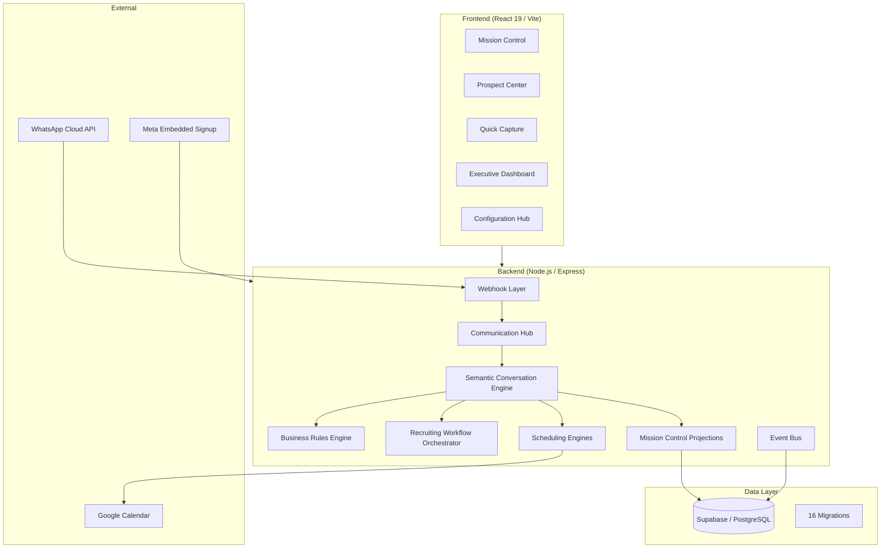
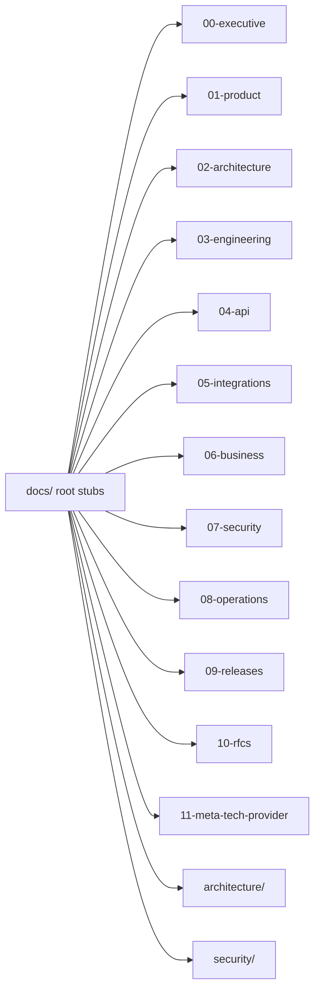
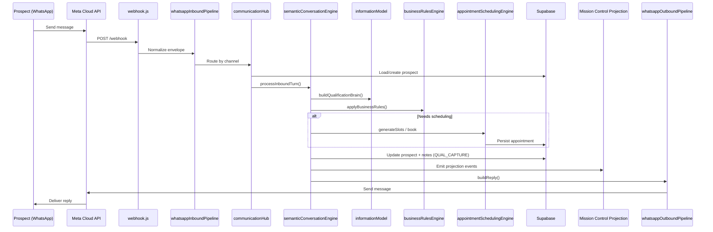
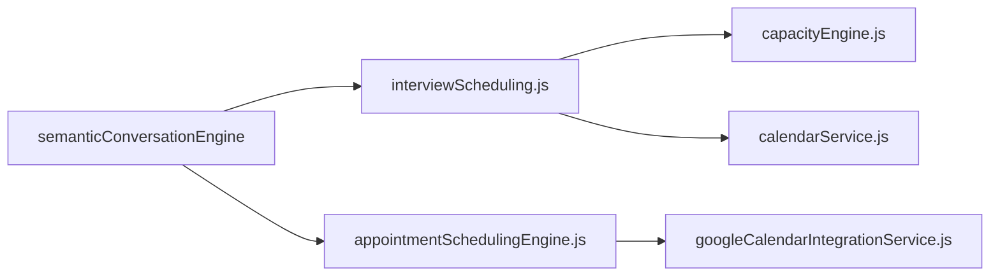
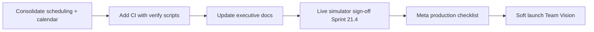

# Atlas Architecture Audit v1

**Date:** 2026-07-28  
**Type:** Read-only architectural discovery  
**Scope:** Full codebase + `/docs` directory  
**Status:** Pre-production assessment  

> **Note:** Requested path was `/docs/Architecture/Atlas-Architecture-Audit-v1.md`. This report lives at `docs/architecture/Atlas-Architecture-Audit-v1.md` to match the repository's existing architecture documentation folder.

---

## Table of Contents

1. [Executive Summary](#1-executive-summary)
2. [Documentation Audit](#2-documentation-audit)
3. [Repository Structure](#3-repository-structure)
4. [Existing Architecture Modules](#4-existing-architecture-modules)
5. [Current Conversation Flow](#5-current-conversation-flow)
6. [Scheduling Analysis](#6-scheduling-analysis)
7. [Workflow Analysis](#7-workflow-analysis)
8. [Business Rules](#8-business-rules)
9. [AI Analysis](#9-ai-analysis)
10. [Technical Debt](#10-technical-debt)
11. [Gap Analysis](#11-gap-analysis)
12. [Production Readiness](#12-production-readiness)
13. [Refactoring Strategy](#13-refactoring-strategy)
14. [Final Recommendations](#14-final-recommendations)

---

# 1. Executive Summary

## What Atlas Is

Atlas is a **multi-tenant recruiting automation platform** built for Team Vision. It handles WhatsApp-first prospect conversations, qualification workflows, interview scheduling (in-person and Zoom), Mission Control for recruiters, and executive visibility. The system combines rule-based conversation logic with optional AI assistance, event-sourced projections, and Google Calendar integration.

## Current Architecture (High Level)



## Main Modules

| Layer | Module | Location | Role |
|-------|--------|----------|------|
| Inbound | WhatsApp webhook | `backend/routes/webhook.js` | Receives Meta webhooks |
| Pipeline | Inbound/outbound pipelines | `backend/core/whatsappInboundPipeline.js`, `whatsappOutboundPipeline.js` | Message normalization |
| Hub | Communication Hub | `backend/core/communicationHub.js` | Channel routing |
| Conversation | Semantic Conversation Engine | `backend/core/semanticConversationEngine.js` | Primary hot-path processor |
| Qualification | Information Model + Capture State | `backend/core/informationModel.js`, `qualificationCaptureState.js` | Field order, missing fields |
| Rules | Business Rules Engine | `backend/core/businessRulesEngine.js` | BR-001+ decisions |
| Workflow | Recruiting Orchestrator | `backend/core/recruitingWorkflowOrchestrator.js` | Workflow coordination |
| Scheduling | Dual stack (legacy + Sprint 22) | `interviewScheduling.js`, `appointmentSchedulingEngine.js` | Slot generation, booking |
| Calendar | Dual stack | `services/calendarService`, `googleCalendarIntegrationService.js` | Google Calendar |
| Mission Control | Triple implementation | routes + projection + live service | Recruiter UI backend |
| Frontend | 40 page components | `frontend/src/pages/` | Operator experience |

## Backend Architecture

- **Runtime:** Node.js, Express (`backend/server.js`)
- **Pattern:** Modular monolith — `backend/core/` engines, `backend/routes/` HTTP, `backend/modules/` feature bundles
- **Hot path:** Webhook → Communication Hub → Semantic Conversation Engine (rule-based, not LLM-first)
- **Secondary path:** Gateway/WorkflowEngine (`backend/workflows/WorkflowEngine.js`) — partial, not primary production path
- **Events:** Event bus + timeline projections for Mission Control and audit

## Frontend Architecture

- **Stack:** React 19, Vite, React Router
- **Pages:** 40 JSX pages including Mission Control, Prospect Center, Quick Capture, Executive Dashboard, Configuration Hub, WhatsApp Connect, Operations Center / Simulator
- **i18n:** `frontend/src/i18n/translations.js` (EN/ES)
- **Auth:** Login, invitation flow, role-based access

## Database

- **Provider:** Supabase (PostgreSQL)
- **Migrations:** 16 SQL migrations in `supabase/migrations/`
- **Model:** Multi-tenant (organizations), prospects, appointments, events, users, configuration
- **Projections:** Event-sourced read models for Mission Control and timeline

## AI Components

| Component | Status | Notes |
|-----------|--------|-------|
| Semantic Conversation Engine | **Production (rule-based)** | Primary processor; LLM optional/fallback |
| Intent detection | Partial | Pattern + semantic helpers, not standalone ML service |
| Entity extraction | Partial | Field capture via qualification brain |
| Response generation | Rule-based copy | `conversationCopy.js`, `teamVisionWorkflowCopy.js` |
| OpenAI / LLM integration | Present but secondary | Used in some paths, not hot-path default |

## Current Maturity

| Area | Maturity |
|------|----------|
| WhatsApp inbound/outbound | **High** — live pipeline |
| Team Vision qualification workflow | **High** — Sprint 21.x hardened |
| Business rules | **High** — BR-001–BR-024+ documented and coded |
| Mission Control | **Medium-High** — live but multiple implementations |
| Scheduling | **Medium** — dual stacks, Sprint 22 engine newer |
| Automated testing | **Low** — 6 unit tests, 61+ verify scripts |
| CI/CD | **Missing** — no `.github/` workflows |
| Documentation | **Medium** — extensive but stale in places |

## Production Readiness Assessment

**Overall: 6/10 — functionally rich, operationally immature.**

Strengths: End-to-end WhatsApp conversation flow works; business rules are codified; Mission Control and Prospect Center exist; Meta embedded signup implemented.

Gaps: No CI/CD; minimal automated tests; duplicate scheduling/calendar/Mission Control implementations; documentation drift (CURRENT_SPRINT = Sprint 17, code at Sprint 21–22); no formal observability stack documented.

---

# 2. Documentation Audit

**Total markdown files:** ~189 under `/docs`  
**Audit method:** Full directory scan + spot-check of authoritative vs. stale sources.

## Documentation Topology



## Authoritative vs. Stale Sources

| Document | Location | Declared Sprint | Actual Code State | Verdict |
|----------|----------|-----------------|-------------------|---------|
| `CURRENT_SPRINT.md` | `docs/00-executive/` | Sprint 17 | Code at Sprint 21–22 | **Stale** |
| `Current_System_State.md` | `docs/00-executive/` | Sprint 11.4 | Pre–Sprint 21 | **Stale** |
| `BUSINESS_RULES.md` | `docs/06-business/` | Current | Matches engine | **Authoritative** |
| `WORKFLOW_ENGINE_SPEC.md` | `docs/02-architecture/` | v1 platform | Partially implemented | **Reference** |
| Sprint 17–22 specs | `docs/architecture/` | 17–22 | Active development | **Current for sprints** |
| Root redirect stubs | `docs/*.md` (19 files) | N/A | Point to numbered folders | **Keep as redirects** |

## Per-Folder Inventory

### `docs/00-executive/` (5 files)

| File | Purpose | Sprint | Keep? | Notes |
|------|---------|--------|-------|-------|
| `README.md` | Index | — | Yes | Entry point |
| `CURRENT_SPRINT.md` | Active sprint | 17 | Yes, **update** | Stale vs. code |
| `Current_System_State.md` | System snapshot | 11.4 | Yes, **update** | Very stale |
| `Roadmap.md` | Product roadmap | — | Yes | Strategic |
| `README.md` (exec) | Navigation | — | Yes | — |

### `docs/01-product/` (~15+ files)

| File | Purpose | Sprint | Keep? | Notes |
|------|---------|--------|-------|-------|
| `Product_Vision.md` | Vision | — | Yes | Source of truth for product |
| `WHY_ATLAS_EXISTS.md` | Rationale | — | Yes | — |
| `ATLAS_NEVER_SLEEPS.md` | Positioning | — | Yes | — |
| `BACKLOG.md` | Backlog | — | Yes | May duplicate root `BACKLOG.md` |
| `README.md` | Index | — | Yes | — |
| `archive/v1-platform/` | Legacy journeys | v1 | Yes (archive) | Historical reference |

### `docs/02-architecture/` (~10 files)

| File | Purpose | Sprint | Keep? | Notes |
|------|---------|--------|-------|-------|
| `ATLAS_CORE_ARCHITECTURE.md` | Core architecture | — | Yes | Primary architecture doc |
| `ATLAS_AGENT_ARCHITECTURE.md` | Agent design | — | Yes | Future-oriented |
| `ATLAS_PLATFORM_V1.md` | Platform v1 | v1 | Yes | Reference |
| `WORKFLOW_ENGINE_SPEC.md` | Workflow spec | — | Yes | Partial implementation |
| `WORKFLOW_SEQUENCE_DIAGRAMS.md` | Diagrams | — | Yes | — |
| `Communication_Hub.md` | Hub design | — | Yes | Matches code |
| `ARCHITECTURE_DECISIONS.md` | ADRs | — | Yes | — |
| `README.md` | Index | — | Yes | — |

### `docs/architecture/` (8+ sprint specs)

| File | Purpose | Sprint | Keep? | Notes |
|------|---------|--------|-------|-------|
| Sprint 16.9–22 specs | Sprint implementation docs | 16.9–22 | **Yes — authoritative for recent work** | Not mirrored in `09-releases/sprints/` |
| `Atlas-Architecture-v1.md` | Architecture snapshot | — | Yes | — |
| `Atlas-Architecture-Audit-v1.md` | This audit | — | Yes | New |

### `docs/03-engineering/` (~15 files)

| File | Purpose | Sprint | Keep? | Notes |
|------|---------|--------|-------|-------|
| `DEVELOPMENT_WORKFLOW.md` | Dev process | — | Yes | Referenced by cursor rules |
| `ENGINEERING_STANDARDS.md` | Standards | — | Yes | — |
| `WORKFLOW_SIMULATOR_SPEC.md` | Simulator | — | Yes | Matches `/dev` routes |
| `frontend/*` | Frontend audits | — | Yes | UX/component inventory |

### `docs/04-api/` (~3 files)

| File | Purpose | Keep? | Notes |
|------|---------|-------|-------|
| `README.md` | Index | Yes | — |
| `mission-control-workflow-advance.md` | MC API | Yes | — |
| `workflow-simulator-dev-api.md` | Dev simulator API | Yes | Dev-only |

### `docs/05-integrations/` (~5+ files)

| File | Purpose | Keep? | Notes |
|------|---------|-------|-------|
| `WHATSAPP_EMBEDDED_SIGNUP.md` | Meta signup | Yes | Matches `metaOnboarding.js` |
| `meta/Meta_Approval_Portfolio.md` | Meta review | Yes | — |
| `meta/README.md` | Meta index | Yes | Duplicates `11-meta-tech-provider/` partially |

### `docs/06-business/` (~6 files)

| File | Purpose | Keep? | Notes |
|------|---------|-------|-------|
| **`BUSINESS_RULES.md`** | **BR-001+** | **Yes — SOURCE OF TRUTH** | Must read before coding |
| `EVENT_CATALOG.md` | Events | Yes | — |
| `ATLAS_GLOSSARY.md` | Terms | Yes | Duplicates root stub |
| `MILESTONE_DEFINITIONS.md` | Milestones | Yes | — |

### `docs/07-security/` (~3 files)

| File | Purpose | Keep? | Notes |
|------|---------|-------|-------|
| `Meta_Review_QA.md` | Meta Q&A | Yes | — |
| `Privacy_and_Data_Handling.md` | Privacy | Yes | — |

### `docs/08-operations/` (~5+ files)

| File | Purpose | Keep? | Notes |
|------|---------|-------|-------|
| `deployment/sprint-11.4-meta-production.md` | Deploy guide | 11.4 | Yes, update | Stale sprint ref |
| `deployment/README.md` | Deploy index | Yes | — |

### `docs/09-releases/` (~20+ files)

| File | Purpose | Keep? | Notes |
|------|---------|-------|-------|
| `CHANGELOG.md` | Changes | Yes | — |
| `RELEASE_HISTORY.md` | Releases | Yes | — |
| `sprints/SPRINT_*` | Sprint records | 8–11 | Yes (archive) | Sprints 17–22 **missing here** |
| `archive/v1-platform/` | v1 releases | v1 | Yes (archive) | — |

### `docs/10-rfcs/` (10 files)

| File | Purpose | Keep? | Notes |
|------|---------|-------|-------|
| `RFC-001` through `RFC-010` | Contracts | Yes | Design contracts, partial implementation |

### `docs/11-meta-tech-provider/` (~5 files)

| File | Purpose | Keep? | Notes |
|------|---------|-------|-------|
| Meta tech provider docs | Meta compliance | Yes | Overlaps `05-integrations/meta/` |

### `docs/security/` (11 files)

| File | Purpose | Keep? | Notes |
|------|---------|-------|-------|
| Security policies | Security | Yes | Parallel to `07-security/` — consolidate paths |

### Root `docs/*.md` stubs (19 files)

| Pattern | Purpose | Keep? |
|---------|---------|-------|
| `BUSINESS_RULES.md`, `BACKLOG.md`, etc. | Redirects to numbered folders | Yes — maintain redirects |

## Duplicates Identified

| Duplicate Set | Recommendation |
|---------------|----------------|
| Root stubs ↔ numbered folders | Keep stubs as redirects; edit numbered folders only |
| `05-integrations/meta/` ↔ `11-meta-tech-provider/` | Consolidate index; cross-link |
| `07-security/` ↔ `docs/security/` | Pick one path; redirect the other |
| `02-architecture/` ↔ `docs/architecture/` | Both needed: numbered = canonical platform; `architecture/` = sprint specs |
| `CHANGELOG` sprint notes ↔ `architecture/` sprint specs | Mirror sprint completion into `09-releases/sprints/` |

## Missing Documentation

| Gap | Priority |
|-----|----------|
| Sprint 17–22 entries in `09-releases/sprints/` | High |
| Updated `CURRENT_SPRINT.md` and `Current_System_State.md` | High |
| Single scheduling architecture doc (dual-stack explanation) | High |
| API reference for all `/api/*` routes | Medium |
| CI/CD and deployment runbook (current) | Medium |
| Observability / logging guide | Medium |
| Test strategy document | Medium |

---

# 3. Repository Structure

## Top-Level Map

```
atlas-ai/
├── backend/          # Node.js API, engines, routes, modules
├── frontend/         # React 19 SPA
├── docs/             # Documentation (189+ markdown files)
├── supabase/         # Database migrations
├── scripts/          # Verify scripts, doc tooling
├── shared/           # Shared constants/types (minimal)
├── tests/            # Automated tests (minimal)
└── package.json      # Root workspace config
```

## `backend/` (~528 files)

| Folder | Responsibility |
|--------|----------------|
| `core/` | **Engines** — conversation, rules, scheduling, qualification, pipelines |
| `routes/` | Express HTTP route handlers |
| `modules/` | Feature modules (mission-control, executive-dashboard, prospects, etc.) |
| `services/` | External integrations (calendar, WhatsApp, email) |
| `workflows/` | WorkflowEngine (Gateway path, partial) |
| `middleware/` | Auth, logging, CORS |
| `utils/` | Helpers |
| `server.js` | Application entry, route mounting |

**Key `core/` files:**

| File | Lines (approx) | Role |
|------|----------------|------|
| `semanticConversationEngine.js` | ~1,118 | Primary conversation processor |
| `informationModel.js` | ~400+ | Qualification brain, field order |
| `businessRulesEngine.js` | ~300+ | BR decisions |
| `recruitingWorkflowOrchestrator.js` | ~200+ | Workflow coordination |
| `interviewScheduling.js` | ~300+ | Legacy scheduling |
| `appointmentSchedulingEngine.js` | ~200+ | Sprint 22 scheduling |
| `qualificationCaptureState.js` | ~150+ | QUAL_CAPTURE markers |
| `communicationHub.js` | ~200+ | Channel hub |

## `frontend/`

| Folder | Responsibility |
|--------|----------------|
| `src/pages/` | Route-level page components (40 pages) |
| `src/components/` | Reusable UI |
| `src/i18n/` | Translations (EN/ES) |
| `src/hooks/` | React hooks |
| `src/services/` | API clients |
| `src/context/` | Auth and app context |

## `docs/`

Numbered folders `00`–`12` plus `architecture/`, `security/`, root stubs. See Section 2.

## `shared/`

Minimal shared code between frontend and backend. Most logic lives in backend `core/`.

## `supabase/` (database)

| Folder | Responsibility |
|--------|----------------|
| `migrations/` | 16 PostgreSQL migrations — schema evolution |

## `scripts/`

| Script Pattern | Responsibility |
|----------------|----------------|
| `verifySprint*.js` | Manual regression verification (61+ scripts) |
| `audit-docs.py`, `consolidate-docs.py`, `fix-doc-links.py` | Documentation tooling |

## `tests/`

| Location | Count | Notes |
|----------|-------|-------|
| `backend/**/*.test.js` | ~6 | Minimal unit coverage |
| `scripts/verifySprint*.js` | 61+ | Primary "test" strategy today |

## Config

| File | Role |
|------|------|
| `backend/.env` (local) | Secrets, API keys |
| `frontend/vite.config.js` | Vite build |
| `package.json` | Workspace scripts |
| No `.github/` | **No CI/CD configured** |

---

# 4. Existing Architecture Modules

For each module: **Exists? | Locations | Responsibility | Maturity | Recommendation**

| Module | Exists | File Locations | Responsibility | Maturity | Recommendation |
|--------|--------|----------------|----------------|----------|----------------|
| **Conversation Engine** | ✅ Yes | `semanticConversationEngine.js`, `conversationCopy.js` | Turn processing, replies, FAQ, handoff | **High** | **Evolve — do not rebuild** |
| **Workflow Engine** | 🟡 Partial | `recruitingWorkflowOrchestrator.js` (active), `workflows/WorkflowEngine.js` (partial) | Workflow steps, Gateway path | **Medium** | Consolidate on orchestrator; deprecate unused Gateway path |
| **State Machine** | 🟡 Partial | `informationModel.js`, `qualificationCaptureState.js`, `schedulingState.js` | Qualification + scheduling state | **High** (qualification) | Extend existing capture state; no new FSM library |
| **Intent Detection** | 🟡 Partial | `semanticConversationEngine.js`, helpers | Pattern/semantic intent routing | **Medium** | Improve within SCE; no standalone service |
| **Entity Extraction** | 🟡 Partial | `informationModel.js`, `qualificationCaptureState.js` | Field capture (city, state, auth, etc.) | **High** | Keep QUAL_CAPTURE approach |
| **Scheduling Engine** | ✅ Yes (dual) | `interviewScheduling.js`, `appointmentSchedulingEngine.js`, `capacityEngine.js` | Slots, booking, buffers | **Medium** | **Consolidate dual stacks** |
| **Availability Engine** | 🟡 Partial | `capacityEngine.js`, `appointmentSchedulingEngine.js` | Business hours, slot generation | **Medium** | Unify into one engine |
| **Business Rules** | ✅ Yes | `businessRulesEngine.js`, `businessRulesApplicator.js`, `docs/06-business/BUSINESS_RULES.md` | BR-001+ decisions | **High** | **Source of truth — evolve** |
| **FAQ Engine** | 🟡 Partial | `semanticConversationEngine.js` (FAQ interrupt/resume) | FAQ detour + resume | **Medium** | Extract FAQ block within SCE if it grows |
| **Human Handoff** | ✅ Yes | `semanticConversationEngine.js`, `teamVisionWorkflowCopy.js` | Coordinator escalation | **High** | Keep |
| **Response Generator** | ✅ Yes | `conversationCopy.js`, `teamVisionWorkflowCopy.js`, SCE reply builder | Template/copy responses | **High** | Keep rule-based copy |
| **WhatsApp Integration** | ✅ Yes | `webhook.js`, `whatsappInboundPipeline.js`, `whatsappOutboundPipeline.js`, `metaEmbeddedSignupService.js` | Inbound/outbound, Meta signup | **High** | **Do not rebuild** |
| **Google Calendar Integration** | 🟡 Dual | `services/calendarService.js`, `googleCalendarIntegrationService.js` | Calendar read/write, events | **Medium** | Consolidate to one service |
| **Mission Control Integration** | ✅ Yes (triple) | `routes/missionControl.js`, `modules/mission-control/`, `missionControlLiveService.js` | Recruiter queue, workflow advance | **Medium-High** | Consolidate three paths |

---

# 5. Current Conversation Flow

## End-to-End Flow Diagram



## File Trace (Hot Path)

| Step | File(s) |
|------|---------|
| 1. Incoming WhatsApp | `backend/routes/webhook.js` |
| 2. Webhook validation | `backend/routes/webhook.js`, Meta verify token |
| 3. Inbound pipeline | `backend/core/whatsappInboundPipeline.js` |
| 4. Communication Hub | `backend/core/communicationHub.js` |
| 5. Load prospect | `backend/modules/prospects/` or prospect services |
| 6. Conversation processing | `backend/core/semanticConversationEngine.js` |
| 7. Qualification brain | `backend/core/informationModel.js` |
| 8. Capture state | `backend/core/qualificationCaptureState.js` |
| 9. Business rules | `backend/core/businessRulesEngine.js`, `businessRulesApplicator.js` |
| 10. Workflow | `backend/core/recruitingWorkflowOrchestrator.js` |
| 11. Scheduling | `appointmentSchedulingEngine.js` and/or `interviewScheduling.js` |
| 12. Calendar | `googleCalendarIntegrationService.js` / `calendarService.js` |
| 13. Database | Supabase client, prospect/appointment tables |
| 14. Mission Control | `backend/modules/mission-control/`, event projections |
| 15. Outgoing message | `backend/core/whatsappOutboundPipeline.js` |
| 16. Logging | `qualificationBrainLogger.js` (Sprint 21.3+) |

## Dev / Simulator Path

| Step | File |
|------|------|
| Simulator UI | `frontend/src/pages/operations/SimulatorReviewExperience.jsx` |
| Dev API | `backend/routes/simulatorRoutes.js` (mounted at `/dev`) |
| Same engine | `semanticConversationEngine.js` |

---

# 6. Scheduling Analysis

## How Scheduling Works Today

Atlas has **two scheduling stacks** that coexist:

### Stack A — Legacy

| Concern | File | Decision Point |
|---------|------|----------------|
| Interview scheduling | `interviewScheduling.js` | Slot proposal, booking |
| Capacity | `capacityEngine.js` | Availability windows |
| Calendar (legacy) | `services/calendarService.js` | Google event CRUD |
| Scheduling state | `schedulingState.js` | Per-prospect scheduling phase |

### Stack B — Sprint 22

| Concern | File | Decision Point |
|---------|------|----------------|
| Appointment engine | `appointmentSchedulingEngine.js` | Unified slot generation |
| Google Calendar | `googleCalendarIntegrationService.js` | OAuth, free/busy, create event |
| Configuration | Organization appointment settings | Business hours, duration, buffers |

## Scheduling Decision Matrix

| Decision | Where Made | Notes |
|----------|------------|-------|
| **Business hours** | Org configuration + `capacityEngine` / `appointmentSchedulingEngine` | May diverge between stacks |
| **Appointment settings** | `frontend/.../AppointmentSettings.jsx` → DB | Duration, type defaults |
| **Google Calendar** | Both calendar services | **Duplicated** |
| **Existing appointments** | DB query + calendar free/busy | Both stacks query |
| **Buffers** | Engine config | Sprint 22 engine supports; legacy varies |
| **Time zones** | Org/prospect timezone fields | Applied in slot generation |
| **Slot generation** | `appointmentSchedulingEngine.js` OR `interviewScheduling.js` | **Duplicated logic** |
| **Availability logic** | `capacityEngine.js` + appointment engine | **Duplicated** |
| **Day part preference** | `informationModel.js`, SCE | Sprint 21.4: morning/afternoon |
| **Local vs remote routing** | `businessRulesApplicator.js` (BR-019–022) | Before scheduling |

## Canonical Qualification → Schedule Order (Sprint 21.4)

```
city → state → authorization → interviewType → dayPart → schedule
```

Gated in `informationModel.js` and `semanticConversationEngine.js` via `QUAL_CAPTURE` markers in `prospect.notes`.

## Duplicated Scheduling Logic (Critical)



**Recommendation:** Route all new work through `appointmentSchedulingEngine.js`; migrate legacy callers; deprecate `interviewScheduling.js` after parity verification.

---

# 7. Workflow Analysis

## Workflow State

| State Store | Mechanism | File |
|-------------|-----------|------|
| Prospect profile | DB columns (city, state, auth, etc.) | Supabase prospects table |
| Capture tracking | `QUAL_CAPTURE:{...}` in `prospect.notes` | `qualificationCaptureState.js` |
| Scheduling phase | `schedulingState.js` | Scheduling step tracking |
| Workflow orchestration | Orchestrator state | `recruitingWorkflowOrchestrator.js` |

## Conversation Memory

- **Short-term:** Current turn context in SCE function params
- **Persistent:** Prospect DB record + notes field (QUAL_CAPTURE JSON)
- **Not used:** Separate conversation memory table or vector store on hot path

## Current State Machine

Qualification is a **ordered field machine**, not a generic FSM library:

```
START → city → state → authorization → interviewType → dayPart → schedule → BOOKED | HANDOFF
```

Implemented in:
- `informationModel.js` — `getMissingFields()`, `buildQualificationBrain()`
- `qualificationCaptureState.js` — explicit capture markers
- `semanticConversationEngine.js` — turn routing

## FAQ Interruption

| Behavior | Location |
|----------|----------|
| FAQ intent detection | `semanticConversationEngine.js` |
| FAQ copy | `teamVisionWorkflowCopy.js`, `conversationCopy.js` |
| Pause qualification | SCE sets FAQ mode |
| Resume last question | SCE reads `brain.nextField` after FAQ |

## Context Recovery

- `QUAL_CAPTURE` markers distinguish "DB has value" vs "prospect explicitly provided"
- Sprint 21.3 fix: scheduling blocked until capture confirmed
- `qualificationBrainLogger.js` logs per-turn JSON for debugging

## Resume Behavior

After FAQ or side question: SCE returns to `brain.nextField` from `buildQualificationBrain()`. No separate resume stack — single brain rebuild per turn.

---

# 8. Business Rules

**Source of truth:** `docs/06-business/BUSINESS_RULES.md`  
**Decision engine:** `backend/core/businessRulesEngine.js`  
**Application layer:** `backend/core/businessRulesApplicator.js`  
**Copy:** `backend/core/conversationCopy.js`, `teamVisionWorkflowCopy.js`

## Team Vision Rules — Implementation Map

| Rule Area | BR IDs | Implementation File(s) | Status |
|-----------|--------|------------------------|--------|
| **Local vs Remote** | BR-019, BR-020 | `businessRulesApplicator.js` | ✅ Implemented |
| **Office vs Zoom** | BR-019–022 | `businessRulesApplicator.js`, SCE | ✅ Implemented |
| **Work Authorization** | BR-003+ (auth section) | SCE, `informationModel.js` | ✅ Implemented |
| **Scheduling** | BR-023+ | Scheduling engines, SCE | ✅ Implemented |
| **Language** | BR-008+ | `translations.js`, SCE i18n | 🟡 Partial |
| **Human Handoff** | BR-005+, BR-022 | SCE, `teamVisionWorkflowCopy.js` | ✅ Implemented |
| **Follow-ups** | BR-010+ | Workflow orchestrator | 🟡 Partial |
| **Reminders** | BR-012+ | Appointment/reminder services | 🟡 Partial |
| **Office location** | BR-018 | `conversationCopy.js` | ✅ Implemented |
| **Zoom for local** | BR-021 | `businessRulesApplicator.js` | ✅ Implemented |
| **Outside in-person request** | BR-022 | SCE handoff | ✅ Implemented |

## Rule Application Flow

```
semanticConversationEngine
  → businessRulesApplicator.applyBusinessRulesToProfile()
    → businessRulesEngine.evaluate*()
  → informationModel.buildQualificationBrain()
  → teamVisionWorkflowCopy (user-facing strings)
```

---

# 9. AI Analysis

## AI Providers

| Provider | Usage | File(s) |
|----------|-------|---------|
| OpenAI (optional) | Fallback / enrichment | Various service files |
| Rule-based (primary) | Hot-path conversation | `semanticConversationEngine.js` |

**Production hot path is rule-based, not LLM-first.** This is intentional for predictability and Meta compliance.

## Prompt Architecture

- No centralized prompt registry
- Copy lives in `conversationCopy.js` and `teamVisionWorkflowCopy.js`
- Sprint 21.4 introduced canonical Team Vision workflow copy

## Intent Extraction

- Pattern matching and semantic helpers inside SCE
- No standalone intent classification model
- FAQ, scheduling, authorization intents handled inline

## Memory

| Type | Implementation |
|------|----------------|
| Session | Prospect record + notes |
| Capture state | QUAL_CAPTURE markers |
| Long-term AI memory | Not on hot path |

## Context

- Per-turn: prospect profile, brain (`nextField`, missing fields), org config
- Passed through SCE function chain — no RAG pipeline on hot path

## Semantic Processing

`semanticConversationEngine.js` name reflects semantic routing (field detection, auth parsing, day-part extraction), not necessarily LLM semantics.

## Conversation Engine

**Primary production engine:** `semanticConversationEngine.js` (~1,118 lines)

Responsibilities: turn processing, field extraction, FAQ, handoff, scheduling gates, reply building, logging.

---

# 10. Technical Debt

## Ranked Issues

### Critical

| Issue | Impact | Location |
|-------|--------|----------|
| Dual scheduling stacks | Inconsistent booking behavior | `interviewScheduling.js` vs `appointmentSchedulingEngine.js` |
| Dual calendar services | Duplicate OAuth/event logic | `calendarService.js` vs `googleCalendarIntegrationService.js` |
| No CI/CD | Regressions ship undetected | Missing `.github/workflows` |
| Minimal automated tests | Sprint verify scripts only | 6 unit tests vs 61 verify scripts |

### High

| Issue | Impact | Location |
|-------|--------|----------|
| Triple Mission Control paths | Divergent MC behavior | routes + module + live service |
| Stale executive docs | Wrong sprint/state communicated | `CURRENT_SPRINT.md`, `Current_System_State.md` |
| Large SCE file | Hard to maintain | `semanticConversationEngine.js` (~1,118 lines) |
| Documentation duplicates | Confusion on source of truth | Root stubs, dual security folders |

### Medium

| Issue | Impact | Location |
|-------|--------|----------|
| Partial WorkflowEngine | Dead or divergent code path | `workflows/WorkflowEngine.js` |
| Gateway vs orchestrator | Two workflow entry points | Gateway routes vs orchestrator |
| i18n incomplete | Some strings hardcoded | Frontend/backend mix |
| No observability doc | Hard to debug production | Logging ad hoc |

### Low

| Issue | Impact | Location |
|-------|--------|----------|
| Root doc stubs | Maintenance overhead | 19 redirect files |
| Archive sprawl | Navigation friction | Multiple archive folders |
| Placeholder pages | UX debt | `PlaceholderPage.jsx` |

---

# 11. Gap Analysis

Comparison: **Current Atlas** vs **Production-Ready SaaS**

| Capability | Status | Notes |
|------------|--------|-------|
| Multi-tenant auth | ✅ Exists | Org model, invitations, roles |
| WhatsApp production | ✅ Exists | Live webhook pipeline |
| Business rules engine | ✅ Exists | BR-001+ codified |
| Conversation engine | ✅ Exists | SCE — mature |
| Qualification workflow | ✅ Exists | Sprint 21.4 canonical order |
| Mission Control | 🟡 Partial | Works; triple implementation |
| Scheduling | 🟡 Partial | Dual stacks need consolidation |
| Google Calendar | 🟡 Partial | Dual services |
| Automated testing | ❌ Missing | Verify scripts only |
| CI/CD | ❌ Missing | No GitHub Actions |
| Observability (APM, metrics) | ❌ Missing | Console logging only |
| API documentation | 🟡 Partial | Dev API docs only |
| Executive Dashboard | 🟡 Partial | Exists, maturity varies |
| FAQ engine (standalone) | 🟡 Partial | Inline in SCE |
| LLM / AI layer | 🟡 Partial | Optional, not primary |
| Event bus / projections | ✅ Exists | Mission Control projections |
| Meta embedded signup | ✅ Exists | Sprint 11.4+ |
| Documentation | 🟡 Partial | Extensive but stale |
| Security audit trail | 🟡 Partial | Events, not full SIEM |
| Rate limiting / abuse | ❌ Missing | Not documented |
| Backup / DR runbook | ❌ Missing | Not in repo |

**Principle:** Prefer evolving SCE, business rules engine, appointment scheduling engine, and WhatsApp pipelines over creating parallel modules.

---

# 12. Production Readiness

Scores: **1 = not ready, 10 = production-grade**

| Area | Score | Rationale |
|------|-------|-----------|
| **Authentication** | 7 | Login, invitations, roles work; needs hardening audit |
| **Multi-tenancy** | 7 | Org scoping exists; needs isolation testing |
| **Scheduling** | 6 | Works but dual stacks risk inconsistency |
| **AI** | 7 | Rule-based path reliable; LLM path immature |
| **Mission Control** | 7 | Functional; consolidate implementations |
| **Executive Dashboard** | 6 | Exists; data completeness varies |
| **Prospect Center** | 7 | Live workspace and center |
| **Quick Capture** | 6 | Functional; needs polish |
| **WhatsApp** | 8 | Strong inbound/outbound + Meta signup |
| **Calendar** | 6 | Dual services; OAuth works |
| **Documentation** | 5 | Volume high, freshness low |
| **Testing** | 3 | Manual verify scripts dominate |

**Composite: ~6.3/10**

---

# 13. Refactoring Strategy

**Minimum refactor to reach production — no redesign.**

## Phase 1 — Consolidate (Weeks 1–2)

1. **Scheduling:** Single entry point via `appointmentSchedulingEngine.js`; migrate callers from `interviewScheduling.js`
2. **Calendar:** Deprecate `calendarService.js`; standardize on `googleCalendarIntegrationService.js`
3. **Mission Control:** Document and route all paths through one projection module

## Phase 2 — Guardrails (Weeks 2–3)

4. **CI:** Add GitHub Actions — lint, unit tests, `verifySprint21_4.js` on PR
5. **Tests:** Promote top 10 verify scripts to automated integration tests
6. **Docs:** Update `CURRENT_SPRINT.md`, `Current_System_State.md`; mirror Sprint 17–22 to `09-releases/sprints/`

## Phase 3 — Extract (Weeks 3–4)

7. **SCE extraction:** Pull FAQ block and scheduling gate into named modules (same package, smaller files)
8. **Remove dead path:** Audit `WorkflowEngine.js` Gateway usage; remove or gate behind feature flag

## Do NOT

- Rebuild conversation engine from scratch
- Replace business rules engine
- Introduce new workflow framework
- Move to LLM-first hot path before production stabilizes

---

# 14. Final Recommendations

## 1. What Already Exists — Do NOT Rebuild

| Component | Why |
|-----------|-----|
| `semanticConversationEngine.js` | Production-hardened through Sprint 21.4 |
| `businessRulesEngine.js` + BR docs | Authoritative Team Vision logic |
| `qualificationCaptureState.js` | Solves DB-vs-capture trust issue |
| WhatsApp inbound/outbound pipelines | Live Meta integration |
| `informationModel.js` qualification brain | Canonical field order |
| Event projections for Mission Control | Working read models |
| Meta embedded signup | Compliance-sensitive, working |

## 2. What Should Be Improved

- Consolidate scheduling and calendar dual stacks
- Update stale executive documentation
- Add CI/CD with verify script automation
- Break up SCE into focused submodules (extract, not rewrite)
- Complete i18n coverage

## 3. What Should Be Consolidated

| From | To |
|------|-----|
| `interviewScheduling.js` | `appointmentSchedulingEngine.js` |
| `calendarService.js` | `googleCalendarIntegrationService.js` |
| `docs/security/` + `docs/07-security/` | Single security folder |
| `05-integrations/meta/` + `11-meta-tech-provider/` | One Meta index with cross-links |
| Mission Control triple paths | Single projection + route module |

## 4. What Should Be Removed

- Unused Gateway WorkflowEngine path (after audit confirms zero production traffic)
- Stale sprint docs that contradict current behavior (archive, don't delete history)
- Placeholder pages not on any route map

## 5. Documentation Source of Truth

| Domain | Source of Truth |
|--------|-----------------|
| Business rules | `docs/06-business/BUSINESS_RULES.md` |
| Architecture | `docs/02-architecture/ATLAS_CORE_ARCHITECTURE.md` |
| Active sprint | `docs/00-executive/CURRENT_SPRINT.md` (needs update) |
| Sprint implementation | `docs/architecture/` (Sprint 17–22 specs) |
| Dev workflow | `docs/03-engineering/DEVELOPMENT_WORKFLOW.md` |
| WhatsApp / Meta | `docs/05-integrations/WHATSAPP_EMBEDDED_SIGNUP.md` |
| API (dev) | `docs/04-api/workflow-simulator-dev-api.md` |
| This audit | `docs/architecture/Atlas-Architecture-Audit-v1.md` |

## 6. Fastest Path to Production



**Ordered steps:**

1. Complete Sprint 21.4 live simulator approval and commit
2. Consolidate scheduling to `appointmentSchedulingEngine.js`
3. Add CI running `verifySprint21_4.js` + lint
4. Update `CURRENT_SPRINT.md` to Sprint 22 (or current)
5. Run Meta production checklist (`docs/08-operations/deployment/`)
6. Soft launch with Team Vision single tenant; monitor via `qualificationBrainLogger`

---

## Appendix A — API Route Map (from `server.js`)

| Mount | Module |
|-------|--------|
| `/health` | Health check |
| `/api/info` | Platform info |
| `/api/recruit`, `/api/recruiting` | Recruiting workflow |
| `/api/mission-control` | Mission Control (dual mount) |
| `/api/executive-dashboard` | Executive Dashboard |
| `/api/prospect-workspace`, `/api/prospect-center` | Prospect UI |
| `/api/meta` | Meta onboarding |
| `/api/knowledge`, `/api/platform-status` | Knowledge Hub |
| `/api/organization`, `/api/configuration` | Org config |
| `/api/appointments` | Appointments |
| `/api/prospects` | Prospects module |
| `/api/auth`, `/api/account`, `/api/admin` | Identity |
| `/dev` | Simulator (dev only) |

## Appendix B — Verification Scripts (Sample)

| Script | Sprint |
|--------|--------|
| `verifySprint21_4.js` | Team Vision workflow alignment |
| `verifySprint21_3.js` | QUAL_CAPTURE regression |
| `verifySprint21_2.js` | Scheduling gates |
| `verifySprint21_0.js`, `verifySprint21_1.js` | Earlier 21.x |

---

*End of Atlas Architecture Audit v1*
