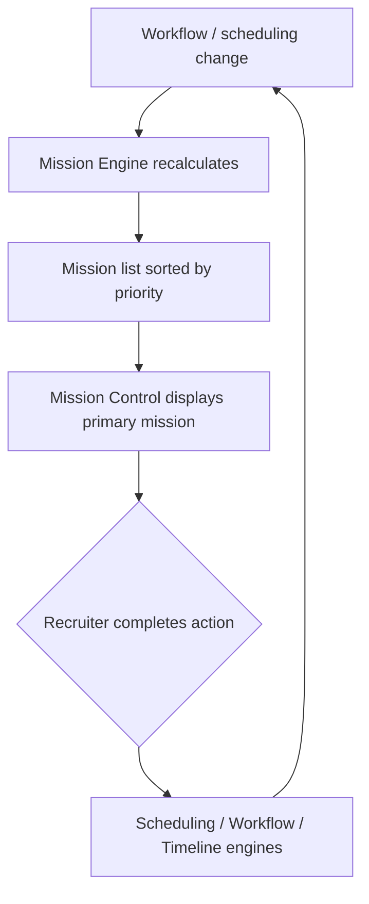

# Mission Engine v1.0

**Sprint 18.3 — Mission Control Orchestration Layer**

Mission Engine decides **what the recruiter should do next**. Mission Control displays the answer. Mission Control never decides.

---

## Architecture

```
Mission Control (UI)
        ↓
Mission Engine (prioritization)
        ↓
Workflow Engine (business rules / milestones)
        ↓
Scheduling Engine (appointments)
        ↓
Conversation Timeline (history)
        ↓
Notification Service (future)
```

| Layer | Responsibility |
|-------|----------------|
| **Mission Control** | Display missions, execute actions, refresh UI |
| **Mission Engine** | Generate, prioritize, and refresh missions |
| **Workflow Engine** | Canonical milestones, validation, advancement |
| **Scheduling Engine** | Book appointments, capacity, Google Calendar push |
| **Conversation Timeline** | Message history only |

---

## Mission Lifecycle



1. **Generate** — Mission Engine reads prospect context from existing engines (no duplicated BR logic).
2. **Prioritize** — Missions sorted: Critical → High → Medium → Low, then due date.
3. **Display** — Mission Control fetches `/api/missions` and renders the primary mission card.
4. **Complete** — Recruiter action delegates to existing Mission Control action handlers.
5. **Recalculate** — `POST /api/missions/recalculate` refreshes missions after workflow changes.

---

## Mission Model

Generic mission object — no interview-specific fields on the model itself.

| Field | Type | Description |
|-------|------|-------------|
| `id` | string | `{prospectPhone}:{missionType}` |
| `prospectId` | string | Prospect phone (tenant-scoped identifier) |
| `missionType` | string | Extensible type key |
| `priority` | string | Critical, High, Medium, Low |
| `title` | string | Display title |
| `description` | string | Longer explanation |
| `reason` | string | Why this mission exists |
| `estimatedMinutes` | number | Time estimate for recruiter |
| `dueDate` | ISO string | When mission should be completed |
| `primaryAction` | `{ id, label }` | Main CTA (maps to existing action IDs) |
| `secondaryActions` | array | Additional actions from agent action engine |
| `status` | string | pending, completed, blocked |
| `createdAt` | ISO string | Generation timestamp |
| `prospect` | object | Summary: name, phone, currentStep |
| `workflowState` | object | Summary: milestone, recorded outcome |

**Storage:** Computed on demand — no database migration. Missions are derived from workflow state at read time.

---

## Mission Types

Implemented in v1:

| Type | Priority | Trigger |
|------|----------|---------|
| `ScheduleInterview` | High | Interested + interview not scheduled |
| `EnterInterviewOutcome` | Critical | Interview time passed + outcome missing |

Future-ready (registered, not yet generated):

- `CallProspect`
- `RescheduleInterview`
- `SendLicensingPacket`
- `CompleteOrientation`
- `ReviewFNA`
- `PolicyDelivery`

Types are defined in `backend/core/configuration/missionTypes.js`. New rules add generators in `missionEngine.js` without changing the model.

---

## Business Rules (v1)

### Rule 1 — Schedule Interview

**When:** Conversation outcome is Interested (or Information Collected) AND workflow requires schedule.

**Mission:** Schedule Interview · **Priority:** High · **Reason:** Prospect is interested and waiting.

**Delegates to:** `agentActionEngine` → `schedule` action → Scheduling Engine.

### Rule 2 — Enter Interview Outcome

**When:** Workflow milestone is `INTERVIEW_RESULT_PENDING` OR confirmed interview time has passed AND no **interview outcome** recorded.

**Note (Sprint 19):** Conversation outcomes such as `Interested` or `Information Collected` do **not** suppress the interview workflow gate. Only recorded interview outcomes (`Recruited`, `No Show`, `Needs More Time`, `Not Interested`, `Rescheduled`) close the gate.

**Mission:** Enter Interview Outcome · **Priority:** Critical · **Reason:** Interview time has passed and outcome is missing.

**Delegates to:** Workflow Gate / `saveInterviewOutcome` → Workflow Engine advancement.

---

## API

| Method | Path | Description |
|--------|------|-------------|
| GET | `/api/missions` | All missions for organization (optional `?prospectPhone=`) |
| GET | `/api/missions/:id` | Single mission by `{phone}:{type}` |
| GET | `/api/missions/prospect/:phone` | Missions for one prospect |
| POST | `/api/missions/recalculate` | Force regeneration (optional `{ prospectPhone }`) |

Mission Control consumes **only** these endpoints for mission display. Action execution continues through existing `/api/mission-control/:phone/actions` routes.

---

## Service Layout

```
backend/
  core/
    missionEngine.js
    configuration/
      missionTypes.js
      missionPriorities.js
  controllers/
    missionController.js
  routes/
    missions.js

frontend/
  services/
    missionService.js
  components/mission-control/
    MissionCard.jsx
    MissionCard.css
```

---

## Responsibilities

### Mission Engine MUST

- Read workflow state from Workflow Engine outputs
- Prioritize missions automatically
- Return generic mission objects
- Recalculate after workflow changes

### Mission Engine MUST NOT

- Duplicate workflow validation logic
- Contain interview-specific services
- Send messages or mutate prospects directly
- Decide UI layout

### Mission Control MUST

- Fetch missions from `/api/missions`
- Display primary mission card
- Delegate actions to existing handlers
- Recalculate after action completion

### Mission Control MUST NOT

- Compute mission priority locally
- Embed business rules
- Bypass Workflow Engine for advancement
- Inject mock prospects into the operational queue (removed Sprint 19)

---

## Sprint 19 Updates

- Mission generation scoped by `organizationId` from authenticated session
- `buildMissionContext(phone, organizationId)` uses compound lookup
- Workflow gate fix: conversation outcomes ≠ interview outcomes
- Core reads from `missionControlReadModel.js` (not controllers)

Verification:

```bash
node backend/dev/verifySprint18_3.js
node backend/dev/verifySprint19.js
```

Tests mission type registry, priority sorting, Rule 1/2 synthetic contexts, Pedro prospect integration, and org recalculation.

---

## Related Documentation

- [Atlas Architecture v1](./Atlas-Architecture-v1.md)
- [Business Rules](../06-business/BUSINESS_RULES.md) — BR-025+ agent actions, BR-034+ workflow
