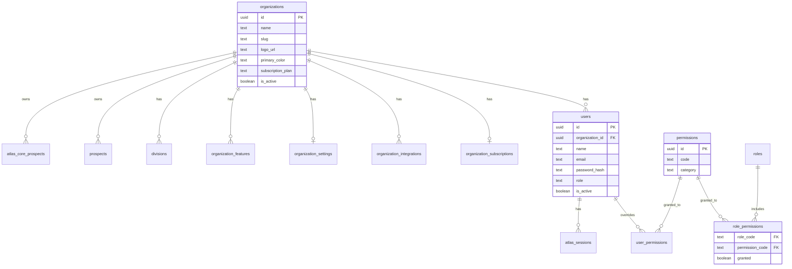

# Sprint 16.9 — Atlas SaaS Multi-Tenant Foundation

**Status:** Implemented (additive foundation)  
**Migration:** `011_saas_multi_tenant_foundation.sql`  
**Date:** 2026-07-25

This sprint transforms Atlas from a single-organization application into an enterprise SaaS platform **without breaking existing Team Vision functionality**. All LC1/LC1.1 features continue to work through backward-compatible layers.

---

## Architecture summary

Atlas now has three identity layers working together:

| Layer | Table / Module | Purpose |
|-------|----------------|---------|
| **SaaS identity** | `users` | Canonical multi-tenant user records |
| **Legacy compatibility** | `atlas_users` | Synced via DB trigger; existing FKs preserved |
| **Authentication** | JWT + `atlas_sessions` | Dual-auth: JWT primary, opaque session fallback |

Tenant isolation uses `organization_id` on all business tables. The backend enforces organization boundaries via `organizationGuard` middleware and `tenantContextService`.

Permissions are **DB-backed** (`permissions`, `role_permissions`, `user_permissions`) with JS fallback for pre-migration environments.

---

## Folder structure

```
backend/
├── database/migrations/
│   └── 011_saas_multi_tenant_foundation.sql   # SaaS schema
├── security/
│   ├── saasRoles.js                           # SaaS role constants + legacy mapping
│   ├── permissionService.js                   # DB permission resolution
│   ├── jwtService.js                          # JWT sign/verify
│   └── passwordService.js                     # bcrypt + scrypt (backward compat)
├── middleware/
│   ├── authenticate.js                        # JWT + session dual-auth
│   ├── authorize.js                           # Composable auth checks
│   ├── organizationGuard.js                   # Tenant boundary enforcement
│   ├── requirePermission.js                   # Permission gate (existing)
│   ├── requireRole.js                         # Role gate (existing)
│   └── requireAtlasUser.js                    # Delegates to authenticate()
├── services/
│   ├── userService.js                         # Canonical users table access
│   ├── tenantContextService.js                # Organization-scoped query helpers
│   └── organizationBrandingService.js         # Logo, colors, name from DB
└── dev/tools/
    └── seedTeamVisionSaaS.js                   # Env-based SUPER_ADMIN seeder
```

---

## Database schema

### Core tables (new or extended)

**organizations** (extended)
- `logo_url`, `primary_color`, `secondary_color`, `website`, `timezone`
- `subscription_plan`, `subscription_status`, `is_active`

**users** (new — canonical identity)
- `id`, `organization_id`, `name`, `email`, `password_hash`, `role`, `is_active`, `last_login`

**roles** — SUPER_ADMIN, ADMIN, RVP, DIVISION_LEADER, REGIONAL_LEADER, FIELD_TRAINER, REPRESENTATIVE

**permissions** — dashboard, executive, mission control, prospects, calendar, AI, reports, users, settings, billing, meta, whatsapp, workflow builder

**role_permissions** — role → permission grants

**user_permissions** — per-user overrides (grant/deny with optional expiry)

**organization_integrations** — meta, whatsapp, google_calendar, google_drive, email, openai

**organization_subscriptions** — plan, status, renewal_date, limits (JSONB)

**organization_settings** — org-scoped JSONB settings

**organization_features** — future-ready feature flags (marketplace, AI agents, CRM, etc.)

### ER diagram



---

## Migration order

Apply migrations sequentially via:

```bash
node backend/dev/environment/applyAtlasCoreMigrations.js
```

| Version | File | Sprint |
|---------|------|--------|
| 002 | quick_capture.sql | 10.1 |
| 003–007 | core prospects, events, projections | 14–15 |
| 008 | lc1_security_foundation.sql | LC1 |
| 009 | identity_management.sql | LC1.1 |
| 010 | platform_bootstrap.sql | Bootstrap |
| **011** | **saas_multi_tenant_foundation.sql** | **16.9** |

Migration 011 is **additive only** — it extends `organizations`, creates new SaaS tables, migrates `atlas_users` → `users`, and installs a sync trigger. No existing FK references are broken.

---

## Authentication flow

```
Login (POST /api/auth/login)
    ↓
Verify password (bcrypt or legacy scrypt)
    ↓
Sign JWT (user_id, organization_id, role, permissions)
    ↓
Store jti in atlas_sessions (revocation support)
    ↓
Return JWT to client

Protected request
    ↓
authenticate() middleware
    ↓
JWT? → verify signature + check jti not revoked
Session? → lookup atlas_sessions + atlas_users
    ↓
buildAuthContextAsync() → DB permissions + legacy role mapping
    ↓
organizationGuard() → set req.tenantContext
    ↓
requirePermission() / requireRole() → route handler
```

### JWT payload

```json
{
  "sub": "user-uuid",
  "user_id": "user-uuid",
  "organization_id": "org-uuid",
  "role": "ADMIN",
  "permissions": ["prospect:read", "dashboard:executive", "..."],
  "jti": "revocation-id"
}
```

### Environment variables

| Variable | Required | Purpose |
|----------|----------|---------|
| `JWT_SECRET` | Production | JWT signing key |
| `JWT_EXPIRES_IN` | No | Default `7d` |
| `ATLAS_SUPER_ADMIN_EMAIL` | Seeder | Super admin email |
| `ATLAS_SUPER_ADMIN_PASSWORD` | Seeder | Super admin password |

---

## Tenant flow

1. User authenticates → JWT contains `organization_id`
2. `organizationGuard` sets `req.tenantContext.organizationId`
3. All business queries filter by `organization_id` via `tenantContextService`
4. Cross-org requests return `403 FORBIDDEN` (except SUPER_ADMIN)

Default organization: `00000000-0000-4000-8000-000000000001` (Team Vision)

---

## Permission system

Permissions are stored in the database, not hardcoded:

```sql
SELECT p.code FROM permissions p
JOIN role_permissions rp ON rp.permission_code = p.code
WHERE rp.role_code = 'ADMIN' AND rp.granted = true;
```

User-level overrides via `user_permissions`:

- `granted = true` → add permission
- `granted = false` → deny permission (override role)
- `expires_at` → temporary grants

Legacy LC1 roles map to SaaS roles automatically:

| Legacy | SaaS |
|--------|------|
| administrator | ADMIN |
| rvp | RVP |
| division_leader | DIVISION_LEADER |
| recruiter/agent | REPRESENTATIVE |

---

## Branding

Organization branding is database-driven:

```
GET /api/organization/branding
```

Returns: `name`, `logoUrl`, `primaryColor`, `secondaryColor`, `website`, `timezone`

Future white-label support: frontend reads branding on app load and applies CSS variables.

---

## Seeder

```bash
ATLAS_SUPER_ADMIN_EMAIL=admin@example.com \
ATLAS_SUPER_ADMIN_PASSWORD='YourSecurePassword!' \
ATLAS_SUPER_ADMIN_NAME='Platform Admin' \
node backend/dev/tools/seedTeamVisionSaaS.js
```

Creates Team Vision organization and SUPER_ADMIN. Passwords never hardcoded — bcrypt hashed from env vars.

---

## Deployment notes

1. **Apply migration 011** before deploying new backend code
2. **Set `JWT_SECRET`** in production (required)
3. **Existing sessions remain valid** — opaque tokens still work via dual-auth
4. **No frontend changes required** — Bearer token format unchanged
5. **Team Vision data preserved** — same organization UUID, users synced
6. **Run seeder only in new environments** — use setup wizard for production first boot

### Validation checklist

- [ ] Contact form works (public route, no auth)
- [ ] WhatsApp webhooks work (no org auth required)
- [ ] Login returns JWT token
- [ ] `/api/auth/me` works with JWT
- [ ] Executive Dashboard loads for authorized users
- [ ] Mission Control loads for authorized users
- [ ] Prospect Center loads for authorized users
- [ ] Cross-org access returns 403
- [ ] `/api/organization/branding` returns Team Vision branding

### Regression script

```bash
node backend/dev/verifyLC1Security.js
```

---

## Future-ready extensions

`organization_features` table prepares for:

- Workflow Marketplace
- Custom AI Agents
- CRM Integrations
- Insurance Products
- Recruiting Products
- Client Portal
- API Access

`organization_integrations` prepares per-tenant credentials for Meta, WhatsApp, Google Calendar, Google Drive, Email, OpenAI.

`organization_subscriptions` prepares Starter / Professional / Enterprise plans with JSONB limits. No payment gateway yet.

---

## Related documentation

- [PLATFORM_FOUNDATION_COMPLETE.md](./PLATFORM_FOUNDATION_COMPLETE.md) — LC1 baseline
- [RBAC_MODEL.md](../security/RBAC_MODEL.md) — Legacy permission matrix
- [backend/dev/tools/README.md](../../backend/dev/tools/README.md) — Developer tools
