# Atlas Roadmap

**Document type:** Roadmap  
**Status:** PUBLISHED  
**Version:** 1.0  
**Last Updated:** 2026-07-21  
**Audience:** Product, Engineering, Leadership  

**Related:** [../releases/RELEASE_HISTORY.md](../releases/RELEASE_HISTORY.md), [../architecture/ATLAS_PLATFORM_V1.md](../architecture/ATLAS_PLATFORM_V1.md), [../vision/WHY_ATLAS_EXISTS.md](../vision/WHY_ATLAS_EXISTS.md)

---

## Release Numbering Strategy

| Series | Meaning | Example |
|--------|---------|---------|
| **Journey #N** | Atlas Core increments (locked after completion) | Journey #6 — Gateway |
| **Release 1.N** | Version 1 product releases (packages, admin, intelligence) | Release 1.3 — Daily Brief |
| **Sprint X.Y** | Historical development sprints (pre-Version 1) | Sprint 13.0 — Workflow Engine |
| **v1.N.0 tags** | Git tags for product releases | `v1.3.0`, `v1.4.0` |
| **Version 2** | Next major platform generation (post-freeze) | TBD |

**Rule:** Version 1 releases do not modify Atlas Core except bug fixes. New capabilities extend through packages, configuration, or new domains.

---

## Completed Releases

### Atlas Core v1.0 (LOCKED)

Foundation platform — no single git tag; verified by Journey scripts.

| Journey | Capability | Verify |
|---------|------------|--------|
| #1 | Onboarding, auth, organization setup | `verifyJourney1.js` |
| #2 | Appointment booking, confirmation | `verifyJourney2.js` |
| #3 | Meeting lifecycle, calendar, Zoom | `verifyJourney3.js` |
| #4 | Agent architecture (design) | `ATLAS_AGENT_ARCHITECTURE.md` |
| #5 Inc 1–4 | Agent, workflow intelligence, tools, autonomous runtime | `verifyJourney5Increment*.js` |
| #6 | Unified Communication Gateway | `verifyJourney6.js` |
| #7 | Production Connectors | `verifyJourney7.js` |

### Release 1.1 — Team Vision Recruiting Pack (LOCKED)

First production package. Recruiting workflow, qualification, interviews, licensing, follow-ups.

- **Verify:** `verifyRelease1_1.js`
- **Docs:** [RELEASE_1_1.md](../releases/RELEASE_1_1.md)

### Release 1.2 — Organization Console (LOCKED)

Administration layer. Organizations configure Atlas without code changes.

- **Verify:** `verifyRelease1_2.js`
- **Docs:** [RELEASE_1_2.md](../releases/RELEASE_1_2.md)

### Release 1.3 — Daily Brief (LOCKED)

Executive intelligence. Morning briefing from organization snapshot.

- **Tag:** `v1.3.0`
- **Verify:** `verifyRelease1_3.js`
- **Docs:** [RELEASE_1_3.md](../releases/RELEASE_1_3.md)

### Release 1.4 — Mission Control (LOCKED)

Operational command center. Event-driven live state.

- **Tag:** `v1.4.0`
- **Verify:** `verifyRelease1_4.js`
- **Docs:** [RELEASE_1_4.md](../releases/RELEASE_1_4.md)

### Stabilization — Version 1 Freeze (CURRENT)

Documentation sprint. No new features. Freezes architecture, vision, RFCs, release history.

---

## Upcoming Releases

### Release 2.0 — Platform Generation 2 (PLANNED)

Major platform evolution. Scope defined after Version 1 production feedback.

Potential themes:

- WebSocket Mission Control delivery
- Executive Dashboard backend integration
- Supabase migration for domain stores
- Multi-tenancy infrastructure

---

## Phase 2 — Operator Experience

| Initiative | Description | Depends on |
|------------|-------------|------------|
| **Mission Control UI** | Web dashboard consuming Release 1.4 API | Release 1.4 |
| **Executive Dashboard UI** | Morning brief + agency pulse visualization | Release 1.3 |
| **Organization Console UI** | Admin interface for Release 1.2 | Release 1.2 |
| **WebSocket Layer** | Real-time Mission Control push | Mission Control UI |
| **Notification Delivery** | Email/push for alerts and briefs | Daily Brief, Mission Control |

---

## Phase 3 — Ecosystem

| Initiative | Description |
|------------|-------------|
| **Marketplace** | Discover, install, and billing for packages |
| **Package SDK** | Authoring tools and certification for third-party packages |
| **Connector Marketplace** | Community connectors beyond Meta/Google/Zoom |
| **SSO & Advanced Auth** | Enterprise identity integration |
| **Audit & Compliance Suite** | Advanced approval workflows |

---

## Future Packages

| Package | Industry | Status |
|---------|----------|--------|
| Team Vision Recruiting | Financial services recruiting | **Shipped (1.1)** |
| Insurance Onboarding | Insurance agent licensing | Planned |
| Mortgage Intake | Mortgage prospect qualification | Planned |
| Real Estate Lead Nurture | Property lead follow-up | Planned |
| Generic Appointment Pack | Any appointment-driven business | Planned |

Packages follow [RFC-005 Package Manifest](../rfcs/RFC-005-package-manifest.md).

---

## Future Platform Capabilities

### Marketplace

Organizations browse, install, and configure packages. Billing and subscription management. Package isolation enforced by Organization Console.

### AI Copilot

Natural-language administration: "Install recruiting pack for Doral office with 25-mile coverage." Builds on Organization Console and Workflow Designer.

### Executive Intelligence

Extends Daily Brief with predictive trends, cross-office comparison, and coaching recommendations. Implements Atlas Never Sleeps Thinking mode at scale.

### Workflow Designer

Visual workflow authoring without code. Outputs RFC-004 compliant workflow contracts. Human approval before deployment.

### API Platform

Public REST/Webhook API for third-party integrations. Organizations expose Atlas capabilities to external systems.

---

## Roadmap Diagram

```mermaid
flowchart LR
    subgraph Done["Version 1 — COMPLETE"]
        CORE[Core v1.0]
        R11[Release 1.1]
        R12[Release 1.2]
        R13[Release 1.3]
        R14[Release 1.4]
        FREEZE[V1 Freeze]
    end

    subgraph Phase2["Phase 2"]
        MCUI[Mission Control UI]
        EDUI[Executive Dashboard UI]
        ORGUI[Org Console UI]
        WS[WebSockets]
    end

    subgraph Phase3["Phase 3"]
        MKT[Marketplace]
        SDK[Package SDK]
        SSO[Enterprise Auth]
    end

    subgraph Future["Future"]
        COPILOT[AI Copilot]
        WFD[Workflow Designer]
        API[API Platform]
    end

    CORE --> R11 --> R12 --> R13 --> R14 --> FREEZE
    FREEZE --> Phase2
    Phase2 --> Phase3
    Phase3 --> Future
```

---

## Out of Scope (Version 1)

- Machine learning / predictive analytics
- Cross-organization benchmarking
- Voice monitoring
- Billing and subscriptions
- Single Sign-On
- Automatic execution of recommendations

These remain on the roadmap for Version 2+.

---

## Document Maintenance

Update this roadmap when releases ship or priorities change. Completed items move to [RELEASE_HISTORY.md](../releases/RELEASE_HISTORY.md).

**Remember: Simple Scales.**
